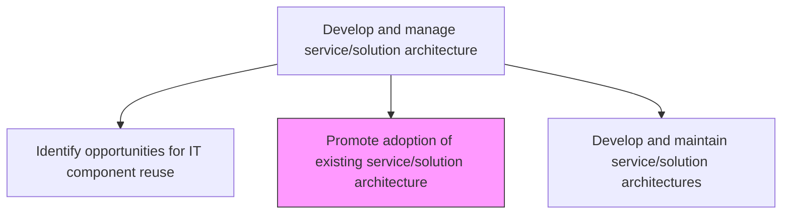
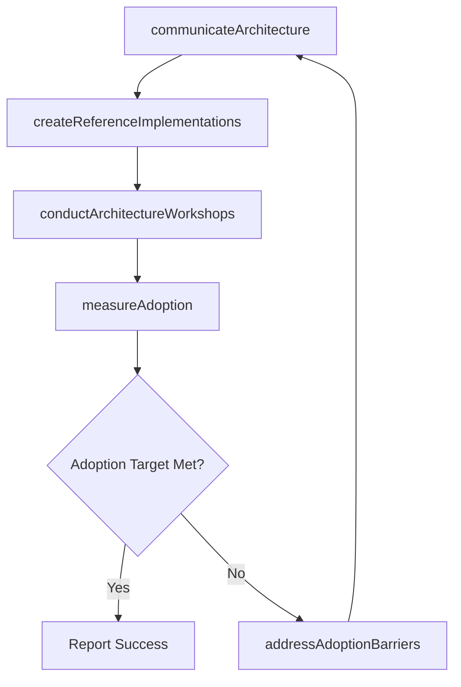

# Promote adoption of existing service/solution architecture

> Business-as-Code definition for driving organizational awareness and adoption of established service and solution architecture patterns, standards, and reference implementations across development teams.

## Overview

Encouraging acceptance of existing IT service/solution architecture in the organization.

## Process Hierarchy



## GraphDL

```yaml
promote:
  object: Adoption Of Existing Service/solution Architecture
  actor: ArchitectureAdvocate
  result: AdoptionReport
```

## Actions

| Action | Description |
|--------|-------------|
| communicateArchitecture | Present existing architecture patterns and standards to development teams |
| createReferenceImplementations | Build reference implementations that demonstrate architecture best practices |
| conductArchitectureWorkshops | Deliver training workshops on architecture patterns and adoption |
| measureAdoption | Track architecture adoption rates across projects and teams |
| addressAdoptionBarriers | Identify and resolve obstacles preventing architecture adoption |

## Events

| Event | Description |
|-------|-------------|
| architectureCommunicated | Architecture patterns and standards presented to teams |
| referenceImplementationsCreated | Reference implementations built and published |
| workshopsConducted | Architecture training workshops delivered |
| adoptionMeasured | Architecture adoption metrics collected and analyzed |
| adoptionBarriersAddressed | Obstacles to adoption identified and resolved |

## Searches

| Search | Description |
|--------|-------------|
| getAdoptionMetrics | Retrieve architecture adoption rates by team, project, or pattern |
| getReferenceImplementations | List available reference implementations by architecture pattern |
| getAdoptionBarriers | Identify reported obstacles to architecture adoption |

## Process Flow



## RACI Matrix

| Activity | Responsible | Accountable | Consulted | Informed |
|----------|-------------|-------------|-----------|----------|
| communicateArchitecture | ArchitectureAdvocate | EnterpriseArchitect | DevelopmentLeads | AllDevelopers |
| createReferenceImplementations | ArchitectureAdvocate | EnterpriseArchitect | SeniorDevelopers | ProjectManagers |
| measureAdoption | ArchitectureAdvocate | EnterpriseArchitect | ITGovernance | ITManagement |

## Related Processes

| Process | Relationship |
|---------|-------------|
| 8.5.3.6 Develop and maintain service/solution architectures | Upstream - architectures must exist before promotion |
| 8.5.3.7 Assess IT service/solution architecture conformance | Downstream - conformance assessment measures adoption effectiveness |
| 8.5.1.3 Identify, deploy, and support development methodologies and tools | Parallel - tools support architecture adoption |

## Related Departments

| Department | Role |
|-----------|------|
| Enterprise Architecture | Champions architecture adoption and creates reference materials |
| Software Engineering | Adopts architecture patterns in development projects |
| IT Training | Delivers architecture training and enablement programs |

## Related Occupations

| Occupation | Involvement |
|-----------|-------------|
| Architecture Advocate | Promotes architecture patterns and addresses barriers |
| Enterprise Architect | Defines architecture standards for adoption |
| Technical Writer | Creates architecture documentation and guides |

## KPIs

| KPI | Description | Unit |
|-----|-------------|------|
| Architecture Adoption Rate | Percentage of new projects following established architecture patterns | % |
| Workshop Attendance | Number of developers attending architecture workshops per quarter | Count |
| Reference Implementation Usage | Number of projects leveraging reference implementations | Count |

## Usage

```typescript
import { promoteAdoptionOfExistingServiceSolutionArchitecture } from '@headlessly/promote-adoption-of-existing-service-solution-architecture'

const adoption = promoteAdoptionOfExistingServiceSolutionArchitecture()

// Check adoption metrics
const metrics = await adoption.getAdoptionMetrics({
  pattern: 'microservices',
  period: 'last-quarter',
  groupBy: 'team'
})

// Get reference implementations
const references = await adoption.getReferenceImplementations({
  pattern: 'event-driven-architecture',
  technology: 'typescript'
})
```
