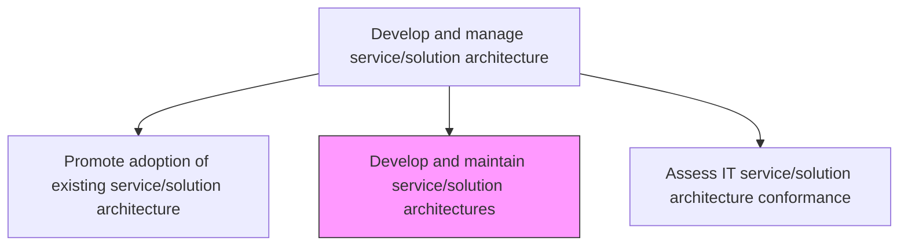
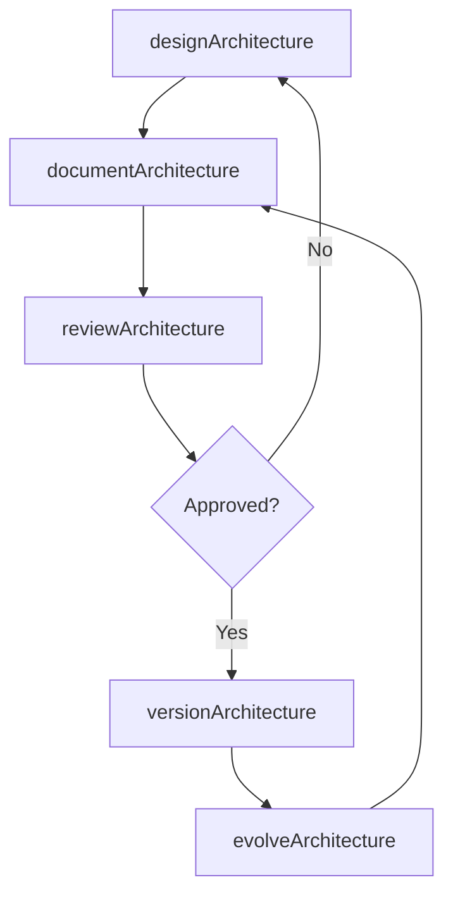

# Develop and maintain service/solution architectures

> Business-as-Code definition for designing, documenting, and continuously evolving the technical architectures that underpin IT services and solutions across the enterprise.

## Overview

Creating and maintaining a services and solutions architecture over a network that can be revised as needed or even eliminated in case of inefficiencies.

## Process Hierarchy



## GraphDL

```yaml
develop:
  object: And Maintain Service/solution Architectures
  actor: SolutionArchitect
  result: ArchitectureDocument
```

## Actions

| Action | Description |
|--------|-------------|
| designArchitecture | Create the technical architecture for a service or solution including component diagrams and data flows |
| documentArchitecture | Produce comprehensive architecture documentation including decision records |
| reviewArchitecture | Conduct architecture reviews with stakeholders and technical experts |
| evolveArchitecture | Update the architecture to address new requirements, technology changes, or performance issues |
| versionArchitecture | Publish a new version of the architecture with change summaries |

## Events

| Event | Description |
|-------|-------------|
| architectureDesigned | Service or solution architecture created |
| architectureDocumented | Architecture documentation completed |
| architectureReviewed | Architecture review with stakeholders completed |
| architectureEvolved | Architecture updated to address new requirements or issues |
| architectureVersioned | New architecture version published |

## Searches

| Search | Description |
|--------|-------------|
| getArchitectures | Retrieve service or solution architectures filtered by domain or status |
| getArchitectureVersion | Get a specific version of an architecture document |
| getArchitectureDecisionRecords | List architecture decision records for a specific service |

## Process Flow



## RACI Matrix

| Activity | Responsible | Accountable | Consulted | Informed |
|----------|-------------|-------------|-----------|----------|
| designArchitecture | SolutionArchitect | EnterpriseArchitect | DevelopmentLeads | ProjectManagers |
| reviewArchitecture | SolutionArchitect | EnterpriseArchitect | SecurityArchitect | ITManagement |
| evolveArchitecture | SolutionArchitect | EnterpriseArchitect | InfrastructureTeam | OperationsTeam |

## Related Processes

| Process | Relationship |
|---------|-------------|
| 8.5.3.5 Promote adoption of existing service/solution architecture | Downstream - new architectures are promoted for adoption |
| 8.5.3.7 Assess IT service/solution architecture conformance | Downstream - architectures serve as the baseline for conformance |
| 8.5.3.1 Assess IT application and infrastructure architecture constraints | Upstream - constraints inform architecture design |

## Related Departments

| Department | Role |
|-----------|------|
| Solution Architecture | Designs and maintains service architectures |
| Enterprise Architecture | Provides standards and governance for architecture design |
| Software Engineering | Implements architectures in development projects |

## Related Occupations

| Occupation | Involvement |
|-----------|-------------|
| Solution Architect | Designs and evolves service architectures |
| Enterprise Architect | Governs architecture standards and reviews |
| Technical Writer | Creates architecture documentation |

## KPIs

| KPI | Description | Unit |
|-----|-------------|------|
| Architecture Documentation Coverage | Percentage of services with current architecture documentation | % |
| Architecture Review Cycle Time | Average time from design to architecture approval | Days |
| Architecture Currency | Percentage of architectures updated within the last 12 months | % |

## Usage

```typescript
import { developAndMaintainServiceSolutionArchitectures } from '@headlessly/develop-and-maintain-service-solution-architectures'

const architectures = developAndMaintainServiceSolutionArchitectures()

// Get architecture for a service
const arch = await architectures.getArchitectures({
  domain: 'customer-experience',
  status: 'current'
})

// Review architecture decision records
const decisions = await architectures.getArchitectureDecisionRecords({
  serviceId: 'checkout-service',
  status: 'accepted'
})
```
