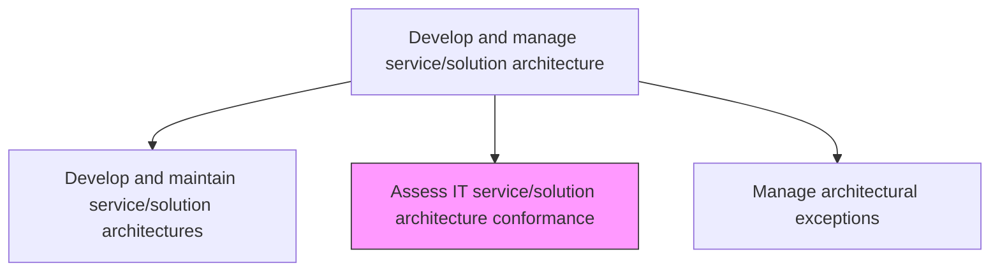
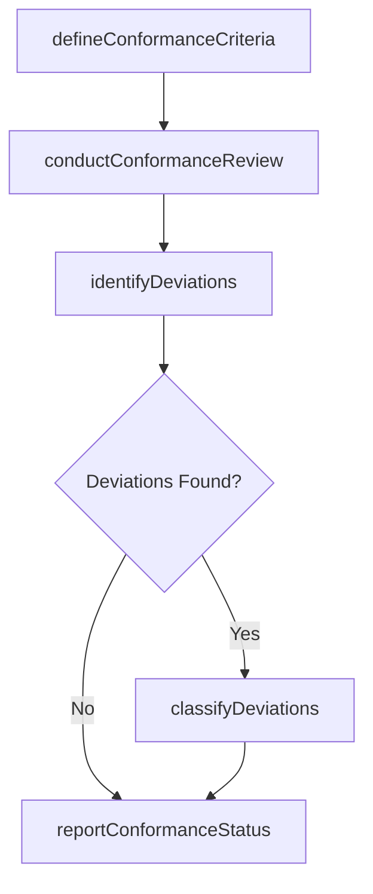

# Assess IT service/solution architecture conformance

> Business-as-Code definition for evaluating whether IT services and solutions comply with established architecture standards, patterns, and guidelines, identifying deviations and non-conformance.

## Overview

Assessing functional compliance of the IT service/solution architecture. Safeguard compliance with guidelines for the architecture.

## Process Hierarchy



## GraphDL

```yaml
assess:
  object: IT Service/solution Architecture Conformance
  actor: ArchitectureReviewer
  result: ConformanceAssessmentReport
```

## Actions

| Action | Description |
|--------|-------------|
| defineConformanceCriteria | Establish the standards and checkpoints used to assess architecture conformance |
| conductConformanceReview | Evaluate a service or solution against established architecture standards |
| identifyDeviations | Document areas where the implementation deviates from the prescribed architecture |
| classifyDeviations | Categorize deviations by severity and risk to determine remediation priority |
| reportConformanceStatus | Compile and distribute conformance assessment results to stakeholders |

## Events

| Event | Description |
|-------|-------------|
| conformanceCriteriaDefined | Architecture conformance criteria established |
| conformanceReviewConducted | Architecture conformance review completed |
| deviationsIdentified | Architecture deviations documented |
| deviationsClassified | Deviations categorized by severity and risk |
| conformanceStatusReported | Conformance results compiled and distributed |

## Searches

| Search | Description |
|--------|-------------|
| getConformanceStatus | Retrieve conformance status for services filtered by domain or compliance level |
| findDeviations | List architecture deviations filtered by severity, service, or type |
| getConformanceHistory | Retrieve historical conformance assessment results for a service |

## Process Flow



## RACI Matrix

| Activity | Responsible | Accountable | Consulted | Informed |
|----------|-------------|-------------|-----------|----------|
| conductConformanceReview | ArchitectureReviewer | EnterpriseArchitect | SolutionArchitects | DevelopmentLeads |
| identifyDeviations | ArchitectureReviewer | EnterpriseArchitect | SecurityArchitect | ProjectManagers |
| reportConformanceStatus | ArchitectureReviewer | EnterpriseArchitect | ITGovernance | ITManagement |

## Related Processes

| Process | Relationship |
|---------|-------------|
| 8.5.3.6 Develop and maintain service/solution architectures | Upstream - architectures provide the conformance baseline |
| 8.5.3.8 Manage architectural exceptions | Downstream - deviations may become architectural exceptions |
| 8.5.3.5 Promote adoption of existing service/solution architecture | Parallel - conformance assessment measures adoption success |

## Related Departments

| Department | Role |
|-----------|------|
| Enterprise Architecture | Defines conformance criteria and conducts reviews |
| IT Governance | Ensures conformance processes are followed |
| Quality Assurance | Supports conformance testing and validation |

## Related Occupations

| Occupation | Involvement |
|-----------|-------------|
| Architecture Reviewer | Conducts conformance assessments |
| Enterprise Architect | Defines conformance standards and criteria |
| Quality Assurance Analyst | Validates conformance through testing |

## KPIs

| KPI | Description | Unit |
|-----|-------------|------|
| Conformance Rate | Percentage of services fully conforming to architecture standards | % |
| Deviation Severity Distribution | Distribution of deviations across severity levels | Distribution |
| Assessment Coverage | Percentage of active services assessed within the review cycle | % |

## Usage

```typescript
import { assessItServiceSolutionArchitectureConformance } from '@headlessly/assess-it-service-solution-architecture-conformance'

const conformance = assessItServiceSolutionArchitectureConformance()

// Check conformance status
const status = await conformance.getConformanceStatus({
  domain: 'customer-facing',
  minComplianceLevel: 'satisfactory'
})

// Find deviations
const deviations = await conformance.findDeviations({
  severity: 'critical',
  service: 'order-processing-service'
})
```
