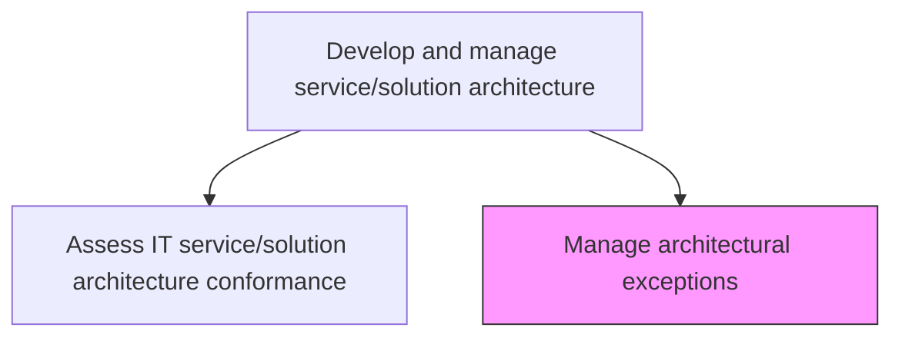
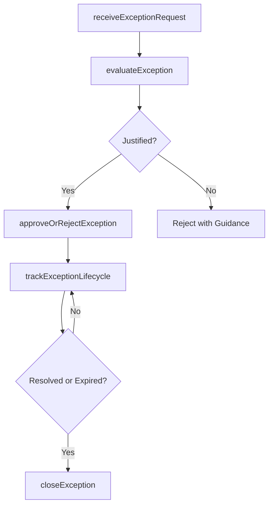

# Manage architectural exceptions

> Business-as-Code definition for governing the lifecycle of architectural exceptions, from request and approval through tracking and eventual resolution, ensuring that deviations from architecture standards are controlled and temporary.

## Overview

Identifying and resolving any architectural exceptions. Address the internal inquiries related to architecture that cannot be addressed immediately. Research inquiries that require the need of exceptional methods.

## Process Hierarchy



## GraphDL

```yaml
manage:
  object: Architectural Exceptions
  actor: ArchitectureGovernanceOfficer
  result: ExceptionRecord
```

## Actions

| Action | Description |
|--------|-------------|
| receiveExceptionRequest | Accept and log a formal request for an architectural exception |
| evaluateException | Assess the exception request against risk, business justification, and technical impact |
| approveOrRejectException | Make a governance decision on the exception with documented rationale |
| trackExceptionLifecycle | Monitor active exceptions through their lifecycle to expiration or resolution |
| closeException | Close an exception when remediated, expired, or the standard is updated |

## Events

| Event | Description |
|-------|-------------|
| exceptionRequestReceived | Formal architectural exception request logged |
| exceptionEvaluated | Exception request assessed for risk and justification |
| exceptionDecisionMade | Exception approved or rejected with rationale |
| exceptionLifecycleTracked | Active exception progress reviewed and updated |
| exceptionClosed | Exception remediated, expired, or resolved |

## Searches

| Search | Description |
|--------|-------------|
| getActiveExceptions | List active architectural exceptions filtered by standard, service, or team |
| getExceptionDetails | Retrieve detailed information about a specific exception |
| getExceptionMetrics | Get aggregate metrics on exception volume, approval rates, and aging |

## Process Flow



## RACI Matrix

| Activity | Responsible | Accountable | Consulted | Informed |
|----------|-------------|-------------|-----------|----------|
| evaluateException | ArchitectureGovernanceOfficer | EnterpriseArchitect | SolutionArchitects | RequestingTeam |
| approveOrRejectException | ArchitectureGovernanceOfficer | EnterpriseArchitect | RiskManager | ITManagement |
| trackExceptionLifecycle | ArchitectureGovernanceOfficer | EnterpriseArchitect | DevelopmentLeads | ProjectManagers |

## Related Processes

| Process | Relationship |
|---------|-------------|
| 8.5.3.7 Assess IT service/solution architecture conformance | Upstream - conformance assessments identify potential exceptions |
| 8.5.1.7 Establish development standards exception governance | Parallel - development exceptions follow similar governance patterns |
| 8.5.3.6 Develop and maintain service/solution architectures | Parallel - architecture updates may resolve standing exceptions |

## Related Departments

| Department | Role |
|-----------|------|
| Architecture Governance | Manages the exception review and approval process |
| Enterprise Architecture | Evaluates technical impact of exceptions |
| Risk Management | Assesses risk of proposed architectural exceptions |

## Related Occupations

| Occupation | Involvement |
|-----------|-------------|
| Architecture Governance Officer | Manages exception lifecycle and governance decisions |
| Enterprise Architect | Evaluates exception requests against standards |
| Risk Manager | Assesses risk implications of architectural exceptions |

## KPIs

| KPI | Description | Unit |
|-----|-------------|------|
| Active Exception Count | Number of currently active architectural exceptions | Count |
| Exception Aging | Average age of active exceptions | Days |
| Exception Closure Rate | Percentage of exceptions resolved within target timeframe | % |

## Usage

```typescript
import { manageArchitecturalExceptions } from '@headlessly/manage-architectural-exceptions'

const exceptions = manageArchitecturalExceptions()

// Get active architectural exceptions
const active = await exceptions.getActiveExceptions({
  standard: 'microservices-architecture',
  agingThreshold: 90
})

// Get exception metrics
const metrics = await exceptions.getExceptionMetrics({
  period: 'last-year',
  groupBy: 'standard'
})
```
