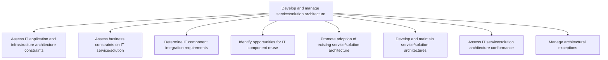
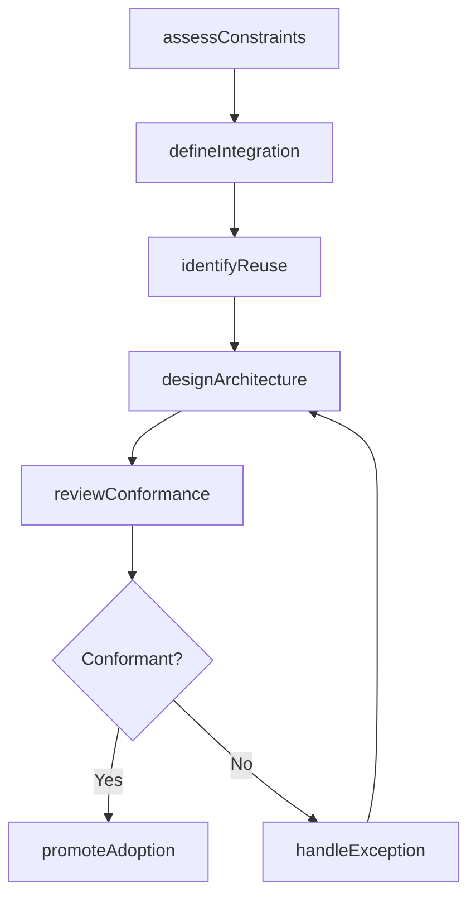

# Develop and manage service/solution architecture

> Business-as-Code definition for creating and governing IT service and solution architectures, including constraint assessment, integration planning, component reuse optimization, conformance reviews, and exception management.

## Overview

Creating the architecture for the IT services and solutions. Assess architecture and business constraints in order to understand integration requirements. Promote existing architecture. Manage exceptions.

## Process Hierarchy



## GraphDL

```yaml
develop:
  object: Service/solution Architecture
  actor: EnterpriseArchitect
  result: ArchitectureBlueprint
```

## Actions

| Action | Description |
|--------|-------------|
| assessConstraints | Evaluate technical and business constraints on the architecture |
| defineIntegration | Determine component integration requirements and patterns |
| identifyReuse | Find opportunities to reuse existing components and services |
| designArchitecture | Create or update the service and solution architecture |
| reviewConformance | Assess architecture conformance against standards and patterns |
| promoteAdoption | Encourage teams to adopt the existing architecture |
| handleException | Review and resolve architectural exception requests |

## Events

| Event | Description |
|-------|-------------|
| constraintsAssessed | Technical and business constraints evaluated and documented |
| integrationDefined | Component integration requirements and patterns established |
| reuseIdentified | Reuse opportunities cataloged with cost-benefit analysis |
| architectureDesigned | Service architecture created or updated |
| conformanceReviewed | Architecture conformance assessment completed |
| adoptionPromoted | Architecture adoption guidance communicated to teams |
| exceptionHandled | Architectural exception reviewed and decision recorded |

## Searches

| Search | Description |
|--------|-------------|
| findArchitectures | List service architectures filtered by domain, status, or technology |
| getConstraints | Retrieve documented constraints for a specific service or solution |
| getReuseOpportunities | List identified component reuse opportunities |
| getConformanceReport | Get conformance assessment results for a service architecture |

## Process Flow



## RACI Matrix

| Activity | Responsible | Accountable | Consulted | Informed |
|----------|-------------|-------------|-----------|----------|
| assessConstraints | SolutionArchitect | EnterpriseArchitect | InfrastructureTeam | DevelopmentTeams |
| designArchitecture | EnterpriseArchitect | VP Engineering | SecurityArchitect | ProjectManagers |
| reviewConformance | ArchitectureReviewer | EnterpriseArchitect | QATeam | DevelopmentTeams |
| handleException | EnterpriseArchitect | ArchitectureReviewBoard | SolutionArchitect | ITGovernance |

## Sub-Processes

| ID | Name | Description |
|----|------|-------------|
| 8.5.3.1 | Assess IT application and infrastructure architecture constraints | Assessing limitations in IT application and infrastructure architecture that may hinder expected per |
| 8.5.3.2 | Assess business constraints on IT service/solution | Evaluate business limitations that may hinder IT service/solution performance. |
| 8.5.3.3 | Determine IT component integration requirements | Determining the requirements to integrate IT components such as hardware, software, database, teleco |
| 8.5.3.4 | Identify opportunities for IT component reuse | Identification of opportunities for reusing IT components so that they can be cost-effective and eff |
| 8.5.3.5 | Promote adoption of existing service/solution architecture | Encouraging acceptance of existing IT service/solution architecture in the organization. |
| 8.5.3.6 | Develop and maintain service/solution architectures | Creating and maintaining a services and solutions architecture over a network that can be revised as |
| 8.5.3.7 | Assess IT service/solution architecture conformance | Assessing functional compliance of the IT service/solution architecture. Safeguard compliance with g |
| 8.5.3.8 | Manage architectural exceptions | Identifying and resolving any architectural exceptions. Address the internal inquiries related to ar |

## Related Processes

| Process | Relationship |
|---------|-------------|
| 8.5.1 Develop service/solution and integration strategy | Upstream - provides strategic direction for architecture |
| 8.5.2 Manage service/solution lifecycle planning | Upstream - lifecycle plans constrain architecture scope |
| 8.5.4 Execute IT service/solution creation and testing | Downstream - architecture guides service creation |

## Related Departments

| Department | Role |
|-----------|------|
| Enterprise Architecture | Designs and governs service architectures |
| IT Development | Implements architectures in service development |
| Infrastructure Engineering | Provides infrastructure constraint inputs |
| IT Security | Ensures security architecture compliance |
| IT Governance | Oversees architecture review board processes |

## Related Occupations

| Occupation | Involvement |
|-----------|-------------|
| Enterprise Architect | Designs and maintains architecture blueprints |
| Solution Architect | Applies architecture patterns to specific solutions |
| Integration Specialist | Defines component integration requirements |

## KPIs

| KPI | Description | Unit |
|-----|-------------|------|
| Architecture Conformance Rate | Percentage of services conforming to architecture standards | % |
| Component Reuse Ratio | Proportion of new services leveraging reusable components | % |
| Exception Resolution Time | Average time to resolve architectural exception requests | Days |
| Architecture Review Cycle Time | Average time to complete an architecture review | Days |

## Usage

```typescript
import { developAndManageServiceSolutionArchitecture } from '@headlessly/develop-and-manage-service-solution-architecture'

const architecture = developAndManageServiceSolutionArchitecture()

// Assess constraints for a new service
const constraints = await architecture.assessConstraints({
  serviceId: 'svc-payment-gateway',
  evaluationScope: ['infrastructure', 'business', 'security']
})

// Design the architecture
const blueprint = await architecture.designArchitecture({
  serviceId: 'svc-payment-gateway',
  pattern: 'event-driven-microservices',
  constraints: constraints.id
})

// Review conformance
const conformance = await architecture.reviewConformance({
  architectureId: blueprint.id,
  standardsVersion: '3.2'
})
```
