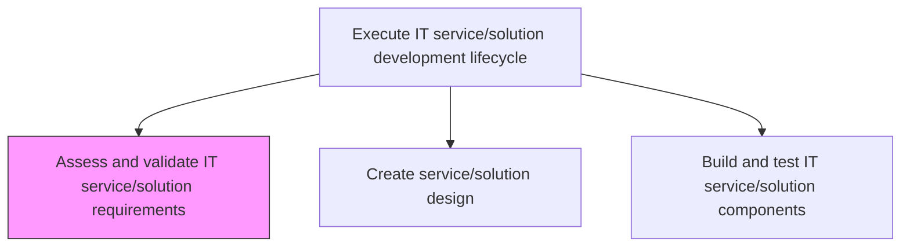
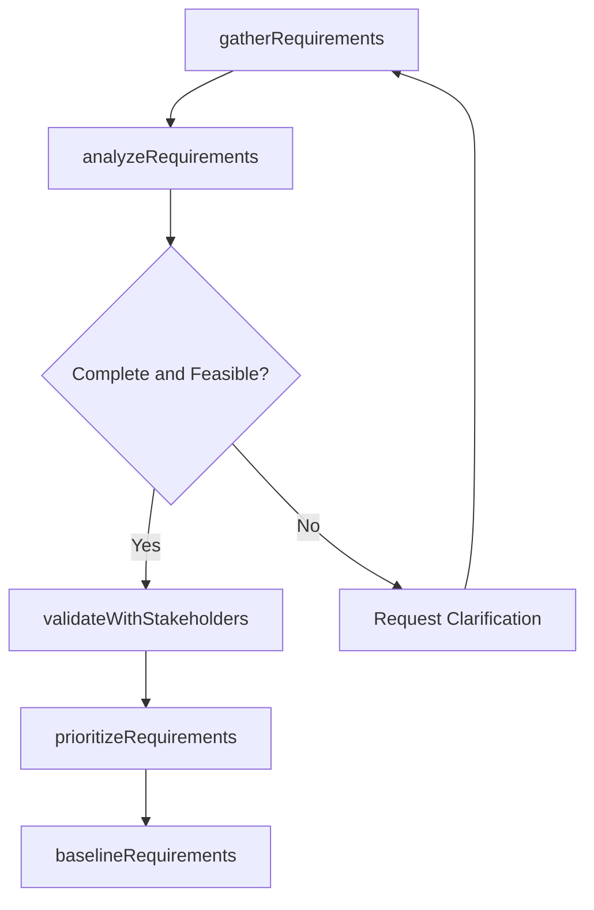

# Assess and validate IT service/solution requirements

> Business-as-Code definition for systematically evaluating and validating the functional, non-functional, and technical requirements for IT services and solutions to ensure completeness, feasibility, and alignment with business needs.

## Overview

Evaluating and validating the requirements and needs of IT service/solution.

## Process Hierarchy



## GraphDL

```yaml
assess:
  object: And Validate IT Service/solution Requirements
  actor: RequirementsAnalyst
  result: ValidatedRequirementsDocument
```

## Actions

| Action | Description |
|--------|-------------|
| gatherRequirements | Collect functional, non-functional, and technical requirements from stakeholders |
| analyzeRequirements | Evaluate requirements for completeness, consistency, and feasibility |
| validateWithStakeholders | Review requirements with business stakeholders to confirm accuracy |
| prioritizeRequirements | Rank requirements by business value, risk, and implementation complexity |
| baselineRequirements | Approve and baseline the validated requirements for development |

## Events

| Event | Description |
|-------|-------------|
| requirementsGathered | Requirements collected from all stakeholder groups |
| requirementsAnalyzed | Requirements evaluated for completeness and feasibility |
| requirementsValidated | Requirements confirmed with business stakeholders |
| requirementsPrioritized | Requirements ranked by value and complexity |
| requirementsBaselined | Validated requirements approved and baselined |

## Searches

| Search | Description |
|--------|-------------|
| getRequirements | Retrieve requirements filtered by service, priority, or status |
| getValidationStatus | Get the validation status and outstanding issues for requirements |
| getRequirementsTraceability | Retrieve traceability matrix linking requirements to design and tests |

## Process Flow



## RACI Matrix

| Activity | Responsible | Accountable | Consulted | Informed |
|----------|-------------|-------------|-----------|----------|
| gatherRequirements | RequirementsAnalyst | DevelopmentLead | BusinessStakeholders | ProjectManagers |
| analyzeRequirements | RequirementsAnalyst | DevelopmentLead | SolutionArchitect | QualityAssurance |
| baselineRequirements | RequirementsAnalyst | DevelopmentLead | ProductOwner | DevelopmentTeam |

## Related Processes

| Process | Relationship |
|---------|-------------|
| 8.5.4.1.2 Create service/solution design | Downstream - validated requirements drive design |
| 8.5.4.1.5 Execute IT service/solution validation | Downstream - requirements serve as validation criteria |
| 8.5.2.2 Identify IT services/solutions | Upstream - service identification generates initial requirements |

## Related Departments

| Department | Role |
|-----------|------|
| Business Analysis | Gathers and documents requirements |
| Software Engineering | Reviews technical feasibility of requirements |
| Quality Assurance | Validates testability of requirements |

## Related Occupations

| Occupation | Involvement |
|-----------|-------------|
| Requirements Analyst | Gathers, analyzes, and validates requirements |
| Business Analyst | Translates business needs into requirements |
| Solution Architect | Reviews technical feasibility |

## KPIs

| KPI | Description | Unit |
|-----|-------------|------|
| Requirements Stability | Percentage of baselined requirements unchanged during development | % |
| Validation Cycle Time | Average time from requirements gathering to baseline approval | Days |
| Requirements Coverage | Percentage of business needs traced to validated requirements | % |

## Usage

```typescript
import { assessAndValidateItServiceSolutionRequirements } from '@headlessly/assess-and-validate-it-service-solution-requirements'

const requirements = assessAndValidateItServiceSolutionRequirements()

// Get validated requirements
const validated = await requirements.getRequirements({
  serviceId: 'customer-analytics-platform',
  status: 'baselined',
  priority: 'high'
})

// Check traceability
const traceability = await requirements.getRequirementsTraceability({
  serviceId: 'customer-analytics-platform',
  includeTestCoverage: true
})
```
