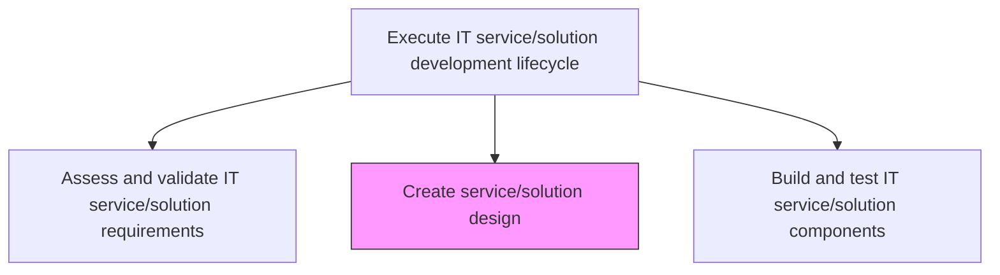
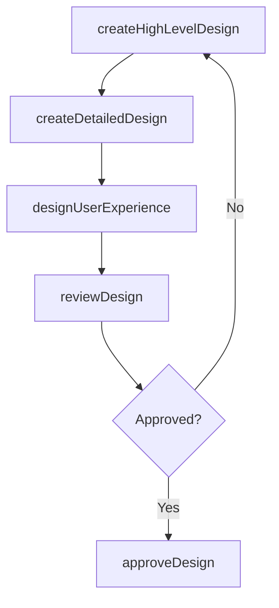

# Create service/solution design

> Business-as-Code definition for formulating the technical and functional design of an IT service or solution, translating validated requirements into a structured architecture and implementation blueprint.

## Overview

Formulating a design for service/solution that helps an organization to meet its objectives. Develop a new framework for molding the service/solution processes into a coherent and structured form.

## Process Hierarchy



## GraphDL

```yaml
create:
  object: Service/solution Design
  actor: SolutionDesigner
  result: DesignSpecification
```

## Actions

| Action | Description |
|--------|-------------|
| createHighLevelDesign | Develop the overall solution architecture and component interaction model |
| createDetailedDesign | Produce detailed technical designs for each component including data models and APIs |
| designUserExperience | Define user interface layouts, workflows, and interaction patterns |
| reviewDesign | Conduct design reviews with architecture and development stakeholders |
| approveDesign | Obtain formal approval for the design specification before development begins |

## Events

| Event | Description |
|-------|-------------|
| highLevelDesignCreated | Overall solution architecture and component model developed |
| detailedDesignCreated | Detailed technical designs for components produced |
| userExperienceDesigned | User interface and interaction patterns defined |
| designReviewed | Design review with stakeholders completed |
| designApproved | Design specification formally approved for development |

## Searches

| Search | Description |
|--------|-------------|
| getDesignDocuments | Retrieve design documents filtered by service, version, or status |
| getDesignReviewFeedback | List design review comments and feedback by reviewer or status |
| getDesignTraceability | Retrieve traceability between requirements and design elements |

## Process Flow



## RACI Matrix

| Activity | Responsible | Accountable | Consulted | Informed |
|----------|-------------|-------------|-----------|----------|
| createHighLevelDesign | SolutionDesigner | DevelopmentLead | SolutionArchitect | ProjectManagers |
| createDetailedDesign | SolutionDesigner | DevelopmentLead | SeniorDevelopers | QualityAssurance |
| reviewDesign | SolutionDesigner | DevelopmentLead | EnterpriseArchitect | SecurityTeam |

## Related Processes

| Process | Relationship |
|---------|-------------|
| 8.5.4.1.1 Assess and validate IT service/solution requirements | Upstream - validated requirements drive design |
| 8.5.4.1.3 Build and test IT service/solution components | Downstream - design specification guides development |
| 8.5.3.6 Develop and maintain service/solution architectures | Upstream - architecture standards inform design |

## Related Departments

| Department | Role |
|-----------|------|
| Solution Design | Creates technical and functional designs |
| Software Engineering | Reviews and implements designs |
| UX Design | Contributes user experience design |

## Related Occupations

| Occupation | Involvement |
|-----------|-------------|
| Solution Designer | Creates high-level and detailed technical designs |
| UX Designer | Designs user interface and interaction patterns |
| Software Architect | Reviews design for architecture compliance |

## KPIs

| KPI | Description | Unit |
|-----|-------------|------|
| Design Approval Cycle Time | Average time from design start to formal approval | Days |
| Design Defect Rate | Number of design defects discovered during development | Count |
| Requirements Traceability | Percentage of requirements with corresponding design elements | % |

## Usage

```typescript
import { createServiceSolutionDesign } from '@headlessly/create-service-solution-design'

const design = createServiceSolutionDesign()

// Get design documents
const docs = await design.getDesignDocuments({
  serviceId: 'customer-analytics-platform',
  version: 'latest',
  status: 'approved'
})

// Review design traceability
const traceability = await design.getDesignTraceability({
  serviceId: 'customer-analytics-platform',
  includeGaps: true
})
```
