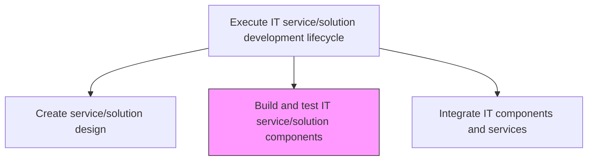
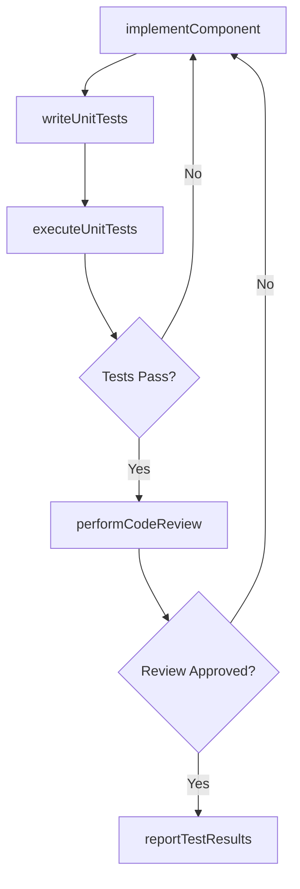

# Build and test IT service/solution components

> Business-as-Code definition for implementing and testing the individual components of an IT service or solution, including coding, unit testing, and component-level verification against design specifications.

## Overview

Building and testing new components required for the development of IT services and solutions.

## Process Hierarchy



## GraphDL

```yaml
build:
  object: And Test IT Service/solution Components
  actor: SoftwareDeveloper
  result: TestedComponent
```

## Actions

| Action | Description |
|--------|-------------|
| implementComponent | Write code and configuration for individual service components |
| writeUnitTests | Create unit tests that verify component behavior against specifications |
| executeUnitTests | Run unit test suites and verify component correctness |
| performCodeReview | Conduct peer code reviews to ensure quality and standards compliance |
| reportTestResults | Document test results, coverage metrics, and outstanding defects |

## Events

| Event | Description |
|-------|-------------|
| componentImplemented | Component code and configuration completed |
| unitTestsWritten | Unit tests created for the component |
| unitTestsExecuted | Unit test suite executed with results recorded |
| codeReviewCompleted | Peer code review conducted and feedback addressed |
| testResultsReported | Test results and coverage metrics documented |

## Searches

| Search | Description |
|--------|-------------|
| getBuildStatus | Retrieve build status for components filtered by service or sprint |
| getTestResults | List unit test results by component, status, or date |
| getCodeReviewFeedback | Retrieve code review comments and resolution status |

## Process Flow



## RACI Matrix

| Activity | Responsible | Accountable | Consulted | Informed |
|----------|-------------|-------------|-----------|----------|
| implementComponent | SoftwareDeveloper | DevelopmentLead | SolutionDesigner | ProjectManagers |
| executeUnitTests | SoftwareDeveloper | DevelopmentLead | QAEngineer | TeamLead |
| performCodeReview | SoftwareDeveloper | DevelopmentLead | SeniorDevelopers | QualityAssurance |

## Related Processes

| Process | Relationship |
|---------|-------------|
| 8.5.4.1.2 Create service/solution design | Upstream - design specification guides component development |
| 8.5.4.1.4 Integrate IT components and services | Downstream - tested components are ready for integration |
| 8.5.1.3 Identify, deploy, and support development methodologies and tools | Upstream - tools support build and test activities |

## Related Departments

| Department | Role |
|-----------|------|
| Software Engineering | Builds and unit-tests components |
| Quality Assurance | Reviews test coverage and quality metrics |
| DevOps | Provides build and test automation infrastructure |

## Related Occupations

| Occupation | Involvement |
|-----------|-------------|
| Software Developer | Implements components and writes unit tests |
| QA Engineer | Reviews test coverage and quality |
| DevOps Engineer | Maintains build and test pipelines |

## KPIs

| KPI | Description | Unit |
|-----|-------------|------|
| Unit Test Coverage | Percentage of code covered by unit tests | % |
| Build Success Rate | Percentage of builds completing without errors | % |
| Code Review Turnaround | Average time from code submission to review completion | Hours |

## Usage

```typescript
import { buildAndTestItServiceSolutionComponents } from '@headlessly/build-and-test-it-service-solution-components'

const build = buildAndTestItServiceSolutionComponents()

// Get build status
const status = await build.getBuildStatus({
  serviceId: 'customer-analytics-platform',
  sprint: 'sprint-12'
})

// Get test results
const results = await build.getTestResults({
  component: 'data-ingestion-service',
  status: 'failed'
})
```
