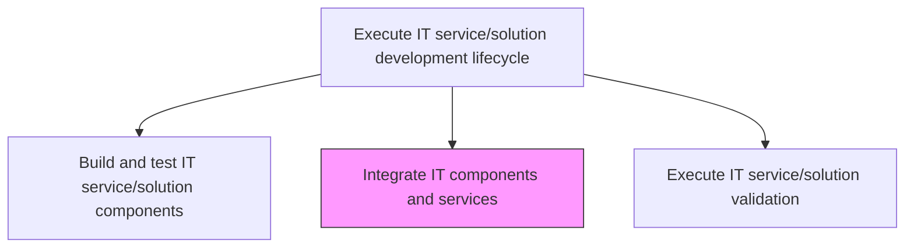
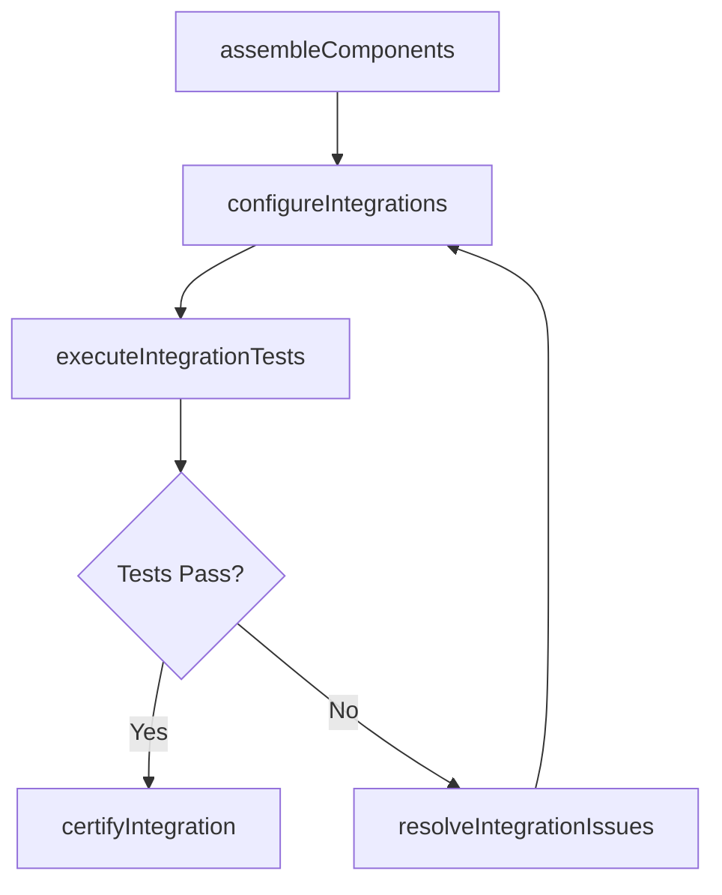

# Integrate IT components and services

> Business-as-Code definition for combining individually built and tested IT components into a unified service, verifying that components interact correctly and the integrated solution meets integration requirements.

## Overview

Combining the newly built IT component along with IT services in order to gain optimum output.

## Process Hierarchy



## GraphDL

```yaml
integrate:
  object: IT Components And Services
  actor: IntegrationEngineer
  result: IntegratedServiceBuild
```

## Actions

| Action | Description |
|--------|-------------|
| assembleComponents | Combine individual components into an integrated service build |
| configureIntegrations | Set up connections, data flows, and messaging between components |
| executeIntegrationTests | Run integration test suites to verify component interactions |
| resolveIntegrationIssues | Debug and fix issues discovered during integration testing |
| certifyIntegration | Confirm the integrated build meets integration acceptance criteria |

## Events

| Event | Description |
|-------|-------------|
| componentsAssembled | Individual components combined into an integrated build |
| integrationsConfigured | Component connections and data flows configured |
| integrationTestsExecuted | Integration test suites completed |
| integrationIssuesResolved | Integration defects debugged and fixed |
| integrationCertified | Integrated build certified as meeting acceptance criteria |

## Searches

| Search | Description |
|--------|-------------|
| getIntegrationStatus | Retrieve the current integration status for a service build |
| getIntegrationTestResults | List integration test results by component pair or test suite |
| getIntegrationIssues | Retrieve outstanding integration issues by severity or component |

## Process Flow



## RACI Matrix

| Activity | Responsible | Accountable | Consulted | Informed |
|----------|-------------|-------------|-----------|----------|
| assembleComponents | IntegrationEngineer | DevelopmentLead | SolutionArchitect | ProjectManagers |
| executeIntegrationTests | IntegrationEngineer | DevelopmentLead | QAEngineer | DevelopmentTeam |
| certifyIntegration | IntegrationEngineer | DevelopmentLead | QualityAssurance | ReleaseManager |

## Related Processes

| Process | Relationship |
|---------|-------------|
| 8.5.4.1.3 Build and test IT service/solution components | Upstream - tested components are assembled for integration |
| 8.5.4.1.5 Execute IT service/solution validation | Downstream - integrated build is submitted for validation |
| 8.5.3.3 Determine IT component integration requirements | Upstream - integration requirements guide assembly and testing |

## Related Departments

| Department | Role |
|-----------|------|
| Integration Engineering | Assembles and tests integrated builds |
| Quality Assurance | Validates integration test coverage and results |
| DevOps | Provides integration environments and automation |

## Related Occupations

| Occupation | Involvement |
|-----------|-------------|
| Integration Engineer | Assembles components and runs integration tests |
| QA Engineer | Designs and reviews integration test suites |
| DevOps Engineer | Manages integration environments |

## KPIs

| KPI | Description | Unit |
|-----|-------------|------|
| Integration Test Pass Rate | Percentage of integration tests passing on first run | % |
| Integration Cycle Time | Average time from component assembly to integration certification | Days |
| Integration Defect Rate | Number of defects found during integration testing | Count |

## Usage

```typescript
import { integrateItComponentsAndServices } from '@headlessly/integrate-it-components-and-services'

const integration = integrateItComponentsAndServices()

// Check integration status
const status = await integration.getIntegrationStatus({
  serviceId: 'customer-analytics-platform',
  buildNumber: 42
})

// Get integration test results
const results = await integration.getIntegrationTestResults({
  serviceId: 'customer-analytics-platform',
  suite: 'api-contract-tests'
})
```
