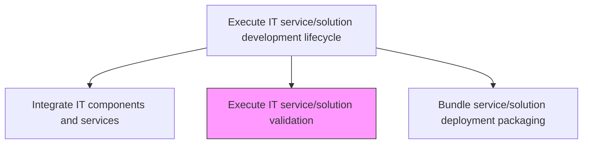
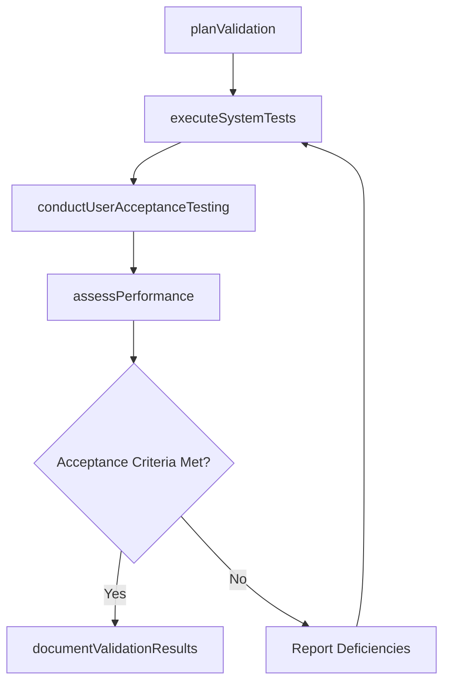

# Execute IT service/solution validation

> Business-as-Code definition for conducting comprehensive validation of the integrated IT service or solution against business requirements, ensuring it delivers the intended functionality and meets acceptance criteria.

## Overview

Validating that the proposed IT service/solution is feasible and provides the needed services for the customer.

## Process Hierarchy



## GraphDL

```yaml
execute:
  object: IT Service/solution Validation
  actor: ValidationLead
  result: ValidationReport
```

## Actions

| Action | Description |
|--------|-------------|
| planValidation | Define the validation strategy, test scenarios, and acceptance criteria |
| executeSystemTests | Run end-to-end system tests against the integrated solution |
| conductUserAcceptanceTesting | Facilitate user acceptance testing with business stakeholders |
| assessPerformance | Validate non-functional requirements including performance and scalability |
| documentValidationResults | Compile validation findings and acceptance decision |

## Events

| Event | Description |
|-------|-------------|
| validationPlanned | Validation strategy and test scenarios defined |
| systemTestsExecuted | End-to-end system testing completed |
| userAcceptanceCompleted | User acceptance testing with stakeholders finished |
| performanceAssessed | Non-functional requirements validation completed |
| validationResultsDocumented | Validation findings and acceptance decision recorded |

## Searches

| Search | Description |
|--------|-------------|
| getValidationPlan | Retrieve the validation plan with test scenarios and criteria |
| getValidationResults | List validation test results by type, status, or severity |
| getAcceptanceDecision | Get the acceptance decision and outstanding conditions |

## Process Flow



## RACI Matrix

| Activity | Responsible | Accountable | Consulted | Informed |
|----------|-------------|-------------|-----------|----------|
| planValidation | ValidationLead | DevelopmentLead | ProductOwner | ProjectManagers |
| conductUserAcceptanceTesting | ValidationLead | DevelopmentLead | BusinessStakeholders | ITManagement |
| documentValidationResults | ValidationLead | DevelopmentLead | QualityAssurance | ReleaseManager |

## Related Processes

| Process | Relationship |
|---------|-------------|
| 8.5.4.1.4 Integrate IT components and services | Upstream - integrated build is submitted for validation |
| 8.5.4.1.6 Bundle service/solution deployment packaging | Downstream - validated solution is packaged for deployment |
| 8.5.4.1.1 Assess and validate IT service/solution requirements | Upstream - requirements define validation criteria |

## Related Departments

| Department | Role |
|-----------|------|
| Quality Assurance | Plans and executes validation testing |
| Business Operations | Participates in user acceptance testing |
| Performance Engineering | Conducts performance and scalability validation |

## Related Occupations

| Occupation | Involvement |
|-----------|-------------|
| Validation Lead | Plans and coordinates validation activities |
| QA Engineer | Executes system and acceptance tests |
| Performance Engineer | Conducts performance validation |

## KPIs

| KPI | Description | Unit |
|-----|-------------|------|
| Acceptance Test Pass Rate | Percentage of acceptance test cases passing | % |
| Validation Cycle Time | Average time from validation start to acceptance decision | Days |
| Performance SLA Compliance | Percentage of non-functional requirements meeting SLA targets | % |

## Usage

```typescript
import { executeItServiceSolutionValidation } from '@headlessly/execute-it-service-solution-validation'

const validation = executeItServiceSolutionValidation()

// Get validation results
const results = await validation.getValidationResults({
  serviceId: 'customer-analytics-platform',
  type: 'user-acceptance',
  status: 'failed'
})

// Check acceptance decision
const decision = await validation.getAcceptanceDecision({
  serviceId: 'customer-analytics-platform',
  version: '2.0'
})
```
