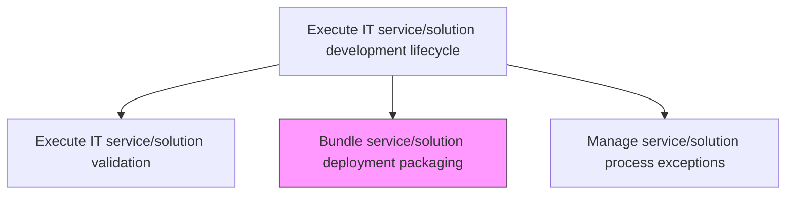
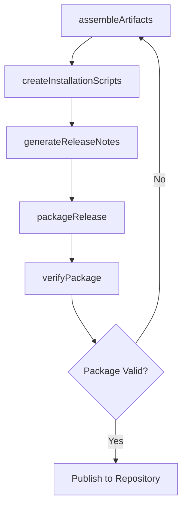

# Bundle service/solution deployment packaging

> Business-as-Code definition for assembling validated service and solution artifacts into deployment-ready packages, including release notes, configuration scripts, and installation procedures.

## Overview

Creating and implementing a strategy for the deployment of IT service/solution by defining all of the activities that make the IT function available for use. Define the deployment process, procedures, and tools. Select the most feasible and practical methodologies for the deployment process.

## Process Hierarchy



## GraphDL

```yaml
bundle:
  object: Service/solution Deployment Packaging
  actor: ReleaseEngineer
  result: DeploymentPackage
```

## Actions

| Action | Description |
|--------|-------------|
| assembleArtifacts | Gather all validated build artifacts, configurations, and dependencies |
| createInstallationScripts | Develop installation, configuration, and migration scripts |
| generateReleaseNotes | Document changes, new features, bug fixes, and known issues |
| packageRelease | Bundle all artifacts and documentation into a deployment-ready package |
| verifyPackage | Run smoke tests on the deployment package to confirm integrity |

## Events

| Event | Description |
|-------|-------------|
| artifactsAssembled | All validated build artifacts gathered |
| installationScriptsCreated | Installation and configuration scripts developed |
| releaseNotesGenerated | Release documentation completed |
| releasePackaged | Deployment-ready package bundled |
| packageVerified | Deployment package integrity confirmed through smoke tests |

## Searches

| Search | Description |
|--------|-------------|
| getDeploymentPackages | Retrieve deployment packages filtered by service, version, or status |
| getReleaseNotes | Get release notes for a specific package version |
| getPackageArtifacts | List all artifacts included in a deployment package |

## Process Flow



## RACI Matrix

| Activity | Responsible | Accountable | Consulted | Informed |
|----------|-------------|-------------|-----------|----------|
| assembleArtifacts | ReleaseEngineer | DevelopmentLead | DevOpsTeam | QualityAssurance |
| packageRelease | ReleaseEngineer | DevelopmentLead | InfrastructureTeam | DeploymentTeam |
| verifyPackage | ReleaseEngineer | DevelopmentLead | QAEngineer | ReleaseManager |

## Related Processes

| Process | Relationship |
|---------|-------------|
| 8.5.4.1.5 Execute IT service/solution validation | Upstream - validated solution is packaged for deployment |
| 8.6.4.3 Execute internal IT implementation plan | Downstream - deployment package is used during implementation |
| 8.6.3.5 Create and communicate deployment schedule | Downstream - package readiness enables deployment scheduling |

## Related Departments

| Department | Role |
|-----------|------|
| Release Engineering | Assembles and verifies deployment packages |
| DevOps | Provides packaging automation and artifact repositories |
| Technical Writing | Contributes release documentation |

## Related Occupations

| Occupation | Involvement |
|-----------|-------------|
| Release Engineer | Creates and verifies deployment packages |
| DevOps Engineer | Automates packaging and artifact management |
| Technical Writer | Authors release notes and documentation |

## KPIs

| KPI | Description | Unit |
|-----|-------------|------|
| Package Build Success Rate | Percentage of deployment packages built without errors | % |
| Packaging Cycle Time | Average time from validation approval to package publication | Hours |
| Package Smoke Test Pass Rate | Percentage of packages passing smoke tests on first attempt | % |

## Usage

```typescript
import { bundleServiceSolutionDeploymentPackaging } from '@headlessly/bundle-service-solution-deployment-packaging'

const packaging = bundleServiceSolutionDeploymentPackaging()

// Get deployment packages
const packages = await packaging.getDeploymentPackages({
  serviceId: 'customer-analytics-platform',
  status: 'verified'
})

// Get release notes
const notes = await packaging.getReleaseNotes({
  serviceId: 'customer-analytics-platform',
  version: '2.0.0'
})
```
