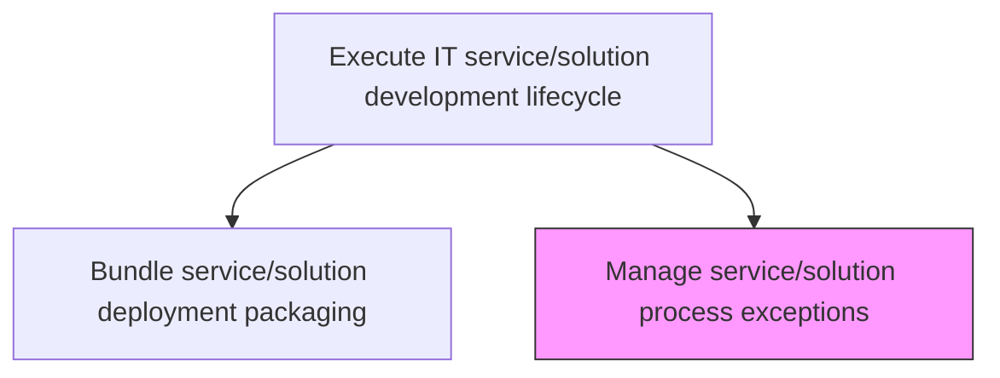
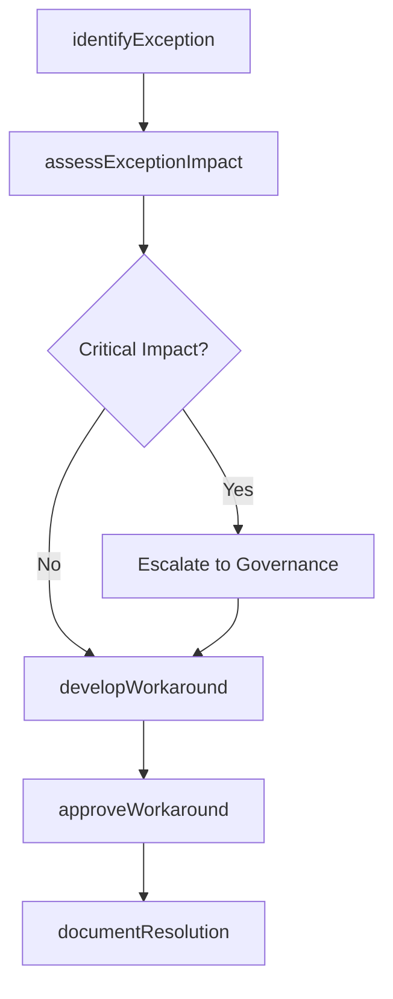

# Manage service/solution process exceptions

> Business-as-Code definition for identifying, evaluating, and resolving exceptions to standard development processes that arise during IT service and solution creation, ensuring deviations are controlled and documented.

## Overview

Identifying and resolving internal needs/inquiries for service/solution that cannot be resolved immediately. Research inquiries that require the need of exceptional solutions.

## Process Hierarchy



## GraphDL

```yaml
manage:
  object: Service/solution Process Exceptions
  actor: ProcessExceptionManager
  result: ExceptionResolutionRecord
```

## Actions

| Action | Description |
|--------|-------------|
| identifyException | Detect and log process exceptions encountered during development |
| assessExceptionImpact | Evaluate the impact of the exception on timeline, quality, and scope |
| developWorkaround | Create a workaround or alternative approach to address the exception |
| approveWorkaround | Obtain approval for the proposed workaround from governance |
| documentResolution | Record the exception, workaround, and lessons learned |

## Events

| Event | Description |
|-------|-------------|
| exceptionIdentified | Process exception detected and logged |
| exceptionImpactAssessed | Exception impact on timeline, quality, and scope evaluated |
| workaroundDeveloped | Alternative approach created to address the exception |
| workaroundApproved | Proposed workaround approved by governance |
| resolutionDocumented | Exception resolution and lessons learned recorded |

## Searches

| Search | Description |
|--------|-------------|
| getActiveExceptions | List active process exceptions filtered by project, type, or severity |
| getExceptionHistory | Retrieve historical exceptions with resolutions and lessons learned |
| getWorkaroundStatus | Get the approval status of proposed workarounds |

## Process Flow



## RACI Matrix

| Activity | Responsible | Accountable | Consulted | Informed |
|----------|-------------|-------------|-----------|----------|
| identifyException | ProcessExceptionManager | DevelopmentLead | DevelopmentTeam | ProjectManagers |
| assessExceptionImpact | ProcessExceptionManager | DevelopmentLead | SolutionArchitect | RiskManager |
| approveWorkaround | ProcessExceptionManager | DevelopmentLead | GovernanceOfficer | ITManagement |

## Related Processes

| Process | Relationship |
|---------|-------------|
| 8.5.1.7 Establish development standards exception governance | Upstream - governance framework defines exception handling procedures |
| 8.5.3.8 Manage architectural exceptions | Parallel - architectural exceptions follow similar governance patterns |
| 8.5.4.1.1 Assess and validate IT service/solution requirements | Parallel - requirement exceptions may trigger process exceptions |

## Related Departments

| Department | Role |
|-----------|------|
| Project Management Office | Tracks exception impact on project timelines |
| IT Governance | Approves workarounds for critical exceptions |
| Software Engineering | Identifies exceptions and develops workarounds |

## Related Occupations

| Occupation | Involvement |
|-----------|-------------|
| Process Exception Manager | Manages exception identification and resolution |
| Project Manager | Assesses schedule and resource impact |
| Governance Officer | Approves workarounds for critical exceptions |

## KPIs

| KPI | Description | Unit |
|-----|-------------|------|
| Exception Resolution Time | Average time from exception identification to resolution | Days |
| Exception Recurrence Rate | Percentage of exceptions that recur across projects | % |
| Workaround Approval Rate | Percentage of proposed workarounds approved | % |

## Usage

```typescript
import { manageServiceSolutionProcessExceptions } from '@headlessly/manage-service-solution-process-exceptions'

const exceptions = manageServiceSolutionProcessExceptions()

// Get active exceptions
const active = await exceptions.getActiveExceptions({
  project: 'customer-analytics-platform',
  severity: 'high'
})

// Review exception history for lessons learned
const history = await exceptions.getExceptionHistory({
  type: 'testing-process',
  since: '2025-01-01'
})
```
