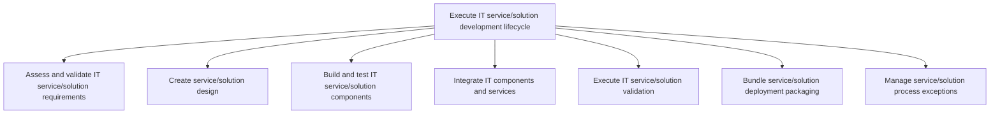
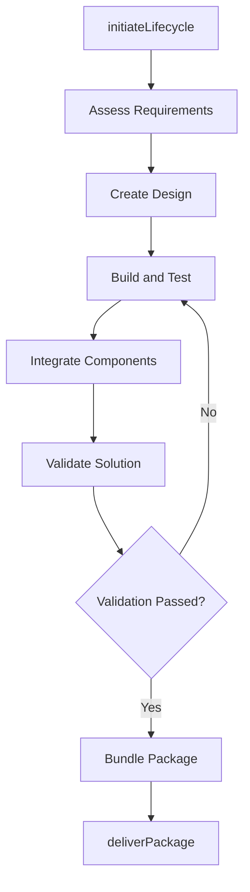

# Execute IT service/solution development lifecycle

> Business-as-Code definition for managing the end-to-end execution of the IT service and solution development lifecycle, from requirements validation through design, build, integration, testing, and deployment packaging.

## Overview

Executing an information system, aiming to produce a high quality system that meets or exceeds customer expectations, reaches completion within time and cost estimates, and is inexpensive to maintain and cost-effective to enhance.

## Process Hierarchy



## GraphDL

```yaml
execute:
  object: IT Service/solution Development Lifecycle
  actor: DevelopmentLead
  result: DeliveredServicePackage
```

## Actions

| Action | Description |
|--------|-------------|
| initiateLifecycle | Start the development lifecycle for a new service or solution |
| trackProgress | Monitor development progress against milestones and deliverables |
| manageQualityGates | Enforce quality gate reviews between lifecycle phases |
| coordinateTeams | Orchestrate work across development, testing, and integration teams |
| deliverPackage | Produce the final tested and packaged service ready for deployment |

## Events

| Event | Description |
|-------|-------------|
| lifecycleInitiated | Development lifecycle started for a new service |
| progressTracked | Development progress updated against milestones |
| qualityGatePassed | Quality gate review completed and phase approved |
| teamsCoordinated | Cross-team coordination checkpoint completed |
| packageDelivered | Final tested service package produced and ready for deployment |

## Searches

| Search | Description |
|--------|-------------|
| getLifecycleStatus | Retrieve the current development lifecycle status for a service |
| getQualityGateResults | List quality gate review results by phase or service |
| getMilestoneProgress | Get milestone progress and projected completion dates |

## Process Flow



## RACI Matrix

| Activity | Responsible | Accountable | Consulted | Informed |
|----------|-------------|-------------|-----------|----------|
| initiateLifecycle | DevelopmentLead | ITDirector | SolutionArchitect | ProjectManagers |
| manageQualityGates | DevelopmentLead | ITDirector | QualityAssurance | SteeringCommittee |
| deliverPackage | DevelopmentLead | ITDirector | ReleaseManager | OperationsTeam |

## Sub-Processes

| ID | Name | Description |
|----|------|-------------|
| 8.5.4.1.1 | Assess and validate IT service/solution requirements | Evaluating and validating the requirements and needs of IT service/solution. |
| 8.5.4.1.2 | Create service/solution design | Formulating a design for service/solution that helps an organization to meet its objectives. Develop |
| 8.5.4.1.3 | Build and test IT service/solution components | Building and testing new components required for the development of IT services and solutions. |
| 8.5.4.1.4 | Integrate IT components and services | Combining the newly built IT component along with IT services in order to gain optimum output. |
| 8.5.4.1.5 | Execute IT service/solution validation | Validating that the proposed IT service/solution is feasible and provides the needed services for th |
| 8.5.4.1.6 | Bundle service/solution deployment packaging | Creating and implementing a strategy for the deployment of IT service/solution by defining all of th |
| 8.5.4.1.7 | Manage service/solution process exceptions | Identifying and resolving internal needs/inquiries for service/solution that cannot be resolved imme |

## Related Processes

| Process | Relationship |
|---------|-------------|
| 8.5.3 Develop and manage service/solution architecture | Upstream - architecture governs development execution |
| 8.5.5.1 Execute IT service/solution maintenance lifecycle | Parallel - maintenance lifecycle follows development lifecycle |
| 8.6.4 Implement technology solutions | Downstream - delivered packages feed into deployment |

## Related Departments

| Department | Role |
|-----------|------|
| Software Engineering | Executes development and testing activities |
| Quality Assurance | Validates quality at each lifecycle phase |
| Release Engineering | Prepares deployment packages |

## Related Occupations

| Occupation | Involvement |
|-----------|-------------|
| Development Lead | Manages the development lifecycle execution |
| Software Engineer | Builds and tests service components |
| QA Engineer | Validates solution quality at each phase |

## KPIs

| KPI | Description | Unit |
|-----|-------------|------|
| On-Time Delivery Rate | Percentage of services delivered within planned timeline | % |
| Defect Density | Number of defects found per unit of development effort | Defects/KLOC |
| Quality Gate Pass Rate | Percentage of lifecycle phases passing quality gates on first attempt | % |

## Usage

```typescript
import { executeItServiceSolutionDevelopmentLifecycle } from '@headlessly/execute-it-service-solution-development-lifecycle'

const lifecycle = executeItServiceSolutionDevelopmentLifecycle()

// Check lifecycle status
const status = await lifecycle.getLifecycleStatus({
  serviceId: 'customer-analytics-platform',
  includePhaseDetails: true
})

// Get quality gate results
const gates = await lifecycle.getQualityGateResults({
  serviceId: 'customer-analytics-platform',
  phase: 'integration-testing'
})
```
