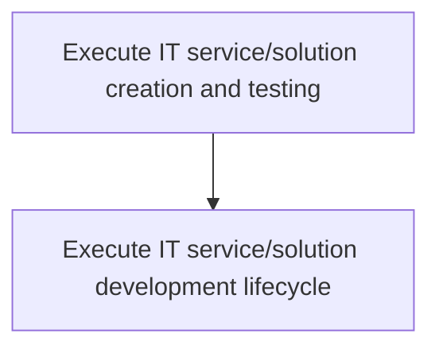
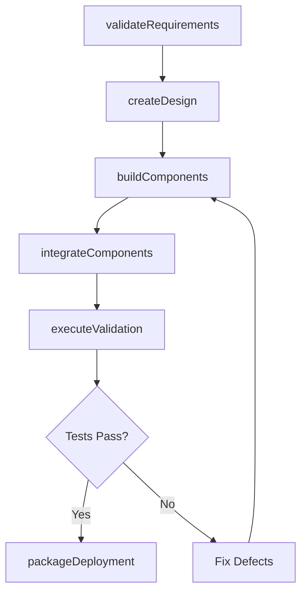

# Execute IT service/solution creation and testing

> Business-as-Code definition for executing the creation and testing of IT services and solutions, covering the full development lifecycle from requirements validation through design, build, integration, testing, and deployment packaging.

## Overview

Understanding customer requirements. Design the IT services and solutions based on the requirements. Develop components for providing the requirements. Train resources to provide support. Test the IT services and solutions in advance. Confirm the customer experience post-sale.

## Process Hierarchy



## GraphDL

```yaml
execute:
  object: IT Service/solution Creation And Testing
  actor: DevelopmentLead
  result: TestedServicePackage
```

## Actions

| Action | Description |
|--------|-------------|
| validateRequirements | Assess and confirm IT service requirements with stakeholders |
| createDesign | Produce the technical design for the service or solution |
| buildComponents | Develop and unit test individual service components |
| integrateComponents | Assemble and connect service components into a working solution |
| executeValidation | Run system integration and user acceptance testing |
| packageDeployment | Bundle the validated service for deployment |

## Events

| Event | Description |
|-------|-------------|
| requirementsValidated | Service requirements confirmed and signed off by stakeholders |
| designCreated | Technical design document produced and reviewed |
| componentsBuilt | Service components developed and unit tested |
| componentsIntegrated | Service components assembled into integrated solution |
| validationExecuted | System integration and acceptance testing completed |
| deploymentPackaged | Service bundled and ready for deployment |

## Searches

| Search | Description |
|--------|-------------|
| findBuilds | List service builds filtered by status, version, or date |
| getTestResults | Retrieve test execution results for a specific build |
| getDesignDocuments | Get technical design documents for a service |
| findPackages | List deployment packages ready for release |

## Process Flow



## RACI Matrix

| Activity | Responsible | Accountable | Consulted | Informed |
|----------|-------------|-------------|-----------|----------|
| validateRequirements | BusinessAnalyst | DevelopmentLead | ProductOwner | ProjectManager |
| createDesign | SolutionArchitect | DevelopmentLead | EnterpriseArchitect | QALead |
| buildComponents | SoftwareEngineer | DevelopmentLead | SolutionArchitect | ProjectManager |
| executeValidation | QAEngineer | QALead | SoftwareEngineer | DevelopmentLead |
| packageDeployment | BuildEngineer | DevelopmentLead | ReleaseManager | OperationsTeam |

## Sub-Processes

| ID | Name | Description |
|----|------|-------------|
| 8.5.4.1 | Execute IT service/solution development lifecycle | Executing an information system, aiming to produce a high quality system that meets or exceeds custo |

## Related Processes

| Process | Relationship |
|---------|-------------|
| 8.5.3 Develop and manage service/solution architecture | Upstream - provides architecture blueprint for creation |
| 8.5.5 Perform service/solution maintenance and testing | Downstream - receives deployed services for maintenance |
| 8.6 Deploy services/solutions | Downstream - receives packaged services for deployment |

## Related Departments

| Department | Role |
|-----------|------|
| Software Engineering | Builds and unit tests service components |
| Quality Assurance | Designs and executes test plans |
| Business Analysis | Validates requirements with stakeholders |
| Release Engineering | Packages services for deployment |

## Related Occupations

| Occupation | Involvement |
|-----------|-------------|
| Software Developer | Builds and tests service components |
| QA Engineer | Designs and executes validation tests |
| Business Analyst | Validates requirements and acceptance criteria |

## KPIs

| KPI | Description | Unit |
|-----|-------------|------|
| Build Success Rate | Percentage of builds that compile and pass unit tests | % |
| Defect Escape Rate | Number of defects found in production per release | Count |
| Test Pass Rate | Percentage of test cases passing on first execution | % |
| Development Velocity | Story points completed per sprint | Points/Sprint |

## Usage

```typescript
import { executeItServiceSolutionCreationAndTesting } from '@headlessly/execute-it-service-solution-creation-and-testing'

const creation = executeItServiceSolutionCreationAndTesting()

// Validate requirements
const requirements = await creation.validateRequirements({
  serviceId: 'svc-invoice-processor',
  stakeholders: ['finance-team', 'product-owner'],
  acceptanceCriteria: ['batch-processing', 'pdf-generation', 'email-delivery']
})

// Build components
const build = await creation.buildComponents({
  requirementsId: requirements.id,
  targetBranch: 'release/v2.1'
})

// Execute validation testing
const results = await creation.executeValidation({
  buildId: build.id,
  testSuites: ['integration', 'performance', 'security']
})
```
