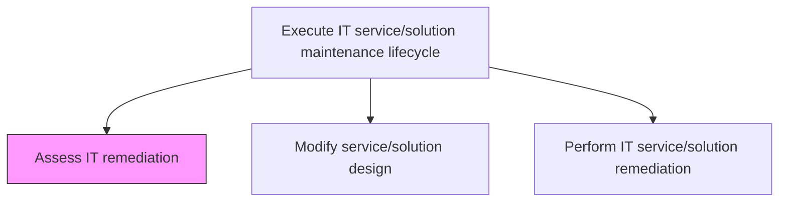
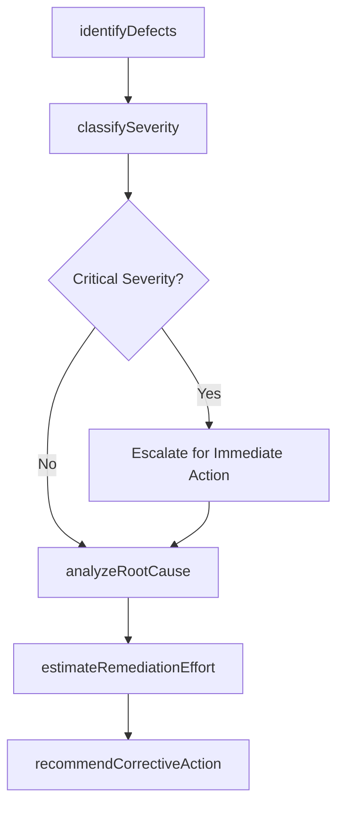

# Assess IT remediation

> Business-as-Code definition for evaluating IT service and solution defects, determining the scope and urgency of remediation efforts, and recommending corrective action plans to restore or enhance service functionality.

## Overview

Evaluate plans to address information technology environmental adulteration for rectification efforts.

## Process Hierarchy



## GraphDL

```yaml
assess:
  object: IT Remediation
  actor: RemediationAnalyst
  result: RemediationAssessmentReport
```

## Actions

| Action | Description |
|--------|-------------|
| identifyDefects | Catalog reported defects, failures, and performance degradations requiring remediation |
| classifySeverity | Assign severity and priority ratings based on business impact and urgency |
| analyzeRootCause | Investigate underlying causes of the defect or service degradation |
| estimateRemediationEffort | Determine the resources, timeline, and cost required for remediation |
| recommendCorrectiveAction | Propose remediation approaches ranked by effectiveness and feasibility |

## Events

| Event | Description |
|-------|-------------|
| defectsIdentified | Reported defects cataloged and documented |
| severityClassified | Severity and priority ratings assigned to defects |
| rootCauseAnalyzed | Root cause investigation completed with findings |
| remediationEffortEstimated | Resource, timeline, and cost estimates prepared |
| correctiveActionRecommended | Remediation approaches proposed and ranked |

## Searches

| Search | Description |
|--------|-------------|
| getDefectsByService | Retrieve reported defects filtered by service, severity, or status |
| getRootCauseAnalysis | Get root cause analysis findings for a specific defect |
| getRemediationEstimates | Retrieve effort and cost estimates for pending remediations |

## Process Flow



## RACI Matrix

| Activity | Responsible | Accountable | Consulted | Informed |
|----------|-------------|-------------|-----------|----------|
| identifyDefects | RemediationAnalyst | MaintenanceManager | ServiceDeskTeam | DevelopmentLead |
| analyzeRootCause | RemediationAnalyst | MaintenanceManager | SolutionArchitect | QualityAssurance |
| recommendCorrectiveAction | RemediationAnalyst | MaintenanceManager | DevelopmentLead | ITManagement |

## Related Processes

| Process | Relationship |
|---------|-------------|
| 8.5.5.1.2 Modify service/solution design | Downstream - assessment findings may trigger design modifications |
| 8.5.5.1.3 Perform IT service/solution remediation | Downstream - assessment informs remediation execution |
| 8.7.6.5 Monitor IT service delivery performance | Upstream - performance monitoring surfaces issues requiring assessment |

## Related Departments

| Department | Role |
|-----------|------|
| IT Maintenance Engineering | Conducts defect analysis and remediation assessment |
| Quality Assurance | Provides defect data and quality metrics |
| Service Operations | Reports operational issues requiring remediation |

## Related Occupations

| Occupation | Involvement |
|-----------|-------------|
| Remediation Analyst | Evaluates defects and recommends corrective actions |
| Quality Engineer | Provides defect analysis and testing data |
| Service Desk Analyst | Reports and triages initial defect submissions |

## KPIs

| KPI | Description | Unit |
|-----|-------------|------|
| Assessment Turnaround Time | Average time from defect report to remediation recommendation | Hours |
| Root Cause Identification Rate | Percentage of defects with confirmed root cause analysis | % |
| Assessment Accuracy | Percentage of assessments with accurate effort estimates | % |

## Usage

```typescript
import { assessItRemediation } from '@headlessly/assess-it-remediation'

const assessment = assessItRemediation()

// Get defects by service
const defects = await assessment.getDefectsByService({
  serviceId: 'customer-analytics-platform',
  severity: 'high',
  status: 'open'
})

// Get root cause analysis
const rootCause = await assessment.getRootCauseAnalysis({
  defectId: defects[0].id
})
```
