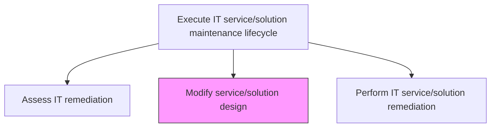
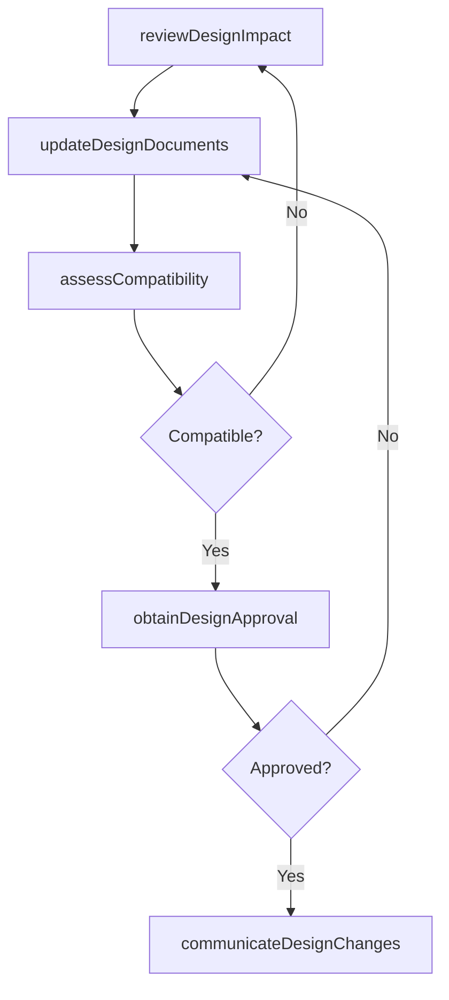

# Modify service/solution design

> Business-as-Code definition for updating and revising the design of IT services and solutions in response to remediation assessments, enhancement requests, or changing business requirements, ensuring modifications align with architectural standards.

## Overview

Redesign the roadmap to seek solution or service with an overall process flow and impact timeframe.

## Process Hierarchy



## GraphDL

```yaml
modify:
  object: Service/solution Design
  actor: SolutionDesigner
  result: RevisedDesignSpecification
```

## Actions

| Action | Description |
|--------|-------------|
| reviewDesignImpact | Analyze how proposed changes affect existing architecture and dependencies |
| updateDesignDocuments | Revise design specifications, diagrams, and interface contracts |
| assessCompatibility | Verify that modified designs remain compatible with integrated components |
| obtainDesignApproval | Submit revised designs for architectural review and stakeholder approval |
| communicateDesignChanges | Notify affected teams and update change records with design modifications |

## Events

| Event | Description |
|-------|-------------|
| designImpactReviewed | Impact analysis of proposed design changes completed |
| designDocumentsUpdated | Design specifications and diagrams revised |
| compatibilityAssessed | Compatibility with integrated components verified |
| designApprovalObtained | Revised design approved by architecture review board |
| designChangesCommunicated | Affected teams notified of design modifications |

## Searches

| Search | Description |
|--------|-------------|
| getDesignRevisions | Retrieve design revision history for a service or solution |
| getPendingDesignChanges | List design modifications awaiting review or approval |
| getDesignImpactAnalysis | Get the impact analysis for a proposed design change |

## Process Flow



## RACI Matrix

| Activity | Responsible | Accountable | Consulted | Informed |
|----------|-------------|-------------|-----------|----------|
| reviewDesignImpact | SolutionDesigner | MaintenanceManager | SolutionArchitect | DevelopmentTeam |
| updateDesignDocuments | SolutionDesigner | MaintenanceManager | IntegrationEngineer | QualityAssurance |
| obtainDesignApproval | SolutionDesigner | MaintenanceManager | ArchitectureReviewBoard | ProjectManagers |

## Related Processes

| Process | Relationship |
|---------|-------------|
| 8.5.5.1.1 Assess IT remediation | Upstream - remediation assessment identifies design changes needed |
| 8.5.5.1.3 Perform IT service/solution remediation | Downstream - modified design guides remediation execution |
| 8.5.3.6 Develop and maintain service/solution architectures | Parallel - architecture standards constrain design modifications |

## Related Departments

| Department | Role |
|-----------|------|
| Solution Architecture | Reviews and approves design modifications |
| Software Engineering | Implements design changes in code and configuration |
| Quality Assurance | Validates that design changes meet quality standards |

## Related Occupations

| Occupation | Involvement |
|-----------|-------------|
| Solution Designer | Authors and revises design specifications |
| Solution Architect | Reviews design changes for architectural compliance |
| Technical Writer | Updates documentation to reflect design modifications |

## KPIs

| KPI | Description | Unit |
|-----|-------------|------|
| Design Revision Cycle Time | Average time from design change request to approval | Days |
| Design Change Approval Rate | Percentage of design changes approved on first submission | % |
| Design Rework Rate | Percentage of design changes requiring revision after initial review | % |

## Usage

```typescript
import { modifyServiceSolutionDesign } from '@headlessly/modify-service-solution-design'

const design = modifyServiceSolutionDesign()

// Get design revisions
const revisions = await design.getDesignRevisions({
  serviceId: 'customer-analytics-platform',
  since: '2025-01-01'
})

// Get pending design changes
const pending = await design.getPendingDesignChanges({
  status: 'awaiting-approval'
})
```
