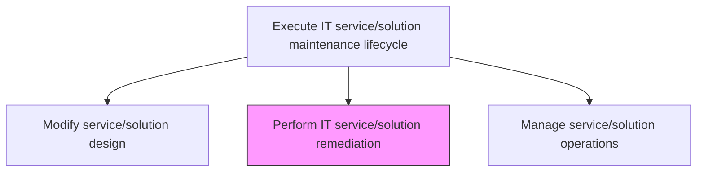
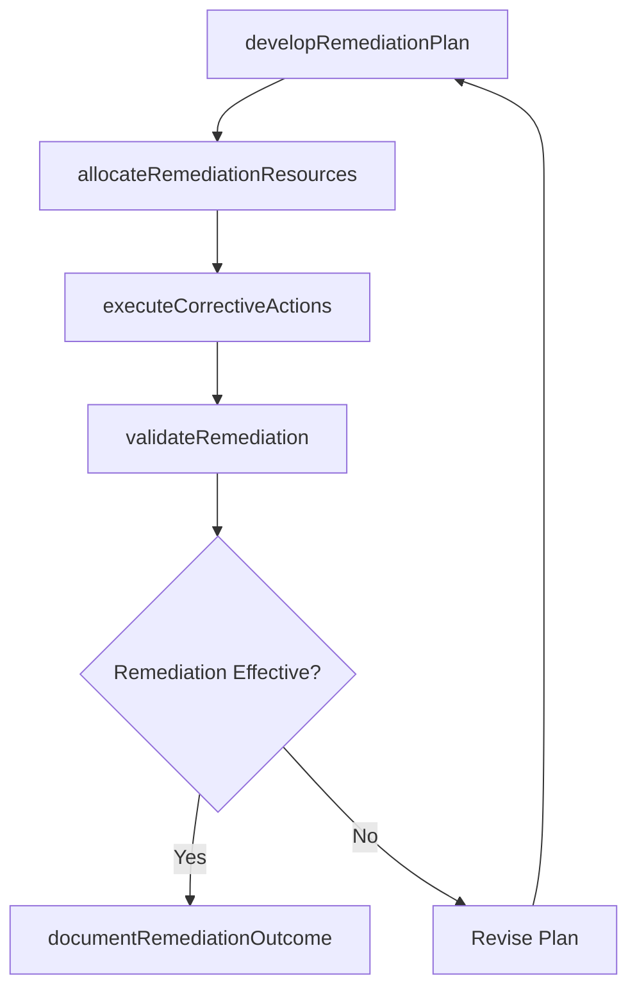

# Perform IT service/solution remediation

> Business-as-Code definition for executing corrective actions on IT services and solutions, including defect resolution, patch application, configuration adjustments, and validation of remediation effectiveness.

## Overview

Administering the efforts and activities for IT service/solution remediation. This process element requires the organization to create plans for corrective action in collaboration with government agencies and pertinent professional services agencies which specialize in remediation efforts relevant to the organization's service/solution. Additionally, the organization needs to consult experts to validate the plan, determine resources allocation, resolve any legal concerns, and formulate a company-wide policy for IT service/solution remediation.

## Process Hierarchy



## GraphDL

```yaml
perform:
  object: IT Service/solution Remediation
  actor: RemediationEngineer
  result: RemediationCompletionRecord
```

## Actions

| Action | Description |
|--------|-------------|
| developRemediationPlan | Create a detailed plan for corrective actions including scope, timeline, and resources |
| allocateRemediationResources | Assign engineering staff, tools, and environments needed for remediation work |
| executeCorrectiveActions | Implement code fixes, patches, configuration changes, and infrastructure adjustments |
| validateRemediation | Test that corrective actions resolve the identified issues without introducing regressions |
| documentRemediationOutcome | Record remediation results, lessons learned, and knowledge base updates |

## Events

| Event | Description |
|-------|-------------|
| remediationPlanDeveloped | Detailed corrective action plan created and approved |
| remediationResourcesAllocated | Engineering staff and tools assigned to remediation work |
| correctiveActionsExecuted | Code fixes, patches, and configuration changes implemented |
| remediationValidated | Corrective actions tested and confirmed effective |
| remediationOutcomeDocumented | Results and lessons learned recorded in knowledge base |

## Searches

| Search | Description |
|--------|-------------|
| getRemediationPlans | Retrieve remediation plans filtered by service, priority, or status |
| getRemediationProgress | Get the current progress of active remediation efforts |
| getRemediationHistory | Retrieve historical remediation records for a service or component |

## Process Flow



## RACI Matrix

| Activity | Responsible | Accountable | Consulted | Informed |
|----------|-------------|-------------|-----------|----------|
| developRemediationPlan | RemediationEngineer | MaintenanceManager | SolutionArchitect | ProjectManagers |
| executeCorrectiveActions | RemediationEngineer | MaintenanceManager | DevelopmentLead | ServiceOperations |
| validateRemediation | RemediationEngineer | MaintenanceManager | QAEngineer | BusinessStakeholders |

## Related Processes

| Process | Relationship |
|---------|-------------|
| 8.5.5.1.1 Assess IT remediation | Upstream - assessment determines remediation scope and approach |
| 8.5.5.1.2 Modify service/solution design | Upstream - design modifications guide remediation implementation |
| 8.5.5.1.5 Prepare fixed/enhanced service/solution packaging | Downstream - remediated components are packaged for release |

## Related Departments

| Department | Role |
|-----------|------|
| IT Maintenance Engineering | Executes remediation activities |
| Quality Assurance | Validates remediation effectiveness through testing |
| Service Operations | Monitors service health during and after remediation |

## Related Occupations

| Occupation | Involvement |
|-----------|-------------|
| Remediation Engineer | Executes corrective actions and validates fixes |
| QA Engineer | Tests remediation effectiveness and regression |
| DevOps Engineer | Manages remediation deployment to environments |

## KPIs

| KPI | Description | Unit |
|-----|-------------|------|
| Remediation Success Rate | Percentage of remediations that resolve the issue on first attempt | % |
| Mean Time to Remediate | Average time from remediation start to validated completion | Hours |
| Regression Introduction Rate | Percentage of remediations that introduce new defects | % |

## Usage

```typescript
import { performItServiceSolutionRemediation } from '@headlessly/perform-it-service-solution-remediation'

const remediation = performItServiceSolutionRemediation()

// Get remediation plans
const plans = await remediation.getRemediationPlans({
  serviceId: 'customer-analytics-platform',
  priority: 'critical',
  status: 'in-progress'
})

// Track remediation progress
const progress = await remediation.getRemediationProgress({
  planId: plans[0].id
})
```
