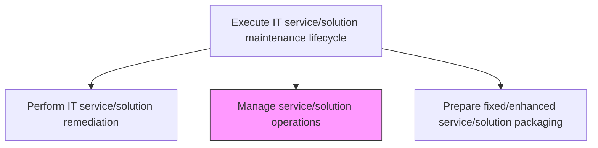
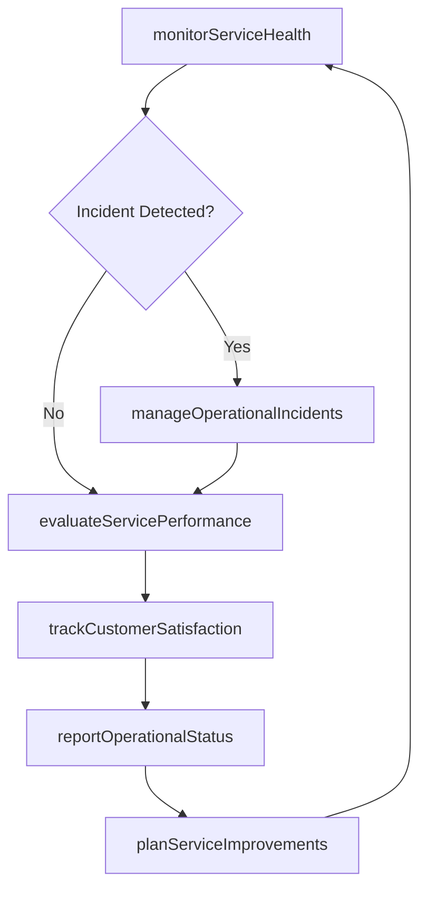

# Manage service/solution operations

> Business-as-Code definition for overseeing the day-to-day operational health of IT services and solutions, including monitoring performance, managing incidents, supporting customers, and ensuring continuous service improvement.

## Overview

Understanding customer requirements. Managing services/solutions based on the requirements. Develop components for providing the requirements. Train resources to provide support. Confirm the customer experience post-sale. Evaluate the performance of service/solution. Communicate the results to the management.

## Process Hierarchy



## GraphDL

```yaml
manage:
  object: Service/solution Operations
  actor: ServiceOperationsManager
  result: OperationalHealthReport
```

## Actions

| Action | Description |
|--------|-------------|
| monitorServiceHealth | Track service availability, performance, and error rates in real time |
| manageOperationalIncidents | Triage, assign, and coordinate resolution of operational incidents |
| trackCustomerSatisfaction | Collect and analyze customer feedback on service quality and experience |
| evaluateServicePerformance | Assess service performance against SLAs and operational benchmarks |
| reportOperationalStatus | Compile and communicate operational status reports to management |
| planServiceImprovements | Identify and prioritize operational improvements based on performance data |

## Events

| Event | Description |
|-------|-------------|
| serviceHealthMonitored | Real-time service metrics captured and anomalies detected |
| operationalIncidentManaged | Operational incident triaged, assigned, and resolved |
| customerSatisfactionTracked | Customer feedback collected and satisfaction metrics updated |
| servicePerformanceEvaluated | Service performance assessed against SLAs and benchmarks |
| operationalStatusReported | Operational status reports compiled and communicated |
| serviceImprovementsPlanned | Operational improvements identified and prioritized |

## Searches

| Search | Description |
|--------|-------------|
| getServiceHealthMetrics | Retrieve real-time health metrics for a service or solution |
| getOperationalIncidents | List operational incidents filtered by service, severity, or status |
| getCustomerSatisfactionScores | Get customer satisfaction scores and feedback for a service |
| getPerformanceReports | Retrieve SLA compliance and performance trend reports |

## Process Flow



## RACI Matrix

| Activity | Responsible | Accountable | Consulted | Informed |
|----------|-------------|-------------|-----------|----------|
| monitorServiceHealth | ServiceOperationsManager | ITServiceManager | DevOpsTeam | DevelopmentLead |
| manageOperationalIncidents | ServiceOperationsManager | ITServiceManager | IncidentResponseTeam | BusinessStakeholders |
| evaluateServicePerformance | ServiceOperationsManager | ITServiceManager | QualityAssurance | ITManagement |

## Related Processes

| Process | Relationship |
|---------|-------------|
| 8.5.5.1.3 Perform IT service/solution remediation | Upstream - remediations improve operational health |
| 8.5.5.1.5 Prepare fixed/enhanced service/solution packaging | Downstream - operational findings drive enhancement requests |
| 8.7.6 Develop and manage service delivery operations | Parallel - service delivery operations align with maintenance operations |

## Related Departments

| Department | Role |
|-----------|------|
| Service Operations | Manages day-to-day service health and incidents |
| Customer Support | Provides customer feedback and satisfaction data |
| IT Management | Reviews operational reports and approves improvement plans |

## Related Occupations

| Occupation | Involvement |
|-----------|-------------|
| Service Operations Manager | Oversees operational health and incident management |
| Site Reliability Engineer | Monitors and maintains service availability and performance |
| Customer Success Manager | Tracks customer satisfaction and experience |

## KPIs

| KPI | Description | Unit |
|-----|-------------|------|
| Service Availability | Percentage of time the service is operational and accessible | % |
| Mean Time to Resolve | Average time from incident detection to resolution | Hours |
| Customer Satisfaction Score | Average customer satisfaction rating for the service | Score (1-5) |

## Usage

```typescript
import { manageServiceSolutionOperations } from '@headlessly/manage-service-solution-operations'

const operations = manageServiceSolutionOperations()

// Get service health metrics
const health = await operations.getServiceHealthMetrics({
  serviceId: 'customer-analytics-platform',
  timeRange: 'last-24h'
})

// Get operational incidents
const incidents = await operations.getOperationalIncidents({
  serviceId: 'customer-analytics-platform',
  severity: 'critical',
  status: 'open'
})
```
