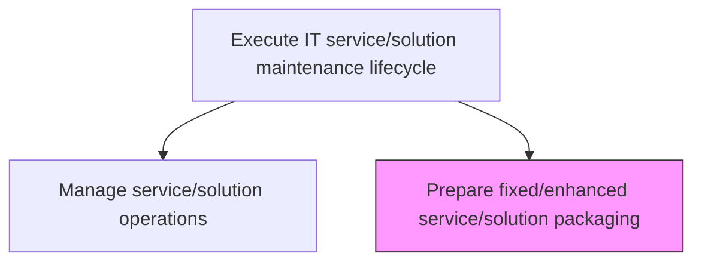
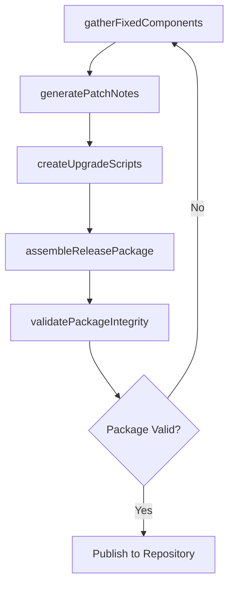

# Prepare fixed/enhanced service/solution packaging

> Business-as-Code definition for assembling remediated and enhanced service components into deployment-ready packages, including patch notes, upgrade scripts, and compatibility documentation for fixed or improved service offerings.

## Overview

Developing packaging for fixed/enhanced service/solution based on the standalone or bundled offerings to be used by the organization.

## Process Hierarchy



## GraphDL

```yaml
prepare:
  object: Fixed/enhanced Service/solution Packaging
  actor: ReleasePackagingEngineer
  result: MaintenanceReleasePackage
```

## Actions

| Action | Description |
|--------|-------------|
| gatherFixedComponents | Collect all remediated and enhanced components for inclusion in the release package |
| generatePatchNotes | Document all fixes, enhancements, known issues, and upgrade instructions |
| createUpgradeScripts | Develop migration and upgrade scripts for transitioning to the fixed version |
| assembleReleasePackage | Bundle components, documentation, and scripts into a deployment-ready package |
| validatePackageIntegrity | Run smoke tests and integrity checks on the assembled release package |

## Events

| Event | Description |
|-------|-------------|
| fixedComponentsGathered | All remediated and enhanced components collected for packaging |
| patchNotesGenerated | Patch documentation and upgrade instructions completed |
| upgradeScriptsCreated | Migration and upgrade scripts developed and tested |
| releasePackageAssembled | Deployment-ready package bundled with all artifacts |
| packageIntegrityValidated | Release package passed smoke tests and integrity checks |

## Searches

| Search | Description |
|--------|-------------|
| getMaintenanceReleases | Retrieve maintenance release packages filtered by service, version, or status |
| getPatchNotes | Get patch notes for a specific maintenance release version |
| getUpgradeCompatibility | Check compatibility requirements for upgrading between versions |

## Process Flow



## RACI Matrix

| Activity | Responsible | Accountable | Consulted | Informed |
|----------|-------------|-------------|-----------|----------|
| gatherFixedComponents | ReleasePackagingEngineer | MaintenanceManager | RemediationEngineer | QualityAssurance |
| assembleReleasePackage | ReleasePackagingEngineer | MaintenanceManager | DevOpsTeam | DeploymentTeam |
| validatePackageIntegrity | ReleasePackagingEngineer | MaintenanceManager | QAEngineer | ReleaseManager |

## Related Processes

| Process | Relationship |
|---------|-------------|
| 8.5.5.1.3 Perform IT service/solution remediation | Upstream - remediated components are inputs to packaging |
| 8.5.4.1.6 Bundle service/solution deployment packaging | Parallel - follows similar packaging workflows for maintenance releases |
| 8.6.3 Manage change deployment control | Downstream - maintenance packages enter the change deployment process |

## Related Departments

| Department | Role |
|-----------|------|
| Release Engineering | Assembles and validates maintenance release packages |
| DevOps | Provides packaging automation and artifact repository management |
| Technical Writing | Authors patch notes and upgrade documentation |

## Related Occupations

| Occupation | Involvement |
|-----------|-------------|
| Release Packaging Engineer | Assembles and validates maintenance release packages |
| DevOps Engineer | Automates packaging pipelines and manages repositories |
| Technical Writer | Authors patch notes and upgrade instructions |

## KPIs

| KPI | Description | Unit |
|-----|-------------|------|
| Package Build Success Rate | Percentage of maintenance packages built without errors | % |
| Packaging Cycle Time | Average time from component gathering to package publication | Hours |
| Patch Deployment Success Rate | Percentage of maintenance packages deployed successfully on first attempt | % |

## Usage

```typescript
import { prepareFixedEnhancedServiceSolutionPackaging } from '@headlessly/prepare-fixed-enhanced-service-solution-packaging'

const packaging = prepareFixedEnhancedServiceSolutionPackaging()

// Get maintenance releases
const releases = await packaging.getMaintenanceReleases({
  serviceId: 'customer-analytics-platform',
  status: 'validated'
})

// Get patch notes
const notes = await packaging.getPatchNotes({
  serviceId: 'customer-analytics-platform',
  version: '2.0.1'
})
```
