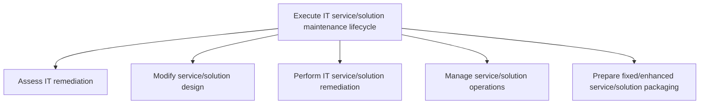
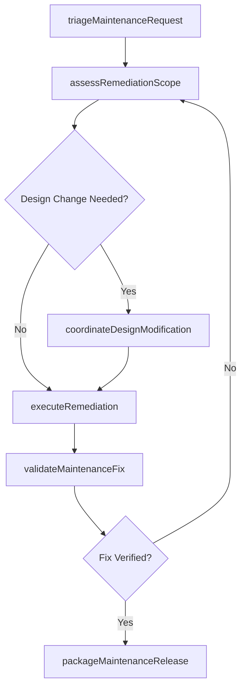

# Execute IT service/solution maintenance lifecycle

> Business-as-Code definition for managing the end-to-end maintenance lifecycle of IT services and solutions, from defect assessment and remediation through design modification, operational management, and repackaging of fixed or enhanced deliverables.

## Overview

Executing IT service/solution maintenance lifecycle in order to reduce maintenance costs and increase reliability of IT infrastructure concerning service/solution related problems.

## Process Hierarchy



## GraphDL

```yaml
execute:
  object: IT Service/solution Maintenance Lifecycle
  actor: MaintenanceManager
  result: MaintenanceLifecycleReport
```

## Actions

| Action | Description |
|--------|-------------|
| triageMaintenanceRequest | Classify and prioritize incoming maintenance requests by severity and impact |
| assessRemediationScope | Evaluate the scope of remediation required across affected services |
| coordinateDesignModification | Orchestrate design changes needed to address identified defects or enhancements |
| executeRemediation | Carry out corrective actions on impacted services and solutions |
| validateMaintenanceFix | Verify that maintenance changes resolve the identified issues without regression |
| packageMaintenanceRelease | Bundle validated fixes and enhancements into a deployable maintenance release |

## Events

| Event | Description |
|-------|-------------|
| maintenanceRequestTriaged | Maintenance request classified and prioritized |
| remediationScopeAssessed | Scope of remediation evaluated and documented |
| designModificationCoordinated | Design changes orchestrated and approved |
| remediationExecuted | Corrective actions completed on affected services |
| maintenanceFixValidated | Maintenance changes verified as resolving identified issues |
| maintenanceReleasePackaged | Validated fixes bundled into a deployable release |

## Searches

| Search | Description |
|--------|-------------|
| getMaintenanceRequests | Retrieve maintenance requests filtered by service, severity, or status |
| getRemediationStatus | Get the current remediation status for active maintenance items |
| getMaintenanceHistory | Retrieve historical maintenance activity for a service or solution |
| getMaintenanceMetrics | Get maintenance lifecycle performance metrics and trends |

## Process Flow



## RACI Matrix

| Activity | Responsible | Accountable | Consulted | Informed |
|----------|-------------|-------------|-----------|----------|
| triageMaintenanceRequest | MaintenanceManager | ITServiceManager | DevelopmentLead | ServiceDeskTeam |
| assessRemediationScope | MaintenanceManager | ITServiceManager | SolutionArchitect | ProjectManagers |
| executeRemediation | MaintenanceEngineer | MaintenanceManager | QualityAssurance | BusinessStakeholders |

## Sub-Processes

| ID | Name | Description |
|----|------|-------------|
| 8.5.5.1.1 | Assess IT remediation | Evaluate plans to address information technology environmental adulteration for rectification effort |
| 8.5.5.1.2 | Modify service/solution design | Redesign the roadmap to seek solution or service with an overall process flow and impact timeframe. |
| 8.5.5.1.3 | Perform IT service/solution remediation | Administering the efforts and activities for IT service/solution remediation. This process element r |
| 8.5.5.1.4 | Manage service/solution operations | Understanding customer requirements. Managing services/solutions based on the requirements. Develop  |
| 8.5.5.1.5 | Prepare fixed/enhanced service/solution packaging | Developing packaging for fixed/enhanced service/solution based on the standalone or bundled offering |

## Related Processes

| Process | Relationship |
|---------|-------------|
| 8.5.4.1 Execute IT service/solution development lifecycle | Upstream - development lifecycle produces services requiring ongoing maintenance |
| 8.5.4.1.6 Bundle service/solution deployment packaging | Downstream - maintenance releases follow similar packaging workflows |
| 8.7.6 Develop and manage service delivery operations | Parallel - operational issues feed into maintenance lifecycle |

## Related Departments

| Department | Role |
|-----------|------|
| IT Maintenance Engineering | Manages the end-to-end maintenance lifecycle |
| Quality Assurance | Validates maintenance fixes and regression testing |
| Service Operations | Identifies operational issues requiring maintenance |

## Related Occupations

| Occupation | Involvement |
|-----------|-------------|
| Maintenance Manager | Coordinates the overall maintenance lifecycle |
| Maintenance Engineer | Executes remediation and fixes |
| Service Delivery Manager | Ensures maintenance activities meet service level agreements |

## KPIs

| KPI | Description | Unit |
|-----|-------------|------|
| Mean Time to Repair | Average time from defect identification to fix deployment | Hours |
| Maintenance Backlog Age | Average age of open maintenance items | Days |
| Fix First-Time Success Rate | Percentage of maintenance fixes that resolve the issue without rework | % |

## Usage

```typescript
import { executeItServiceSolutionMaintenanceLifecycle } from '@headlessly/execute-it-service-solution-maintenance-lifecycle'

const maintenance = executeItServiceSolutionMaintenanceLifecycle()

// Get active maintenance requests
const requests = await maintenance.getMaintenanceRequests({
  serviceId: 'customer-analytics-platform',
  severity: 'critical',
  status: 'open'
})

// Check remediation status
const status = await maintenance.getRemediationStatus({
  requestId: requests[0].id
})
```
