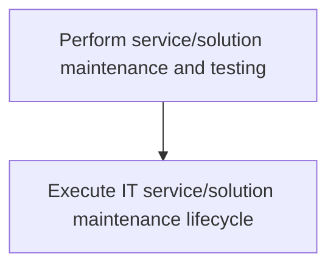
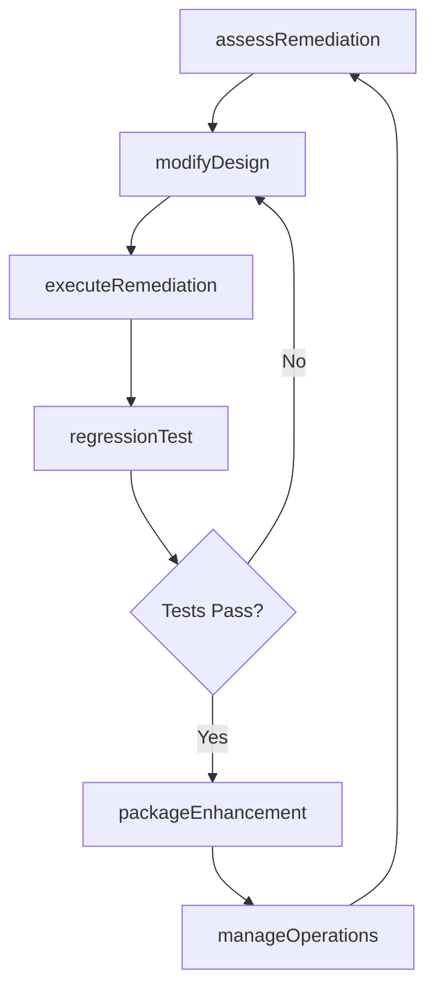

# Perform service/solution maintenance and testing

> Business-as-Code definition for performing preventative, routine, and corrective maintenance on IT services and solutions, including remediation assessment, design modification, operations management, and enhanced packaging.

## Overview

Engaging in all aspects of service/solution maintenance and testing includes all preventative, routine, and corrective activates. Ensure that IT service/solution are functioning properly and regulations where applicable.

## Process Hierarchy



## GraphDL

```yaml
perform:
  object: Service/solution Maintenance And Testing
  actor: MaintenanceEngineer
  result: MaintenanceRecord
```

## Actions

| Action | Description |
|--------|-------------|
| assessRemediation | Evaluate reported issues and determine the scope of remediation |
| modifyDesign | Update the service design to address defects or enhancements |
| executeRemediation | Apply patches, fixes, and corrective changes to the service |
| manageOperations | Monitor and manage ongoing service operations |
| packageEnhancement | Bundle fixes and enhancements into a maintenance release |
| regressionTest | Execute regression tests to verify maintenance changes |

## Events

| Event | Description |
|-------|-------------|
| remediationAssessed | Issue evaluation and remediation scope determined |
| designModified | Service design updated to address maintenance needs |
| remediationExecuted | Patches and corrective changes applied successfully |
| operationsManaged | Service operations monitoring cycle completed |
| enhancementPackaged | Maintenance release bundled and ready for deployment |
| regressionTested | Regression testing completed for maintenance changes |

## Searches

| Search | Description |
|--------|-------------|
| findMaintenanceItems | List pending maintenance items filtered by severity or service |
| getMaintenanceHistory | Retrieve maintenance history for a specific service |
| getRemediationStatus | Get the current status of an ongoing remediation effort |
| findRegressionResults | List regression test results by build or release |

## Process Flow



## RACI Matrix

| Activity | Responsible | Accountable | Consulted | Informed |
|----------|-------------|-------------|-----------|----------|
| assessRemediation | MaintenanceEngineer | MaintenanceLead | ServiceOwner | ProjectManager |
| modifyDesign | SoftwareEngineer | MaintenanceLead | SolutionArchitect | QATeam |
| executeRemediation | MaintenanceEngineer | MaintenanceLead | DevelopmentLead | OperationsTeam |
| regressionTest | QAEngineer | QALead | MaintenanceEngineer | ReleaseManager |

## Sub-Processes

| ID | Name | Description |
|----|------|-------------|
| 8.5.5.1 | Execute IT service/solution maintenance lifecycle | Executing IT service/solution maintenance lifecycle in order to reduce maintenance costs and increas |

## Related Processes

| Process | Relationship |
|---------|-------------|
| 8.5.4 Execute IT service/solution creation and testing | Upstream - provides initially created services requiring maintenance |
| 8.6 Deploy services/solutions | Downstream - receives maintenance releases for deployment |
| 8.7 Create and manage support services/solutions | Parallel - support identifies issues requiring maintenance |

## Related Departments

| Department | Role |
|-----------|------|
| Application Maintenance | Executes corrective and preventative maintenance |
| Quality Assurance | Performs regression and maintenance testing |
| IT Operations | Manages day-to-day service operations |
| Release Management | Coordinates maintenance release scheduling |

## Related Occupations

| Occupation | Involvement |
|-----------|-------------|
| Maintenance Engineer | Assesses, plans, and executes service remediation |
| QA Engineer | Validates maintenance changes through regression testing |
| Release Coordinator | Packages and schedules maintenance releases |

## KPIs

| KPI | Description | Unit |
|-----|-------------|------|
| Mean Time to Repair | Average time from defect report to fix deployment | Hours |
| Maintenance Backlog | Number of outstanding maintenance items | Count |
| Regression Pass Rate | Percentage of regression tests passing after maintenance | % |
| Maintenance Cost Ratio | Maintenance spend as percentage of total IT service cost | % |

## Usage

```typescript
import { performServiceSolutionMaintenanceAndTesting } from '@headlessly/perform-service-solution-maintenance-and-testing'

const maintenance = performServiceSolutionMaintenanceAndTesting()

// Assess remediation for a reported issue
const assessment = await maintenance.assessRemediation({
  serviceId: 'svc-billing-engine',
  issueId: 'INC-2025-0847',
  severity: 'critical'
})

// Execute the remediation
await maintenance.executeRemediation({
  assessmentId: assessment.id,
  changeType: 'hotfix',
  branch: 'hotfix/billing-calc-fix'
})

// Run regression tests
const results = await maintenance.regressionTest({
  serviceId: 'svc-billing-engine',
  testSuite: 'billing-regression'
})
```
