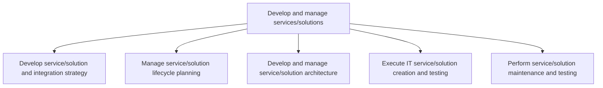
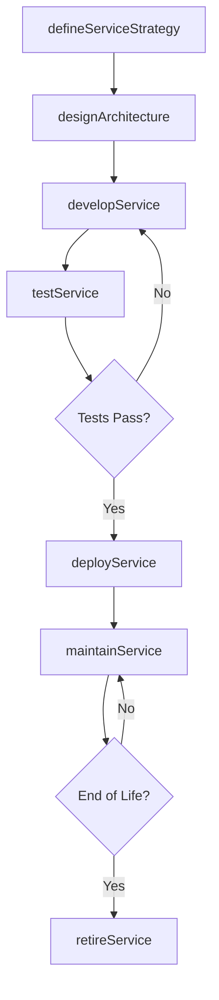

# Develop and manage services/solutions

> Business-as-Code definition for the end-to-end lifecycle of IT service and solution development, from strategy and architecture through creation, testing, and ongoing maintenance.

## Overview

Designing and maintaining the IT services/solutions catalogue. Evaluate the performance of IT services/solutions. Communicate the results to the management.

## Process Hierarchy



## GraphDL

```yaml
develop:
  object: Services/solutions
  actor: ITServiceManager
  result: ServiceCatalog
```

## Actions

| Action | Description |
|--------|-------------|
| defineServiceStrategy | Establish the overarching strategy for IT service and solution development |
| designArchitecture | Create the technical architecture for a new service or solution |
| developService | Build and code the IT service or solution components |
| testService | Execute unit, integration, and user acceptance testing |
| deployService | Release the service or solution into the production environment |
| maintainService | Perform ongoing maintenance, patches, and enhancements |
| retireService | Sunset and decommission end-of-life services or solutions |

## Events

| Event | Description |
|-------|-------------|
| serviceStrategyDefined | Service development strategy has been established and approved |
| architectureDesigned | Technical architecture for the service has been finalized |
| serviceDeveloped | Service or solution components have been built and unit tested |
| serviceTested | Integration and user acceptance testing completed successfully |
| serviceDeployed | Service or solution released to production |
| serviceMaintained | Maintenance cycle completed with patches or enhancements applied |
| serviceRetired | Service or solution decommissioned and archived |

## Searches

| Search | Description |
|--------|-------------|
| findServices | List services filtered by status, domain, or technology stack |
| getServiceDetails | Retrieve detailed specification and architecture for a specific service |
| getLifecycleStatus | Get the current lifecycle stage and health metrics of a service |
| findMaintenanceBacklog | List pending maintenance items across services |

## Process Flow



## RACI Matrix

| Activity | Responsible | Accountable | Consulted | Informed |
|----------|-------------|-------------|-----------|----------|
| defineServiceStrategy | ITServiceManager | CIO | BusinessAnalyst | ExecutiveTeam |
| designArchitecture | EnterpriseArchitect | VP Engineering | SecurityTeam | ITServiceManager |
| developService | SoftwareEngineer | DevelopmentLead | EnterpriseArchitect | ProjectManager |
| testService | QAEngineer | QALead | SoftwareEngineer | DevelopmentLead |
| deployService | ReleaseManager | VP Engineering | OperationsTeam | BusinessStakeholders |

## Sub-Processes

| ID | Name | Description |
|----|------|-------------|
| 8.5.1 | Develop service/solution and integration strategy | Developing service/solution along with creating a strategy that provides a base for delivering servi |
| 8.5.2 | Manage service/solution lifecycle planning | Executing life-cycle planning for IT services and solutions. Develop new requirements and feature-fu |
| 8.5.3 | Develop and manage service/solution architecture | Creating the architecture for the IT services and solutions. Assess architecture and business constr |
| 8.5.4 | Execute IT service/solution creation and testing | Understanding customer requirements. Design the IT services and solutions based on the requirements. |
| 8.5.5 | Perform service/solution maintenance and testing | Engaging in all aspects of service/solution maintenance and testing includes all preventative, routi |

## Related Processes

| Process | Relationship |
|---------|-------------|
| 8.4 Manage information | Upstream - provides data architecture requirements |
| 8.6 Deploy services/solutions | Downstream - receives built services for deployment |
| 8.7 Create and manage support services/solutions | Downstream - receives services requiring support |
| 8.3 Manage IT resiliency | Parallel - ensures services meet resilience standards |

## Related Departments

| Department | Role |
|-----------|------|
| IT Development | Primary owner of service creation and maintenance |
| Enterprise Architecture | Defines architectural standards and reviews designs |
| Quality Assurance | Validates service quality through testing |
| Project Management Office | Coordinates timelines, budgets, and resource allocation |
| Information Security | Ensures services comply with security policies |

## Related Occupations

| Occupation | Involvement |
|-----------|-------------|
| Software Developer | Builds and maintains service components |
| Enterprise Architect | Designs solution architecture and integration patterns |
| IT Project Manager | Plans and tracks service development projects |
| QA Engineer | Develops and executes test plans |

## KPIs

| KPI | Description | Unit |
|-----|-------------|------|
| Service Delivery Cycle Time | Average time from requirements to production deployment | Days |
| Defect Density | Number of defects per thousand lines of code | Defects/KLOC |
| Test Coverage | Percentage of code covered by automated tests | % |
| Service Availability | Uptime percentage of deployed services | % |
| Reuse Ratio | Percentage of components reused across services | % |

## Usage

```typescript
import { developAndManageServicesSolutions } from '@headlessly/develop-and-manage-services-solutions'

const services = developAndManageServicesSolutions()

// Define a new service strategy
const strategy = await services.defineServiceStrategy({
  domain: 'Customer Portal',
  businessObjective: 'Self-service account management',
  targetRelease: '2025-Q3'
})

// Design the architecture
const architecture = await services.designArchitecture({
  strategyId: strategy.id,
  pattern: 'microservices',
  integrations: ['CRM', 'Billing', 'Identity']
})

// Retrieve lifecycle status
const status = await services.getLifecycleStatus({
  serviceId: architecture.serviceId
})
```
