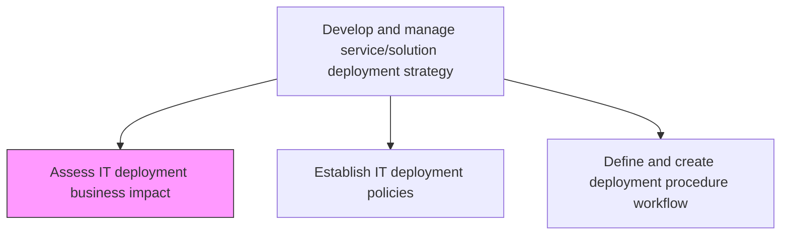
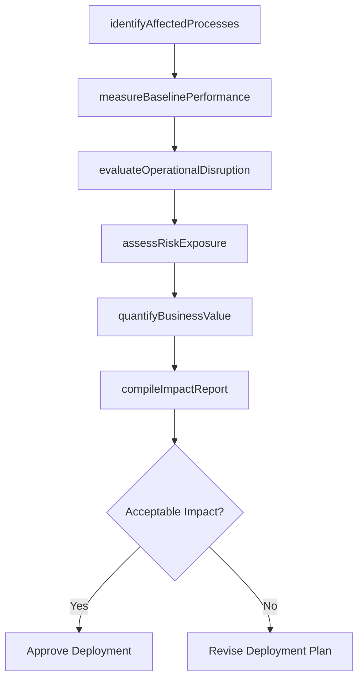

# Assess IT deployment business impact

> Business-as-Code definition for evaluating the operational, financial, and organizational effects of IT deployments on business performance and end-user productivity.

## Overview

Evaluate the impact of IT deployment (products/services) on the business. Compare pre and post development performance, behavior of resources, and cost to assess organizational benefit.

## Process Hierarchy



## GraphDL

```yaml
assess:
  object: IT Deployment Business Impact
  actor: DeploymentAnalyst
  result: BusinessImpactAssessment
```

## Actions

| Action | Description |
|--------|-------------|
| identifyAffectedProcesses | Map business processes and user groups impacted by the deployment |
| measureBaselinePerformance | Capture pre-deployment metrics for comparison against post-deployment results |
| evaluateOperationalDisruption | Assess the expected downtime and workflow disruptions during deployment |
| quantifyBusinessValue | Calculate the projected ROI, cost savings, and productivity gains |
| assessRiskExposure | Identify deployment risks including data loss, service degradation, and compliance gaps |
| compileImpactReport | Consolidate findings into a formal business impact assessment document |

## Events

| Event | Description |
|-------|-------------|
| affectedProcessesIdentified | Business processes and user groups impacted by deployment mapped |
| baselinePerformanceMeasured | Pre-deployment performance metrics captured |
| operationalDisruptionEvaluated | Expected downtime and workflow disruption assessment completed |
| businessValueQuantified | Projected ROI and productivity gains calculated |
| riskExposureAssessed | Deployment risk analysis completed |
| impactReportCompiled | Formal business impact assessment document finalized |

## Searches

| Search | Description |
|--------|-------------|
| findImpactAssessments | List impact assessments filtered by deployment, date, or risk level |
| getBaselineMetrics | Retrieve pre-deployment performance baselines for a specific service |
| getRiskExposureReport | Get the risk analysis for a given deployment |
| getAffectedProcesses | List business processes affected by a specific deployment |

## Process Flow



## RACI Matrix

| Activity | Responsible | Accountable | Consulted | Informed |
|----------|-------------|-------------|-----------|----------|
| identifyAffectedProcesses | DeploymentAnalyst | ReleaseManager | BusinessProcessOwners | EndUsers |
| measureBaselinePerformance | PerformanceEngineer | DeploymentAnalyst | ApplicationTeams | ITManagement |
| assessRiskExposure | DeploymentAnalyst | ReleaseManager | SecurityTeam | ComplianceOfficer |
| compileImpactReport | DeploymentAnalyst | ReleaseManager | FinanceTeam | ExecutiveSponsor |

## Related Processes

| Process | Relationship |
|---------|-------------|
| 8.6.1.2 Establish IT deployment policies | Downstream - impact assessments inform deployment policy constraints |
| 8.6.2.1 Assess IT deployment risk | Parallel - risk assessment complements business impact evaluation |
| 8.6.3.1 Assess IT change/release impact | Related - change impact builds on deployment impact findings |

## Related Departments

| Department | Role |
|-----------|------|
| Release Management | Owns the deployment strategy and impact assessment process |
| Business Analysis | Provides business process knowledge for impact mapping |
| Finance | Validates cost-benefit and ROI calculations |
| IT Operations | Assesses operational readiness and disruption potential |

## Related Occupations

| Occupation | Involvement |
|-----------|-------------|
| Deployment Analyst | Conducts the business impact assessment |
| Business Analyst | Maps affected business processes and stakeholders |
| Release Manager | Approves deployments based on impact findings |

## KPIs

| KPI | Description | Unit |
|-----|-------------|------|
| Impact Assessment Completion Rate | Percentage of deployments with completed impact assessments | % |
| Predicted vs Actual Disruption | Variance between forecasted and actual deployment disruption | Hours |
| Business Value Realization | Percentage of projected business value achieved post-deployment | % |
| Assessment Cycle Time | Average time to complete a business impact assessment | Days |

## Usage

```typescript
import { assessItDeploymentBusinessImpact } from '@headlessly/assess-it-deployment-business-impact'

const impact = assessItDeploymentBusinessImpact()

// Identify affected business processes
const affected = await impact.getAffectedProcesses({
  deploymentId: 'erp-upgrade-v4.2',
  includeIndirect: true
})

// Retrieve baseline metrics for comparison
const baseline = await impact.getBaselineMetrics({
  serviceId: 'order-management-system',
  metricTypes: ['latency', 'throughput', 'errorRate']
})
```
