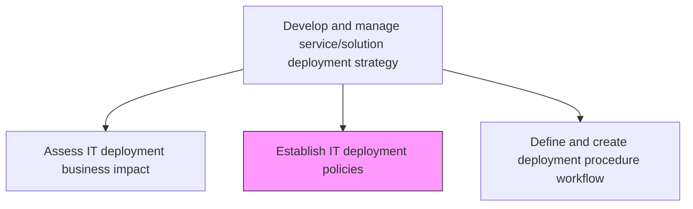
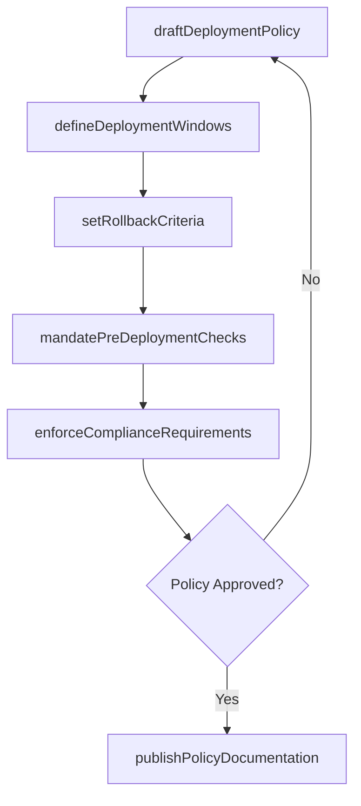

# Establish IT deployment policies

> Business-as-Code definition for creating and maintaining the governance policies that regulate how IT services and solutions are deployed into production environments.

## Overview

Defining deployment policies regarding IT services and solutions to allow employees to plan accordingly. Reduce the negative impact to the user community.

## Process Hierarchy



## GraphDL

```yaml
establish:
  object: IT Deployment Policies
  actor: DeploymentPolicyManager
  result: DeploymentPolicyDocument
```

## Actions

| Action | Description |
|--------|-------------|
| draftDeploymentPolicy | Author new deployment policy covering scope, constraints, and approval criteria |
| defineDeploymentWindows | Specify permitted deployment time windows based on business activity patterns |
| setRollbackCriteria | Establish thresholds and conditions that trigger automatic deployment rollback |
| mandatePreDeploymentChecks | Define required validation gates before any production deployment |
| enforceComplianceRequirements | Incorporate regulatory and security compliance mandates into deployment rules |
| publishPolicyDocumentation | Distribute approved policies to all stakeholders and deployment teams |

## Events

| Event | Description |
|-------|-------------|
| deploymentPolicyDrafted | New deployment policy document authored and submitted for review |
| deploymentWindowsDefined | Permitted deployment time windows established |
| rollbackCriteriaDefined | Rollback thresholds and trigger conditions set |
| preDeploymentChecksMandated | Required validation gates formalized |
| complianceRequirementsEnforced | Regulatory and security mandates incorporated into deployment rules |
| policyDocumentationPublished | Approved policies distributed to stakeholders |

## Searches

| Search | Description |
|--------|-------------|
| findDeploymentPolicies | List deployment policies filtered by environment, service tier, or status |
| getPolicyDetails | Retrieve the full details of a specific deployment policy |
| getDeploymentWindows | Get permitted deployment windows for a given environment |
| findComplianceRequirements | List compliance mandates applicable to a deployment type |

## Process Flow



## RACI Matrix

| Activity | Responsible | Accountable | Consulted | Informed |
|----------|-------------|-------------|-----------|----------|
| draftDeploymentPolicy | DeploymentPolicyManager | ITDirector | SecurityTeam | ReleaseEngineers |
| defineDeploymentWindows | DeploymentPolicyManager | ITDirector | BusinessOperations | EndUsers |
| setRollbackCriteria | ReleaseManager | ITDirector | OperationsTeam | DevelopmentTeams |
| enforceComplianceRequirements | ComplianceOfficer | ITDirector | LegalTeam | AuditTeam |

## Related Processes

| Process | Relationship |
|---------|-------------|
| 8.6.1.1 Assess IT deployment business impact | Upstream - impact assessments inform policy constraints |
| 8.6.1.4 Define IT change/release standards | Downstream - policies govern change/release standards |
| 8.6.3.2 Confirm change/release compliance | Downstream - compliance checks validate policy adherence |

## Related Departments

| Department | Role |
|-----------|------|
| IT Governance | Owns deployment policy creation and enforcement |
| Security | Defines security-related deployment constraints |
| Compliance | Ensures regulatory requirements are embedded in policies |
| Operations | Provides operational feasibility input for deployment windows |

## Related Occupations

| Occupation | Involvement |
|-----------|-------------|
| Deployment Policy Manager | Authors and maintains deployment policies |
| IT Director | Approves and sponsors deployment governance |
| Compliance Officer | Validates regulatory alignment of policies |

## KPIs

| KPI | Description | Unit |
|-----|-------------|------|
| Policy Coverage | Percentage of deployment types covered by formal policies | % |
| Policy Compliance Rate | Percentage of deployments that fully adhere to established policies | % |
| Policy Review Frequency | How often deployment policies are reviewed and updated | Per Year |
| Violation Incident Rate | Number of policy violations detected per deployment cycle | Count |

## Usage

```typescript
import { establishItDeploymentPolicies } from '@headlessly/establish-it-deployment-policies'

const policies = establishItDeploymentPolicies()

// Find policies for production environments
const prodPolicies = await policies.findDeploymentPolicies({
  environment: 'production',
  status: 'active'
})

// Get permitted deployment windows
const windows = await policies.getDeploymentWindows({
  environment: 'production',
  dayOfWeek: 'Tuesday'
})
```
