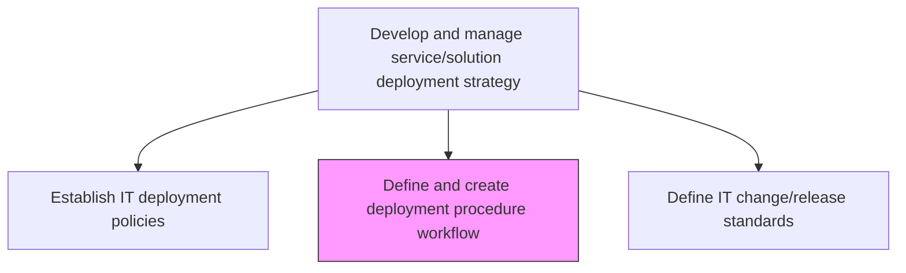
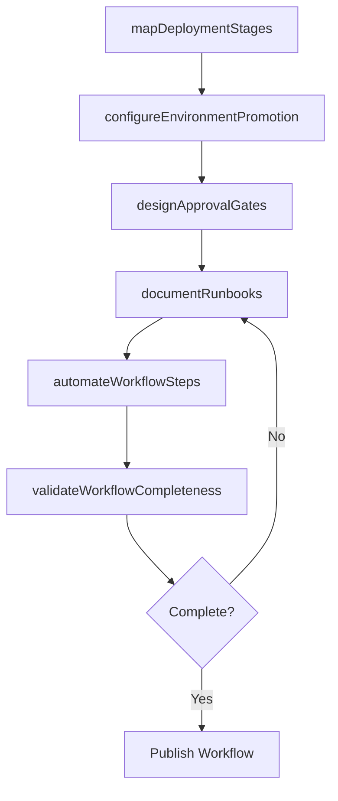

# Define and create deployment procedure workflow

> Business-as-Code definition for designing and documenting the step-by-step procedures and automated workflows that govern how IT solutions move from staging to production environments.

## Overview

Outlining processes, methods, and equipment for deployment of IT solutions. Manage core operations servers like subversion server, production server, and development server, to make the IT services and solutions available for internal/client use.

## Process Hierarchy



## GraphDL

```yaml
define:
  object: And Create Deployment Procedure Workflow
  actor: DeploymentEngineer
  result: DeploymentWorkflowDocument
```

## Actions

| Action | Description |
|--------|-------------|
| mapDeploymentStages | Define the sequential stages from build artifact to production release |
| configureEnvironmentPromotion | Establish rules for promoting deployments across dev, staging, and production |
| designApprovalGates | Create checkpoint gates requiring sign-off before advancing to next stage |
| documentRunbooks | Author step-by-step operational runbooks for each deployment scenario |
| automateWorkflowSteps | Implement CI/CD pipeline automation for repeatable deployment steps |
| validateWorkflowCompleteness | Review the workflow end-to-end for gaps, bottlenecks, and failure scenarios |

## Events

| Event | Description |
|-------|-------------|
| deploymentStagesMapped | Sequential deployment stages defined and documented |
| environmentPromotionConfigured | Promotion rules across environments established |
| approvalGatesDesigned | Checkpoint gates created with required approvers |
| runbooksDocumented | Operational runbooks authored for deployment scenarios |
| workflowStepsAutomated | CI/CD pipeline automation implemented for deployment workflow |
| workflowCompletenessValidated | End-to-end workflow review completed |

## Searches

| Search | Description |
|--------|-------------|
| findDeploymentWorkflows | List deployment workflows filtered by application, environment, or status |
| getWorkflowDetails | Retrieve the full step-by-step procedure for a specific deployment workflow |
| getRunbook | Get the operational runbook for a given deployment scenario |
| findApprovalGates | List approval gates configured for a specific workflow |

## Process Flow



## RACI Matrix

| Activity | Responsible | Accountable | Consulted | Informed |
|----------|-------------|-------------|-----------|----------|
| mapDeploymentStages | DeploymentEngineer | ReleaseManager | DevelopmentLeads | QATeam |
| designApprovalGates | ReleaseManager | ITDirector | SecurityTeam | BusinessOwners |
| automateWorkflowSteps | DevOpsEngineer | ReleaseManager | PlatformTeam | DevelopmentTeams |
| documentRunbooks | DeploymentEngineer | ReleaseManager | OperationsTeam | ServiceDesk |

## Related Processes

| Process | Relationship |
|---------|-------------|
| 8.6.1.2 Establish IT deployment policies | Upstream - policies constrain workflow design |
| 8.6.4.3 Execute internal IT implementation plan | Downstream - workflows are executed during implementation |
| 8.6.4.5 Implement software change/release | Downstream - change releases follow defined procedures |

## Related Departments

| Department | Role |
|-----------|------|
| DevOps Engineering | Designs and automates deployment pipelines |
| Release Management | Governs workflow procedures and approval gates |
| Quality Assurance | Defines testing gates within the workflow |
| IT Operations | Executes runbooks during production deployments |

## Related Occupations

| Occupation | Involvement |
|-----------|-------------|
| Deployment Engineer | Designs and documents deployment workflows |
| DevOps Engineer | Automates workflow steps using CI/CD tooling |
| Release Manager | Approves and governs workflow procedures |

## KPIs

| KPI | Description | Unit |
|-----|-------------|------|
| Workflow Automation Rate | Percentage of deployment steps that are fully automated | % |
| Runbook Coverage | Percentage of deployment scenarios with documented runbooks | % |
| Workflow Execution Time | Average time to execute a complete deployment workflow | Minutes |
| Gate Approval Latency | Average wait time at each approval gate | Hours |

## Usage

```typescript
import { defineAndCreateDeploymentProcedureWorkflow } from '@headlessly/define-and-create-deployment-procedure-workflow'

const workflow = defineAndCreateDeploymentProcedureWorkflow()

// Find workflows for a specific application
const workflows = await workflow.findDeploymentWorkflows({
  application: 'payment-gateway',
  environment: 'production'
})

// Get runbook for emergency deployment
const runbook = await workflow.getRunbook({
  scenario: 'hotfix-production',
  application: 'payment-gateway'
})
```
