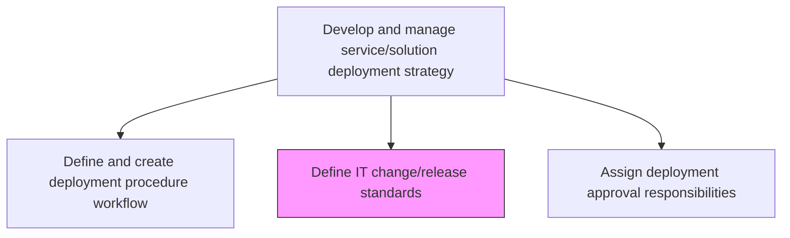
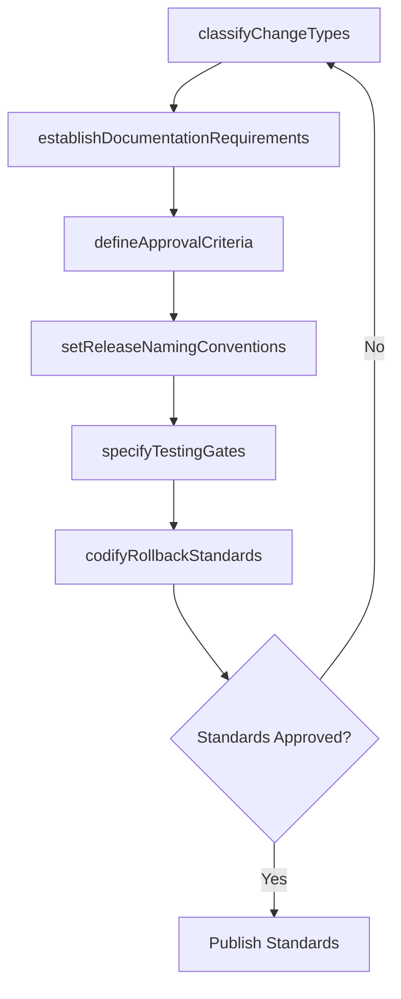

# Define IT change/release standards

> Business-as-Code definition for establishing the classification, documentation, and governance standards that regulate how IT changes and releases are categorized, approved, and tracked.

## Overview

Establishing guidelines for the changed/released IT services and solutions to meet business objectives with optimum utilization.

## Process Hierarchy



## GraphDL

```yaml
define:
  object: IT Change/release Standards
  actor: ChangeManager
  result: ChangeReleaseStandardsDocument
```

## Actions

| Action | Description |
|--------|-------------|
| classifyChangeTypes | Define categories for standard, normal, and emergency changes |
| establishDocumentationRequirements | Specify the minimum documentation required for each change type |
| defineApprovalCriteria | Set the criteria and authority levels for approving different change categories |
| setReleaseNamingConventions | Standardize versioning and naming conventions for all releases |
| specifyTestingGates | Define mandatory testing requirements before any release can proceed |
| codifyRollbackStandards | Establish standard rollback procedures and criteria for each change type |

## Events

| Event | Description |
|-------|-------------|
| changeTypesClassified | Change categories defined and published |
| documentationRequirementsEstablished | Minimum documentation standards set for each change type |
| approvalCriteriaDefined | Approval criteria and authority levels established |
| releaseNamingConventionsSet | Versioning and naming conventions standardized |
| testingGatesSpecified | Mandatory testing requirements defined for releases |
| rollbackStandardsCodified | Standard rollback procedures established |

## Searches

| Search | Description |
|--------|-------------|
| findChangeStandards | List change/release standards filtered by change type or service tier |
| getApprovalCriteria | Retrieve approval requirements for a specific change category |
| getReleaseNamingConvention | Get the naming and versioning convention for a given release type |
| findTestingGates | List mandatory testing gates for a specific change classification |

## Process Flow



## RACI Matrix

| Activity | Responsible | Accountable | Consulted | Informed |
|----------|-------------|-------------|-----------|----------|
| classifyChangeTypes | ChangeManager | ITDirector | ReleaseManagers | DevelopmentTeams |
| defineApprovalCriteria | ChangeManager | ITDirector | SecurityTeam | ComplianceOfficer |
| specifyTestingGates | QAManager | ChangeManager | TestEngineers | ReleaseManagers |
| codifyRollbackStandards | ReleaseManager | ChangeManager | OperationsTeam | ServiceDeskManager |

## Related Processes

| Process | Relationship |
|---------|-------------|
| 8.6.1.2 Establish IT deployment policies | Upstream - deployment policies govern change standards |
| 8.6.3.1 Assess IT change/release impact | Downstream - standards define how changes are assessed |
| 8.6.3.2 Confirm change/release compliance | Downstream - compliance checks validate against these standards |

## Related Departments

| Department | Role |
|-----------|------|
| Change Management | Owns and maintains change/release standards |
| Quality Assurance | Defines testing gate requirements |
| IT Governance | Ensures standards align with governance framework |
| Release Engineering | Implements standards in release tooling and processes |

## Related Occupations

| Occupation | Involvement |
|-----------|-------------|
| Change Manager | Authors and governs change/release standards |
| Release Manager | Implements standards in release operations |
| QA Manager | Defines testing criteria within the standards |

## KPIs

| KPI | Description | Unit |
|-----|-------------|------|
| Standards Compliance Rate | Percentage of changes that meet defined standards | % |
| Unauthorized Change Rate | Number of changes deployed without proper classification | Count |
| Standards Currency | Time since last review and update of change standards | Days |
| Change Failure Rate | Percentage of changes that result in service degradation | % |

## Usage

```typescript
import { defineItChangeReleaseStandards } from '@headlessly/define-it-change-release-standards'

const standards = defineItChangeReleaseStandards()

// Find standards for emergency changes
const emergencyStandards = await standards.findChangeStandards({
  changeType: 'emergency',
  serviceTier: 'tier-1'
})

// Get approval criteria for a normal change
const criteria = await standards.getApprovalCriteria({
  changeCategory: 'normal',
  impactLevel: 'medium'
})
```
