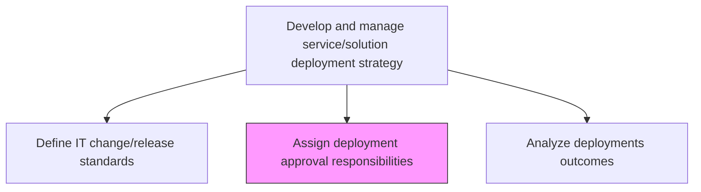
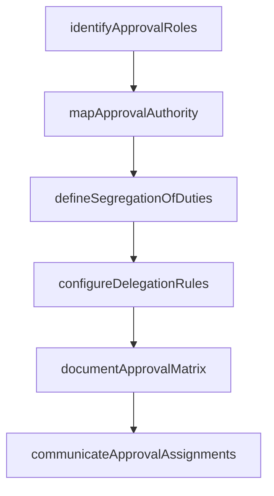

# Assign deployment approval responsibilities

> Business-as-Code definition for designating the individuals and roles authorized to approve IT deployments at each stage of the release pipeline, ensuring proper segregation of duties.

## Overview

Coordinating development approval responsibilities based on defined change standards.

## Process Hierarchy



## GraphDL

```yaml
assign:
  object: Deployment Approval Responsibilities
  actor: ReleaseGovernanceLead
  result: ApprovalResponsibilityMatrix
```

## Actions

| Action | Description |
|--------|-------------|
| identifyApprovalRoles | Determine which roles are required to approve deployments at each stage |
| mapApprovalAuthority | Assign approval authority levels based on change impact and risk classification |
| configureDelegationRules | Establish delegation and escalation paths when primary approvers are unavailable |
| defineSegregationOfDuties | Ensure approvers are independent from the teams requesting the deployment |
| documentApprovalMatrix | Create a formal responsibility assignment matrix for deployment approvals |
| communicateApprovalAssignments | Notify designated approvers of their responsibilities and approval workflows |

## Events

| Event | Description |
|-------|-------------|
| approvalRolesIdentified | Required approval roles determined for each deployment stage |
| approvalAuthorityMapped | Authority levels assigned based on change impact and risk |
| delegationRulesConfigured | Delegation and escalation paths established |
| segregationOfDutiesDefined | Approver independence requirements formalized |
| approvalMatrixDocumented | Responsibility assignment matrix for approvals created |
| approvalAssignmentsCommunicated | Designated approvers notified of their responsibilities |

## Searches

| Search | Description |
|--------|-------------|
| findApprovers | List designated approvers filtered by deployment stage, change type, or environment |
| getApprovalMatrix | Retrieve the approval responsibility matrix for a specific service |
| getDelegationPath | Get the delegation and escalation path for a given approver role |
| findApprovalHistory | List past approval decisions for a specific deployment or approver |

## Process Flow



## RACI Matrix

| Activity | Responsible | Accountable | Consulted | Informed |
|----------|-------------|-------------|-----------|----------|
| identifyApprovalRoles | ReleaseGovernanceLead | ITDirector | ChangeManager | DevelopmentLeads |
| mapApprovalAuthority | ReleaseGovernanceLead | ITDirector | SecurityOfficer | AuditTeam |
| defineSegregationOfDuties | ComplianceOfficer | ITDirector | ReleaseGovernanceLead | HRManager |
| documentApprovalMatrix | ReleaseGovernanceLead | ITDirector | ReleaseManagers | AllApprovers |

## Related Processes

| Process | Relationship |
|---------|-------------|
| 8.6.1.4 Define IT change/release standards | Upstream - change standards define the approval requirements |
| 8.6.3.6 Approve change/release deployment | Downstream - assigned approvers execute approval decisions |
| 8.6.1.1 Assess IT deployment business impact | Parallel - impact assessment informs approval authority levels |

## Related Departments

| Department | Role |
|-----------|------|
| Release Governance | Owns the approval responsibility assignment process |
| IT Security | Ensures segregation of duties compliance |
| Compliance | Validates that approval structures meet audit requirements |
| IT Management | Provides executive-level approval authority |

## Related Occupations

| Occupation | Involvement |
|-----------|-------------|
| Release Governance Lead | Designs and maintains the approval responsibility framework |
| Change Manager | Aligns approval roles with change management standards |
| Compliance Officer | Validates segregation of duties requirements |

## KPIs

| KPI | Description | Unit |
|-----|-------------|------|
| Approval Coverage | Percentage of deployment stages with assigned approvers | % |
| Delegation Availability | Percentage of time a valid approver or delegate is available | % |
| Segregation Compliance | Percentage of approvals meeting segregation of duties requirements | % |
| Approval Response Time | Average time from approval request to decision | Hours |

## Usage

```typescript
import { assignDeploymentApprovalResponsibilities } from '@headlessly/assign-deployment-approval-responsibilities'

const approvals = assignDeploymentApprovalResponsibilities()

// Find approvers for a production deployment
const approvers = await approvals.findApprovers({
  environment: 'production',
  changeType: 'normal',
  impactLevel: 'high'
})

// Get the delegation path for an unavailable approver
const delegation = await approvals.getDelegationPath({
  approverRole: 'ReleaseManager',
  deploymentStage: 'production-go-live'
})
```
