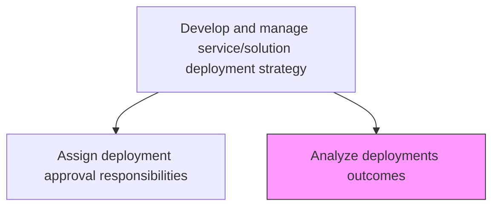
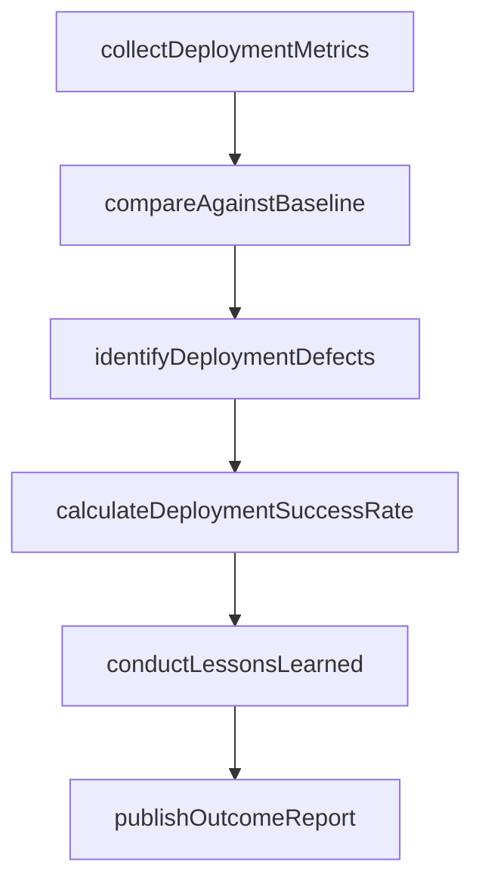

# Analyze deployments outcomes

> Business-as-Code definition for conducting post-deployment analysis to evaluate success, identify lessons learned, and drive continuous improvement in IT deployment practices.

## Overview

Evaluating the impact (pros and cons) of IT services deployment.

## Process Hierarchy



## GraphDL

```yaml
analyze:
  object: Deployments Outcomes
  actor: DeploymentAnalyst
  result: DeploymentOutcomeReport
```

## Actions

| Action | Description |
|--------|-------------|
| collectDeploymentMetrics | Gather post-deployment performance, availability, and incident data |
| compareAgainstBaseline | Measure actual outcomes against pre-deployment baselines and projections |
| identifyDeploymentDefects | Catalog issues, defects, and incidents that occurred during or after deployment |
| conductLessonsLearned | Facilitate retrospective sessions to capture improvement opportunities |
| calculateDeploymentSuccessRate | Compute success metrics including rollback rate and incident frequency |
| publishOutcomeReport | Produce and distribute the formal post-deployment outcome analysis |

## Events

| Event | Description |
|-------|-------------|
| deploymentMetricsCollected | Post-deployment performance data gathered and consolidated |
| baselineComparisonCompleted | Actual outcomes measured against pre-deployment baselines |
| deploymentDefectsIdentified | Issues and defects from deployment cataloged |
| lessonsLearnedConducted | Retrospective session completed with improvement actions |
| deploymentSuccessRateCalculated | Deployment success metrics computed |
| outcomeReportPublished | Formal post-deployment analysis distributed to stakeholders |

## Searches

| Search | Description |
|--------|-------------|
| findDeploymentOutcomes | List deployment outcome reports filtered by date, service, or success status |
| getOutcomeMetrics | Retrieve detailed metrics for a specific deployment outcome |
| findDeploymentDefects | List defects and incidents associated with a deployment |
| getLessonsLearned | Get lessons learned entries for a specific deployment or time period |

## Process Flow



## RACI Matrix

| Activity | Responsible | Accountable | Consulted | Informed |
|----------|-------------|-------------|-----------|----------|
| collectDeploymentMetrics | DeploymentAnalyst | ReleaseManager | OperationsTeam | DevelopmentTeams |
| compareAgainstBaseline | DeploymentAnalyst | ReleaseManager | PerformanceEngineers | BusinessOwners |
| conductLessonsLearned | ReleaseManager | ITDirector | AllDeploymentParticipants | QAManager |
| publishOutcomeReport | DeploymentAnalyst | ReleaseManager | ChangeManager | ExecutiveSponsor |

## Related Processes

| Process | Relationship |
|---------|-------------|
| 8.6.1.1 Assess IT deployment business impact | Upstream - provides pre-deployment baselines for comparison |
| 8.6.4.8 Verify change/release implementation success | Upstream - verification data feeds outcome analysis |
| 8.6.3.7 Document IT change/release outcome | Parallel - change documentation complements outcome analysis |

## Related Departments

| Department | Role |
|-----------|------|
| Release Management | Owns the post-deployment analysis process |
| IT Operations | Provides production performance and incident data |
| Quality Assurance | Contributes defect analysis and quality metrics |
| Business Analysis | Assesses business value realization |

## Related Occupations

| Occupation | Involvement |
|-----------|-------------|
| Deployment Analyst | Conducts post-deployment analysis and reporting |
| Release Manager | Facilitates lessons learned and process improvements |
| Performance Engineer | Provides performance metrics and baseline comparisons |

## KPIs

| KPI | Description | Unit |
|-----|-------------|------|
| Deployment Success Rate | Percentage of deployments completed without rollback or major incidents | % |
| Post-Deployment Incident Rate | Number of incidents within 72 hours of deployment | Count |
| Lessons Learned Adoption | Percentage of identified improvements implemented in subsequent releases | % |
| Outcome Report Timeliness | Time from deployment completion to outcome report publication | Days |

## Usage

```typescript
import { analyzeDeploymentsOutcomes } from '@headlessly/analyze-deployments-outcomes'

const outcomes = analyzeDeploymentsOutcomes()

// Find outcomes for recent deployments
const reports = await outcomes.findDeploymentOutcomes({
  dateRange: { start: '2025-01-01', end: '2025-03-31' },
  status: 'completed'
})

// Get lessons learned from a specific deployment
const lessons = await outcomes.getLessonsLearned({
  deploymentId: 'crm-v3.1-release',
  category: 'process-improvement'
})
```
