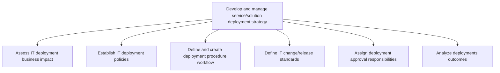
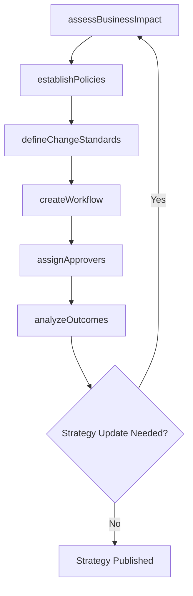

# Develop and manage service/solution deployment strategy

> Business-as-Code definition for establishing and governing the deployment strategy for IT services and solutions, including impact assessment, policy definition, workflow creation, change standards, approval chains, and outcome analysis.

## Overview

Creating and implementing a strategy for the deployment of IT service/solution. Define all of the activities that make the IT function available for use. Establish the change policies for IT services and solutions. Define the deployment process, procedures, and tools. Select the most feasible and practical methodologies for the deployment process.

## Process Hierarchy



## GraphDL

```yaml
develop:
  object: Service/solution Deployment Strategy
  actor: DeploymentStrategyManager
  result: DeploymentStrategyDocument
```

## Actions

| Action | Description |
|--------|-------------|
| assessBusinessImpact | Evaluate the business impact of deploying new IT services |
| establishPolicies | Define deployment policies governing timing, approvals, and compliance |
| createWorkflow | Design the deployment procedure workflow and automation pipelines |
| defineChangeStandards | Establish standards for change and release management |
| assignApprovers | Designate approval authorities for deployment stages |
| analyzeOutcomes | Review deployment results and derive continuous improvement insights |

## Events

| Event | Description |
|-------|-------------|
| businessImpactAssessed | Deployment business impact analysis completed |
| policiesEstablished | Deployment policies defined and published |
| workflowCreated | Deployment procedure workflow designed and documented |
| changeStandardsDefined | Change and release management standards established |
| approversAssigned | Deployment approval responsibilities designated |
| outcomesAnalyzed | Post-deployment outcome analysis completed |

## Searches

| Search | Description |
|--------|-------------|
| getPolicies | Retrieve current deployment policies filtered by scope or effective date |
| getWorkflows | List deployment workflows by service type or environment |
| getOutcomeReports | Retrieve deployment outcome analysis reports |
| findApprovers | List designated approval authorities by deployment tier |

## Process Flow



## RACI Matrix

| Activity | Responsible | Accountable | Consulted | Informed |
|----------|-------------|-------------|-----------|----------|
| assessBusinessImpact | ChangeAnalyst | DeploymentStrategyManager | BusinessUnitLeads | ExecutiveTeam |
| establishPolicies | DeploymentStrategyManager | VP IT Operations | ComplianceTeam | DevelopmentTeams |
| createWorkflow | DevOpsEngineer | DeploymentStrategyManager | InfrastructureTeam | ReleaseManager |
| assignApprovers | DeploymentStrategyManager | CIO | ChangeAdvisoryBoard | ITGovernance |

## Sub-Processes

| ID | Name | Description |
|----|------|-------------|
| 8.6.1.1 | Assess IT deployment business impact | Evaluate the impact of IT deployment (products/services) on the business. Compare pre and post devel |
| 8.6.1.2 | Establish IT deployment policies | Defining deployment policies regarding IT services and solutions to allow employees to plan accordin |
| 8.6.1.3 | Define and create deployment procedure workflow | Outlining processes, methods, and equipment for deployment of IT solutions. Manage core operations s |
| 8.6.1.4 | Define IT change/release standards | Establishing guidelines for the changed/released IT services and solutions to meet business objectiv |
| 8.6.1.5 | Assign deployment approval responsibilities | Coordinating development approval responsibilities based on defined change standards. |
| 8.6.1.6 | Analyze deployments outcomes | Evaluating the impact (pros and cons) of IT services deployment. |

## Related Processes

| Process | Relationship |
|---------|-------------|
| 8.6.2 Plan service and solution implementation | Downstream - strategy guides implementation planning |
| 8.6.3 Manage change deployment control | Downstream - strategy defines change control standards |
| 8.5 Develop and manage services/solutions | Upstream - receives services ready for deployment |

## Related Departments

| Department | Role |
|-----------|------|
| Release Management | Defines and operates deployment workflows |
| IT Governance | Oversees policy compliance and approval processes |
| Change Management | Manages change advisory board and standards |
| IT Operations | Provides infrastructure and environment inputs |

## Related Occupations

| Occupation | Involvement |
|-----------|-------------|
| Release Manager | Designs deployment strategies and workflows |
| Change Manager | Defines change standards and approval chains |
| DevOps Engineer | Implements deployment automation and pipelines |

## KPIs

| KPI | Description | Unit |
|-----|-------------|------|
| Policy Compliance Rate | Percentage of deployments following established policies | % |
| Deployment Strategy Review Cycle | Frequency of strategy reviews and updates | Per Year |
| Impact Assessment Coverage | Percentage of deployments with completed impact assessments | % |
| Post-Deployment Analysis Completion | Percentage of deployments with outcome analysis | % |

## Usage

```typescript
import { developAndManageServiceSolutionDeploymentStrategy } from '@headlessly/develop-and-manage-service-solution-deployment-strategy'

const strategy = developAndManageServiceSolutionDeploymentStrategy()

// Assess business impact of a deployment
const impact = await strategy.assessBusinessImpact({
  serviceId: 'svc-hr-portal',
  deploymentScope: 'global',
  affectedUsers: 5000
})

// Establish deployment policies
const policy = await strategy.establishPolicies({
  environment: 'production',
  maintenanceWindows: ['Sunday 02:00-06:00 UTC'],
  approvalRequired: true,
  rollbackTimeLimit: '4 hours'
})

// Analyze deployment outcomes
const outcomes = await strategy.analyzeOutcomes({
  period: '2025-Q2',
  metrics: ['success-rate', 'rollback-rate', 'downtime']
})
```
