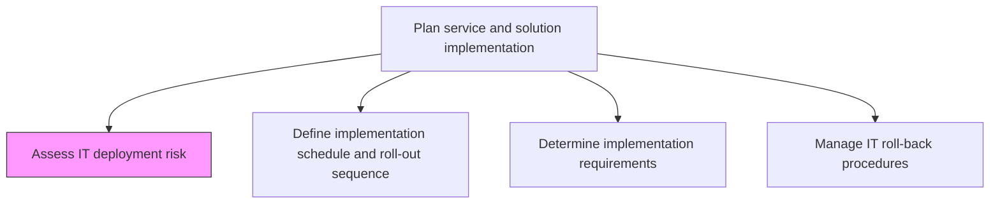
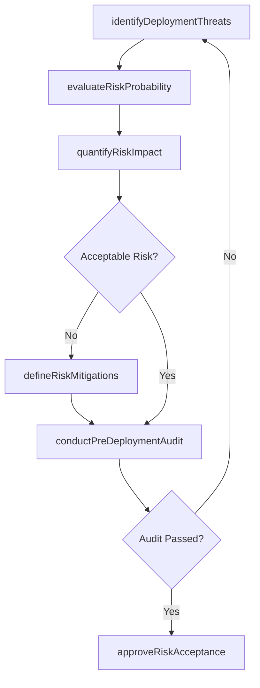

# Assess IT deployment risk

> Business-as-Code definition for assessing threats, vulnerabilities, and potential failures related to the deployment of IT services and solutions, enabling risk-informed go/no-go decisions.

## Overview

Accessing threats and potential failures related to the deployment of IT services/solutions.

## Process Hierarchy



## GraphDL

```yaml
assess:
  object: IT Deployment Risk
  actor: DeploymentRiskAnalyst
  result: DeploymentRiskAssessment
```

## Actions

| Action | Description |
|--------|-------------|
| identifyDeploymentThreats | Catalog potential threats to the deployment including infrastructure failures, data loss, and integration breakdowns |
| evaluateRiskProbability | Assess the likelihood of each identified threat materializing during deployment |
| quantifyRiskImpact | Determine the business impact severity if a deployment risk event occurs |
| defineRiskMitigations | Establish preventive controls and contingency plans for high-priority risks |
| conductPreDeploymentAudit | Perform a structured audit of deployment readiness against risk criteria |
| approveRiskAcceptance | Formally accept residual risks and authorize deployment to proceed |

## Events

| Event | Description |
|-------|-------------|
| deploymentThreatsIdentified | Potential deployment threats cataloged and categorized |
| riskProbabilityEvaluated | Likelihood assessment for deployment risks completed |
| riskImpactQuantified | Business impact analysis for deployment risks finalized |
| riskMitigationsDefined | Preventive controls and contingency plans established |
| preDeploymentAuditConducted | Deployment readiness audit completed against risk criteria |
| riskAcceptanceApproved | Residual risks formally accepted and deployment authorized |

## Searches

| Search | Description |
|--------|-------------|
| getDeploymentRisks | Retrieve identified deployment risks filtered by severity, category, or affected system |
| getRiskMitigations | List mitigation plans associated with specific deployment risks |
| getAuditFindings | Retrieve pre-deployment audit results and open findings |
| getRiskHistory | Access historical deployment risk data for similar releases |

## Process Flow



## RACI Matrix

| Activity | Responsible | Accountable | Consulted | Informed |
|----------|-------------|-------------|-----------|----------|
| identifyDeploymentThreats | DeploymentRiskAnalyst | ReleaseManager | InfrastructureTeam | ProjectManager |
| evaluateRiskProbability | DeploymentRiskAnalyst | ReleaseManager | SecurityTeam | ChangeAdvisoryBoard |
| defineRiskMitigations | DeploymentRiskAnalyst | ITDirector | OperationsTeam | BusinessStakeholders |
| approveRiskAcceptance | ReleaseManager | ITDirector | DeploymentRiskAnalyst | ExecutiveSponsors |

## Related Processes

| Process | Relationship |
|---------|-------------|
| 8.6.2.2 Define implementation schedule and roll-out sequence | Downstream - risk assessment informs deployment scheduling |
| 8.6.2.7 Manage IT roll-back procedures | Downstream - risk findings drive roll-back planning |
| 8.6.3.3 Assess IT change/release risk | Parallel - complements change-level risk assessment |

## Related Departments

| Department | Role |
|-----------|------|
| IT Risk Management | Leads risk identification, evaluation, and mitigation planning |
| Release Management | Coordinates risk assessment with deployment scheduling |
| IT Security | Evaluates security-related deployment threats |
| IT Operations | Assesses operational impact and infrastructure readiness |

## Related Occupations

| Occupation | Involvement |
|-----------|-------------|
| IT Risk Analyst | Performs threat identification and impact analysis |
| Release Manager | Integrates risk findings into deployment decisions |
| Security Engineer | Evaluates security vulnerabilities in deployment plans |

## KPIs

| KPI | Description | Unit |
|-----|-------------|------|
| Risk Identification Coverage | Percentage of deployment components assessed for risk | % |
| Mitigation Effectiveness | Percentage of identified risks with approved mitigation plans | % |
| Pre-Deployment Audit Pass Rate | Percentage of deployments passing risk audit on first attempt | % |
| Deployment Incident Rate | Number of risk events occurring per deployment | Count |

## Usage

```typescript
import { assessItDeploymentRisk } from '@headlessly/assess-it-deployment-risk'

const riskAssessment = assessItDeploymentRisk()

// Identify threats for an upcoming deployment
const threats = await riskAssessment.getDeploymentRisks({
  releaseId: 'rel-2024-q4-003',
  severity: 'high',
  category: ['infrastructure', 'integration']
})

// Retrieve mitigation plans for critical risks
const mitigations = await riskAssessment.getRiskMitigations({
  riskIds: threats.map(t => t.id),
  status: 'approved'
})
```
