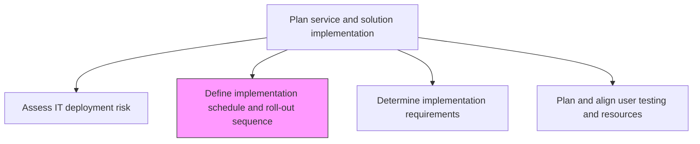
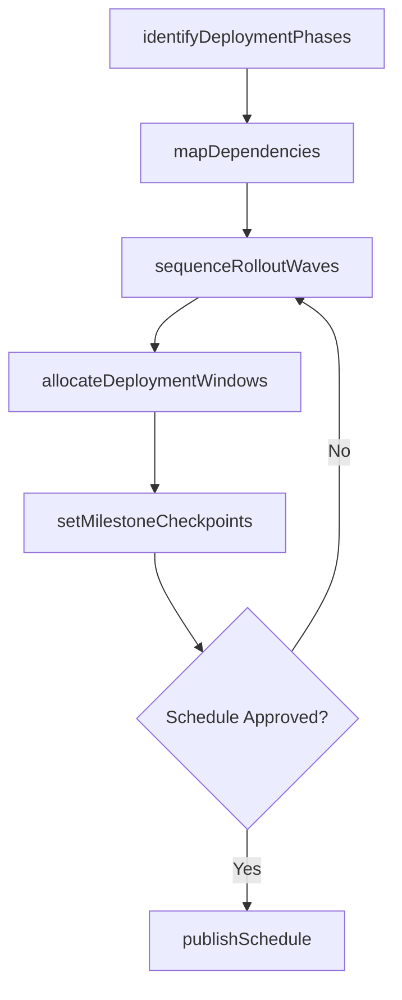

# Define implementation schedule and roll-out sequence

> Business-as-Code definition for creating detailed implementation timelines and phased roll-out sequences that coordinate deployment activities across environments, teams, and business units.

## Overview

Defining the schedule for implementation of change. Plan and carry out a process or procedure to implement the predefined changes.

## Process Hierarchy



## GraphDL

```yaml
define:
  object: Implementation Schedule And Roll-out Sequence
  actor: ReleaseManager
  result: ImplementationSchedule
```

## Actions

| Action | Description |
|--------|-------------|
| identifyDeploymentPhases | Break the implementation into sequential phases with clear milestones and gate criteria |
| sequenceRolloutWaves | Define the order of roll-out waves across regions, business units, or user groups |
| allocateDeploymentWindows | Reserve maintenance windows and deployment slots aligned with business calendars |
| mapDependencies | Chart inter-system and inter-team dependencies that constrain scheduling |
| setMilestoneCheckpoints | Establish go/no-go checkpoints between phases to validate readiness |
| publishSchedule | Distribute the finalized implementation timeline to all stakeholders |

## Events

| Event | Description |
|-------|-------------|
| deploymentPhasesIdentified | Implementation phases and milestones defined |
| rolloutWavesSequenced | Roll-out wave ordering and grouping finalized |
| deploymentWindowsAllocated | Maintenance windows and deployment slots reserved |
| dependenciesMapped | Inter-system and inter-team dependencies documented |
| milestoneCheckpointsSet | Go/no-go checkpoints established between phases |
| schedulePublished | Finalized implementation timeline distributed to stakeholders |

## Searches

| Search | Description |
|--------|-------------|
| getImplementationSchedule | Retrieve the deployment schedule filtered by phase, date range, or environment |
| getRolloutWaves | List roll-out waves with assigned business units and target dates |
| getDependencyMap | Get inter-system dependencies that affect scheduling |
| getDeploymentWindows | Retrieve available and reserved maintenance windows |

## Process Flow



## RACI Matrix

| Activity | Responsible | Accountable | Consulted | Informed |
|----------|-------------|-------------|-----------|----------|
| identifyDeploymentPhases | ReleaseManager | ITDirector | ProjectManagers | BusinessStakeholders |
| sequenceRolloutWaves | ReleaseManager | ITDirector | RegionalITLeads | ChangeAdvisoryBoard |
| allocateDeploymentWindows | ReleaseManager | ITDirector | ITOperations | ServiceDeskManager |
| publishSchedule | ReleaseManager | ITDirector | CommunicationsTeam | AllStakeholders |

## Related Processes

| Process | Relationship |
|---------|-------------|
| 8.6.2.1 Assess IT deployment risk | Upstream - risk assessment informs schedule timing |
| 8.6.2.3 Determine implementation requirements | Parallel - requirements constrain schedule feasibility |
| 8.6.3.5 Create and communicate deployment schedule | Downstream - feeds into formal deployment schedule |

## Related Departments

| Department | Role |
|-----------|------|
| Release Management | Owns schedule creation and coordination across teams |
| IT Operations | Validates infrastructure availability for deployment windows |
| Project Management Office | Aligns implementation schedule with portfolio timelines |
| Business Units | Confirms roll-out wave sequencing and blackout dates |

## Related Occupations

| Occupation | Involvement |
|-----------|-------------|
| Release Manager | Creates and maintains the implementation schedule |
| Project Manager | Coordinates team resource allocation against schedule |
| IT Operations Manager | Validates operational readiness for each deployment window |

## KPIs

| KPI | Description | Unit |
|-----|-------------|------|
| Schedule Adherence | Percentage of deployments completed within planned windows | % |
| Phase Gate Pass Rate | Percentage of milestones passing go/no-go review on first attempt | % |
| Deployment Window Utilization | Ratio of used to available maintenance windows | % |
| Roll-out Wave Completion Rate | Percentage of waves completed on schedule | % |

## Usage

```typescript
import { defineImplementationScheduleAndRollOutSequence } from '@headlessly/define-implementation-schedule-and-roll-out-sequence'

const scheduler = defineImplementationScheduleAndRollOutSequence()

// Retrieve the deployment schedule for a release
const schedule = await scheduler.getImplementationSchedule({
  releaseId: 'rel-2024-q4-003',
  phase: 'production',
  dateRange: { start: '2024-10-01', end: '2024-12-31' }
})

// List roll-out waves with their business units
const waves = await scheduler.getRolloutWaves({
  releaseId: 'rel-2024-q4-003',
  status: 'pending'
})
```
