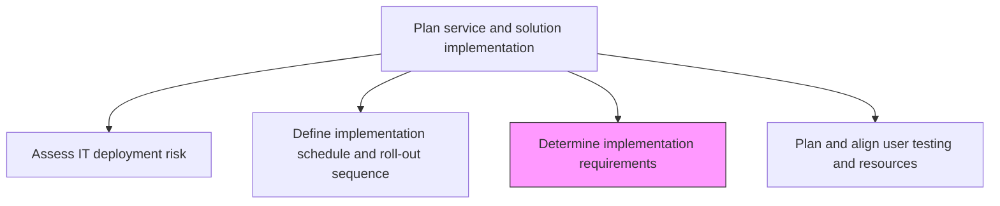
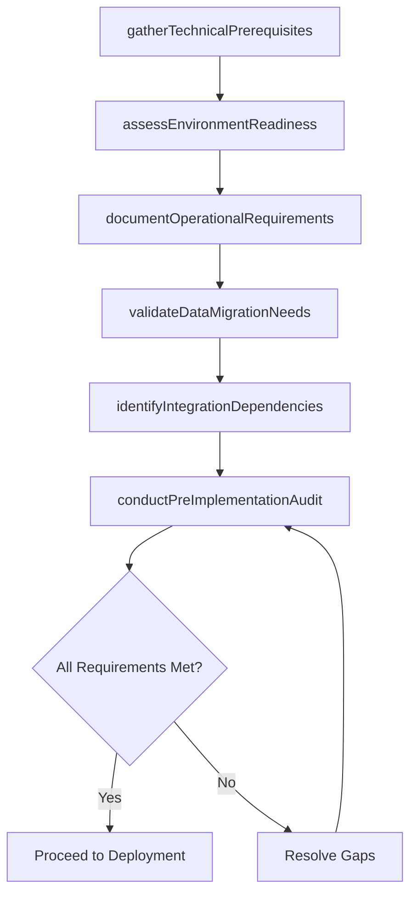

# Determine implementation requirements

> Business-as-Code definition for gathering and validating all technical, operational, and organizational prerequisites needed before deploying IT services and solutions into production environments.

## Overview

Determine requirements for implementation of IT deployment. Carry out a pre-implementation audit to assess the impact and use case. Gauge the possible vulnerabilities and impact the business operations during and after the implementation.

## Process Hierarchy



## GraphDL

```yaml
determine:
  object: Implementation Requirements
  actor: ImplementationPlanner
  result: ImplementationRequirementsDocument
```

## Actions

| Action | Description |
|--------|-------------|
| gatherTechnicalPrerequisites | Collect hardware, software, network, and configuration prerequisites for deployment |
| assessEnvironmentReadiness | Evaluate target environments against deployment prerequisites and capacity needs |
| documentOperationalRequirements | Define operational staffing, support, and monitoring requirements for go-live |
| validateDataMigrationNeeds | Confirm data migration, transformation, and validation requirements |
| identifyIntegrationDependencies | Map integration points and third-party service dependencies required for deployment |
| conductPreImplementationAudit | Perform a structured audit to validate all requirements are met before proceeding |

## Events

| Event | Description |
|-------|-------------|
| technicalPrerequisitesGathered | Hardware, software, and configuration prerequisites collected |
| environmentReadinessAssessed | Target environment evaluated against deployment needs |
| operationalRequirementsDocumented | Staffing, support, and monitoring requirements defined |
| dataMigrationNeedsValidated | Data migration and transformation requirements confirmed |
| integrationDependenciesIdentified | Integration points and service dependencies mapped |
| preImplementationAuditConducted | Structured readiness audit completed |

## Searches

| Search | Description |
|--------|-------------|
| getImplementationRequirements | Retrieve requirements filtered by type, status, or target environment |
| getEnvironmentReadiness | Get readiness assessment results for target deployment environments |
| getPrerequisiteGaps | List unmet prerequisites that block deployment |
| getAuditResults | Retrieve pre-implementation audit findings and open items |

## Process Flow



## RACI Matrix

| Activity | Responsible | Accountable | Consulted | Informed |
|----------|-------------|-------------|-----------|----------|
| gatherTechnicalPrerequisites | ImplementationPlanner | ReleaseManager | InfrastructureTeam | ProjectManager |
| assessEnvironmentReadiness | EnvironmentManager | ReleaseManager | ITOperations | ChangeAdvisoryBoard |
| validateDataMigrationNeeds | DataEngineer | ReleaseManager | DatabaseAdmins | BusinessAnalysts |
| conductPreImplementationAudit | ImplementationPlanner | ITDirector | SecurityTeam | ExecutiveSponsor |

## Related Processes

| Process | Relationship |
|---------|-------------|
| 8.6.2.1 Assess IT deployment risk | Upstream - risk assessment drives requirement priorities |
| 8.6.2.4 Plan and align user testing and resources | Downstream - requirements inform testing resource needs |
| 8.6.4.1 Confirm hardware/software operational status | Downstream - requirements validated during implementation |

## Related Departments

| Department | Role |
|-----------|------|
| IT Infrastructure | Validates hardware and network prerequisites |
| Application Development | Confirms software and integration requirements |
| IT Operations | Assesses operational readiness and support requirements |
| Data Management | Validates data migration and transformation needs |

## Related Occupations

| Occupation | Involvement |
|-----------|-------------|
| Implementation Planner | Leads requirements gathering and audit activities |
| Infrastructure Engineer | Validates technical environment prerequisites |
| Database Administrator | Assesses data migration requirements |

## KPIs

| KPI | Description | Unit |
|-----|-------------|------|
| Requirement Completion Rate | Percentage of identified requirements fulfilled before deployment | % |
| Prerequisite Gap Count | Number of unmet prerequisites at audit time | Count |
| Environment Readiness Score | Composite score of target environment readiness | Score (1-10) |
| Audit Cycle Time | Average time to complete pre-implementation audit | Days |

## Usage

```typescript
import { determineImplementationRequirements } from '@headlessly/determine-implementation-requirements'

const requirements = determineImplementationRequirements()

// Get unmet prerequisites blocking deployment
const gaps = await requirements.getPrerequisiteGaps({
  releaseId: 'rel-2024-q4-003',
  environment: 'production',
  severity: 'blocking'
})

// Retrieve environment readiness assessment
const readiness = await requirements.getEnvironmentReadiness({
  environment: 'production',
  releaseId: 'rel-2024-q4-003'
})
```
