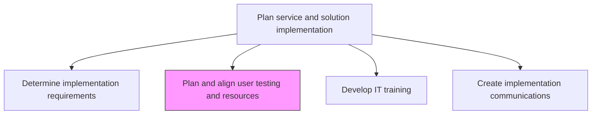
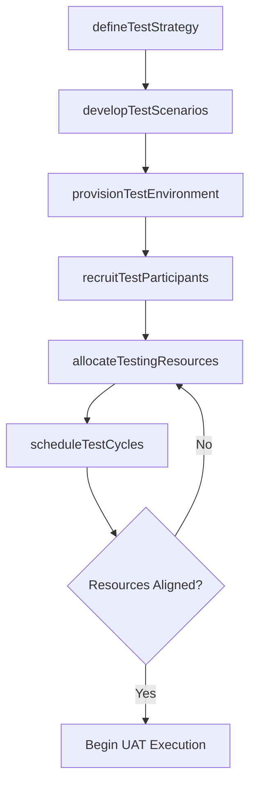

# Plan and align user testing and resources

> Business-as-Code definition for planning user acceptance testing methodologies and aligning testing resources, environments, and schedules to validate IT deployments meet business requirements.

## Overview

Plan methodologies and align resources for user testing of IT deployment.

## Process Hierarchy



## GraphDL

```yaml
plan:
  object: And Align User Testing And Resources
  actor: UATCoordinator
  result: UserTestingPlan
```

## Actions

| Action | Description |
|--------|-------------|
| defineTestStrategy | Establish UAT methodology, scope, acceptance criteria, and test case coverage |
| provisionTestEnvironment | Set up and configure test environments mirroring production for user validation |
| recruitTestParticipants | Identify and onboard business users who will perform acceptance testing |
| developTestScenarios | Create detailed test scripts and scenarios aligned with business requirements |
| allocateTestingResources | Assign testers, tools, and support staff to testing phases and timelines |
| scheduleTestCycles | Define UAT execution windows coordinated with deployment milestones |

## Events

| Event | Description |
|-------|-------------|
| testStrategyDefined | UAT methodology and acceptance criteria established |
| testEnvironmentProvisioned | Test environment configured and validated for user testing |
| testParticipantsRecruited | Business user testers identified and onboarded |
| testScenariosDevloped | Test scripts and scenarios created and reviewed |
| testingResourcesAllocated | Testers, tools, and support staff assigned to test phases |
| testCyclesScheduled | UAT execution windows defined and communicated |

## Searches

| Search | Description |
|--------|-------------|
| getTestPlan | Retrieve UAT plan details filtered by release, phase, or business area |
| getTestResources | List allocated testing resources including testers, environments, and tools |
| getTestScenarios | Retrieve test scenarios and scripts for a specific release or feature |
| getTestSchedule | Get UAT cycle schedule with assigned participants and milestones |

## Process Flow



## RACI Matrix

| Activity | Responsible | Accountable | Consulted | Informed |
|----------|-------------|-------------|-----------|----------|
| defineTestStrategy | UATCoordinator | QAManager | BusinessAnalysts | ProjectManager |
| provisionTestEnvironment | EnvironmentManager | QAManager | InfrastructureTeam | ReleaseManager |
| recruitTestParticipants | UATCoordinator | BusinessUnitManager | HRDepartment | ProjectManager |
| scheduleTestCycles | UATCoordinator | QAManager | ReleaseManager | AllStakeholders |

## Related Processes

| Process | Relationship |
|---------|-------------|
| 8.6.2.3 Determine implementation requirements | Upstream - requirements define test scope |
| 8.6.2.5 Develop IT training | Parallel - testing readiness includes user training |
| 8.5.4.1.5 Execute IT service/solution validation | Related - development-phase testing feeds UAT planning |

## Related Departments

| Department | Role |
|-----------|------|
| Quality Assurance | Defines test strategy and coordinates UAT execution |
| Business Units | Provides subject matter experts as test participants |
| IT Infrastructure | Provisions and maintains test environments |
| Project Management Office | Aligns testing schedule with project milestones |

## Related Occupations

| Occupation | Involvement |
|-----------|-------------|
| UAT Coordinator | Plans and manages user acceptance testing activities |
| Business Analyst | Develops test scenarios from business requirements |
| Environment Manager | Provisions and configures test infrastructure |

## KPIs

| KPI | Description | Unit |
|-----|-------------|------|
| Test Coverage | Percentage of business requirements covered by UAT scenarios | % |
| Resource Utilization | Ratio of allocated testing resources actively engaged | % |
| Environment Availability | Uptime of test environments during scheduled UAT windows | % |
| Test Cycle Adherence | Percentage of test cycles completed within scheduled windows | % |

## Usage

```typescript
import { planAndAlignUserTestingAndResources } from '@headlessly/plan-and-align-user-testing-and-resources'

const testPlanning = planAndAlignUserTestingAndResources()

// Retrieve UAT plan for a release
const testPlan = await testPlanning.getTestPlan({
  releaseId: 'rel-2024-q4-003',
  phase: 'uat',
  businessArea: 'finance'
})

// List allocated testing resources
const resources = await testPlanning.getTestResources({
  releaseId: 'rel-2024-q4-003',
  resourceType: 'testers'
})
```
