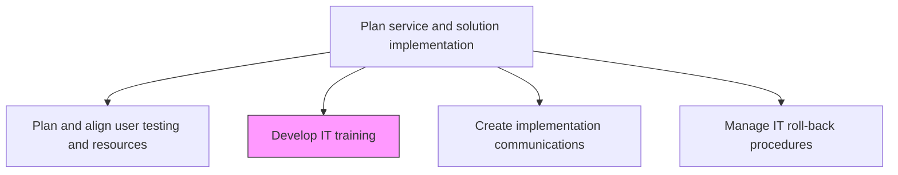
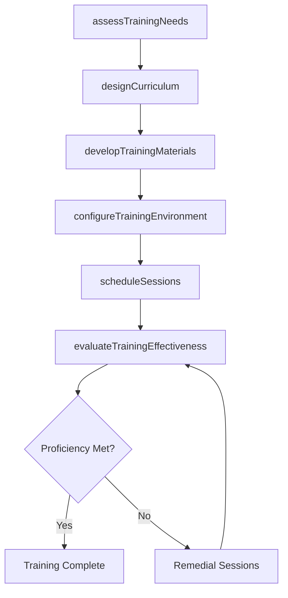

# Develop IT training

> Business-as-Code definition for creating and managing IT training programs that prepare end users, support staff, and administrators for new or changed IT services and solutions.

## Overview

Create and manage employee training programs by considering the need and availability of these programs. Manage all aspects related to the training programs.

## Process Hierarchy



## GraphDL

```yaml
develop:
  object: IT Training
  actor: ITTrainingSpecialist
  result: TrainingProgram
```

## Actions

| Action | Description |
|--------|-------------|
| assessTrainingNeeds | Evaluate skill gaps and learning requirements for affected user groups |
| designCurriculum | Create structured training curriculum covering features, workflows, and support procedures |
| developTrainingMaterials | Build instructional content including guides, videos, simulations, and quick reference cards |
| configureTrainingEnvironment | Set up sandbox environments for hands-on practice sessions |
| scheduleSessions | Plan training delivery windows aligned with roll-out phases and user availability |
| evaluateTrainingEffectiveness | Measure knowledge retention and skill acquisition through assessments and feedback |

## Events

| Event | Description |
|-------|-------------|
| trainingNeedsAssessed | Skill gaps and learning requirements evaluated for user groups |
| curriculumDesigned | Structured training curriculum created and approved |
| trainingMaterialsDeveloped | Instructional content built and reviewed |
| trainingEnvironmentConfigured | Sandbox environments provisioned for hands-on practice |
| sessionsScheduled | Training delivery windows planned and communicated |
| trainingEffectivenessEvaluated | Knowledge retention and skill acquisition measured |

## Searches

| Search | Description |
|--------|-------------|
| getTrainingPrograms | Retrieve training programs filtered by release, audience, or delivery method |
| getTrainingSchedule | List scheduled training sessions with dates, audiences, and facilitators |
| getTrainingMaterials | Access training content and materials for a specific program |
| getTrainingMetrics | Retrieve completion rates, assessment scores, and feedback data |

## Process Flow



## RACI Matrix

| Activity | Responsible | Accountable | Consulted | Informed |
|----------|-------------|-------------|-----------|----------|
| assessTrainingNeeds | ITTrainingSpecialist | ITTrainingManager | BusinessUnitLeads | ProjectManager |
| designCurriculum | ITTrainingSpecialist | ITTrainingManager | SubjectMatterExperts | ReleaseManager |
| developTrainingMaterials | InstructionalDesigner | ITTrainingManager | ApplicationTeam | HRDepartment |
| evaluateTrainingEffectiveness | ITTrainingSpecialist | ITTrainingManager | BusinessUnitLeads | ITDirector |

## Related Processes

| Process | Relationship |
|---------|-------------|
| 8.6.2.6 Create implementation communications | Parallel - training complements deployment communications |
| 8.6.5.1 Conduct IT training | Downstream - training programs delivered during rollout |
| 8.6.2.4 Plan and align user testing and resources | Upstream - testing reveals training focus areas |

## Related Departments

| Department | Role |
|-----------|------|
| IT Training | Designs and develops training programs and materials |
| Human Resources | Coordinates training logistics and tracks completion |
| Application Development | Provides subject matter expertise for curriculum design |
| Business Units | Identifies user training needs and validates content relevance |

## Related Occupations

| Occupation | Involvement |
|-----------|-------------|
| IT Training Specialist | Assesses needs and designs training programs |
| Instructional Designer | Creates training materials and e-learning content |
| Subject Matter Expert | Validates technical accuracy of training content |

## KPIs

| KPI | Description | Unit |
|-----|-------------|------|
| Training Completion Rate | Percentage of targeted users who completed required training | % |
| Knowledge Assessment Score | Average score on post-training knowledge assessments | Score (0-100) |
| Training Satisfaction | Average user satisfaction rating for training sessions | Score (1-5) |
| Time to Proficiency | Average time from training to demonstrated competency | Days |

## Usage

```typescript
import { developItTraining } from '@headlessly/develop-it-training'

const training = developItTraining()

// Retrieve training programs for a release
const programs = await training.getTrainingPrograms({
  releaseId: 'rel-2024-q4-003',
  audience: 'end-users',
  deliveryMethod: 'instructor-led'
})

// Get training completion metrics
const metrics = await training.getTrainingMetrics({
  programId: programs[0].id,
  metric: 'completionRate'
})
```
