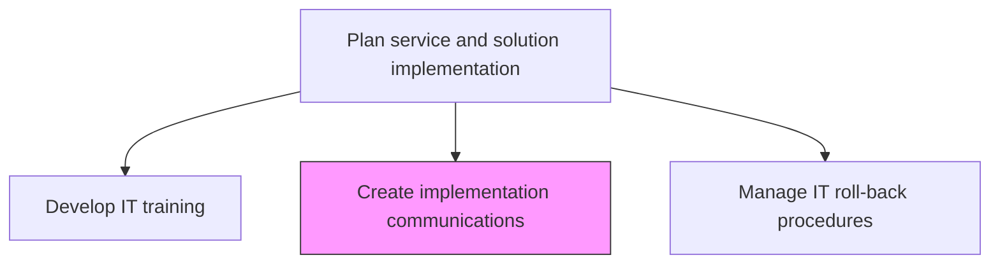
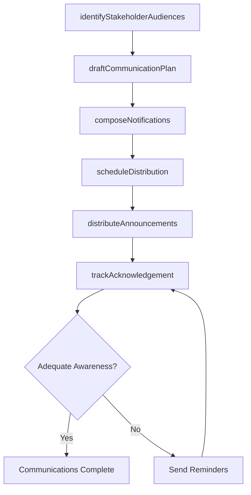

# Create implementation communications

> Business-as-Code definition for developing and distributing stakeholder communications that inform employees and business partners about upcoming IT implementation changes, timelines, and expected impacts.

## Overview

Coordinating change implementation in IT services and solutions communications with employees and stakeholders.

## Process Hierarchy



## GraphDL

```yaml
create:
  object: Implementation Communications
  actor: ChangeCoordinator
  result: CommunicationPlan
```

## Actions

| Action | Description |
|--------|-------------|
| identifyStakeholderAudiences | Segment affected stakeholders by role, impact level, and communication needs |
| draftCommunicationPlan | Create a structured plan outlining messages, channels, timing, and responsible parties |
| composeNotifications | Write deployment notifications, impact summaries, and action-required messages |
| scheduleDistribution | Time communication delivery to align with deployment phases and milestones |
| distributeAnnouncements | Send communications through approved channels including email, intranet, and meetings |
| trackAcknowledgement | Monitor stakeholder receipt and acknowledgement of deployment communications |

## Events

| Event | Description |
|-------|-------------|
| stakeholderAudiencesIdentified | Affected stakeholder groups segmented and cataloged |
| communicationPlanDrafted | Structured communication plan created and approved |
| notificationsComposed | Deployment notifications and impact summaries written |
| distributionScheduled | Communication delivery timed to deployment milestones |
| announcementsDistributed | Communications sent through approved channels |
| acknowledgementTracked | Stakeholder receipt and acknowledgement monitored |

## Searches

| Search | Description |
|--------|-------------|
| getCommunicationPlan | Retrieve the communication plan for a specific deployment or release |
| getNotifications | List scheduled or sent notifications filtered by audience or status |
| getAcknowledgements | Get stakeholder acknowledgement status for deployment communications |

## Process Flow



## RACI Matrix

| Activity | Responsible | Accountable | Consulted | Informed |
|----------|-------------|-------------|-----------|----------|
| draftCommunicationPlan | ChangeCoordinator | ReleaseManager | CorporateCommunications | ProjectManager |
| composeNotifications | ChangeCoordinator | ReleaseManager | BusinessAnalysts | ITDirector |
| distributeAnnouncements | ChangeCoordinator | ReleaseManager | ITOperations | AllStakeholders |

## Related Processes

| Process | Relationship |
|---------|-------------|
| 8.6.2.5 Develop IT training | Parallel - communications complement training outreach |
| 8.6.5.2 Prepare and distribute service/solution communications | Downstream - implementation comms feed rollout communications |
| 8.6.3.5 Create and communicate deployment schedule | Related - schedule communications align with deployment comms |

## Related Departments

| Department | Role |
|-----------|------|
| Change Management | Owns the communication plan and stakeholder engagement |
| Corporate Communications | Provides messaging standards and distribution channels |
| Release Management | Aligns communications with deployment timelines |

## Related Occupations

| Occupation | Involvement |
|-----------|-------------|
| Change Coordinator | Creates and manages implementation communications |
| Communications Specialist | Reviews messaging quality and channel strategy |
| Release Manager | Validates communication timing against deployment schedule |

## KPIs

| KPI | Description | Unit |
|-----|-------------|------|
| Stakeholder Reach | Percentage of affected stakeholders who received communications | % |
| Acknowledgement Rate | Percentage of stakeholders who acknowledged receipt | % |
| Communication Timeliness | Percentage of communications delivered on schedule | % |
| Stakeholder Awareness Score | Survey-based awareness score of upcoming changes | Score (1-5) |

## Usage

```typescript
import { createImplementationCommunications } from '@headlessly/create-implementation-communications'

const comms = createImplementationCommunications()

// Retrieve communication plan for a deployment
const plan = await comms.getCommunicationPlan({
  releaseId: 'rel-2024-q4-003',
  audience: 'business-users'
})

// Track acknowledgement status
const acks = await comms.getAcknowledgements({
  releaseId: 'rel-2024-q4-003',
  status: 'pending'
})
```
