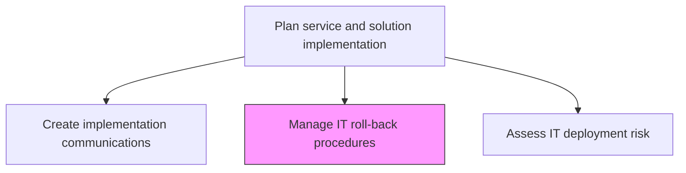
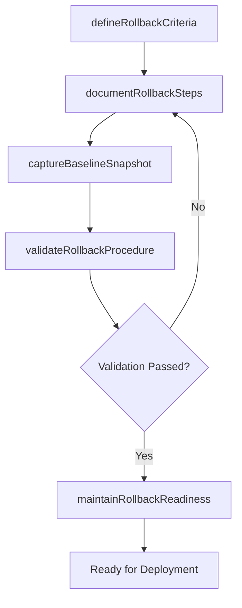

# Manage IT roll-back procedures

> Business-as-Code definition for establishing and maintaining roll-back procedures that enable a safe return to the previous stable state when IT deployments encounter critical failures.

## Overview

Managing procedures to return to initial pre-deployment stage or previous state from current environment.

## Process Hierarchy



## GraphDL

```yaml
manage:
  object: IT Roll-back Procedures
  actor: ReleaseEngineer
  result: RollbackPlan
```

## Actions

| Action | Description |
|--------|-------------|
| defineRollbackCriteria | Establish measurable trigger conditions that initiate a roll-back decision |
| documentRollbackSteps | Create step-by-step procedures for reverting each component to its prior state |
| captureBaselineSnapshot | Record the pre-deployment baseline state of all affected systems and data |
| validateRollbackProcedure | Test the roll-back procedure in a staging environment before production deployment |
| maintainRollbackReadiness | Keep roll-back artifacts, scripts, and snapshots current and accessible |

## Events

| Event | Description |
|-------|-------------|
| rollbackCriteriaDefined | Trigger conditions for roll-back established and documented |
| rollbackStepsDocumented | Step-by-step reversion procedures created and reviewed |
| baselineSnapshotCaptured | Pre-deployment system and data baselines recorded |
| rollbackProcedureValidated | Roll-back procedure tested and confirmed in staging |
| rollbackReadinessMaintained | Roll-back artifacts and scripts verified as current |

## Searches

| Search | Description |
|--------|-------------|
| getRollbackPlans | Retrieve roll-back plans filtered by release, component, or environment |
| getRollbackCriteria | List defined trigger conditions for initiating a roll-back |
| getBaselineSnapshots | Access pre-deployment baseline snapshots for specific deployments |
| getRollbackTestResults | Retrieve validation results from roll-back procedure testing |

## Process Flow



## RACI Matrix

| Activity | Responsible | Accountable | Consulted | Informed |
|----------|-------------|-------------|-----------|----------|
| defineRollbackCriteria | ReleaseEngineer | ReleaseManager | ITOperations | ChangeAdvisoryBoard |
| documentRollbackSteps | ReleaseEngineer | ReleaseManager | DatabaseAdmins | InfrastructureTeam |
| validateRollbackProcedure | ReleaseEngineer | ReleaseManager | QATeam | ProjectManager |
| maintainRollbackReadiness | ReleaseEngineer | ReleaseManager | SecurityTeam | ITDirector |

## Related Processes

| Process | Relationship |
|---------|-------------|
| 8.6.2.1 Assess IT deployment risk | Upstream - risk assessment defines roll-back priorities |
| 8.6.4.9 Execute roll-back plan | Downstream - roll-back procedures executed when triggered |
| 8.6.3.3 Assess IT change/release risk | Parallel - change risk assessment informs roll-back scope |

## Related Departments

| Department | Role |
|-----------|------|
| Release Engineering | Creates and validates roll-back procedures and scripts |
| IT Operations | Maintains infrastructure snapshots and baseline configurations |
| Database Administration | Manages data roll-back procedures and backup integrity |

## Related Occupations

| Occupation | Involvement |
|-----------|-------------|
| Release Engineer | Documents and tests roll-back procedures |
| Database Administrator | Designs data reversion and restore procedures |
| Infrastructure Engineer | Manages system snapshots and configuration baselines |

## KPIs

| KPI | Description | Unit |
|-----|-------------|------|
| Rollback Plan Coverage | Percentage of deployments with documented roll-back procedures | % |
| Rollback Validation Rate | Percentage of roll-back plans tested before production deployment | % |
| Rollback Execution Time | Average time to complete a roll-back when triggered | Minutes |
| Baseline Snapshot Currency | Percentage of snapshots captured within 24 hours of deployment | % |

## Usage

```typescript
import { manageItRollBackProcedures } from '@headlessly/manage-it-roll-back-procedures'

const rollback = manageItRollBackProcedures()

// Retrieve roll-back plan for a release
const plans = await rollback.getRollbackPlans({
  releaseId: 'rel-2024-q4-003',
  environment: 'production'
})

// Access baseline snapshots
const snapshots = await rollback.getBaselineSnapshots({
  releaseId: 'rel-2024-q4-003',
  component: 'order-processing-service'
})
```
