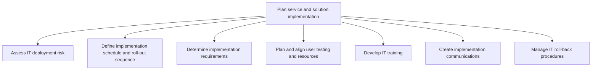
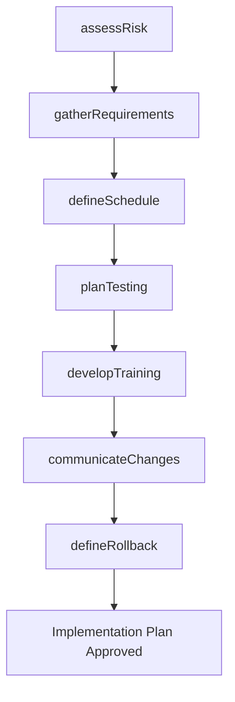

# Plan service and solution implementation

> Business-as-Code definition for planning the implementation of IT services and solutions, including risk assessment, scheduling, requirements gathering, user testing, training development, stakeholder communication, and rollback procedures.

## Overview

Strategizing and executing changes in IT solutions and services. Create a plan for deploying the changes. Communicate with stakeholders about the changes. Administer and implement the changes. Train the resources who will be affected by these changes. Install changes and verify their effect.

## Process Hierarchy



## GraphDL

```yaml
plan:
  object: Service And Solution Implementation
  actor: ImplementationManager
  result: ImplementationPlan
```

## Actions

| Action | Description |
|--------|-------------|
| assessRisk | Evaluate threats and potential failures related to the deployment |
| defineSchedule | Create the implementation timeline and roll-out sequence |
| gatherRequirements | Determine infrastructure, resource, and configuration prerequisites |
| planTesting | Organize user acceptance testing resources and schedules |
| developTraining | Create training materials and programs for affected users |
| communicateChanges | Prepare and distribute implementation communications to stakeholders |
| defineRollback | Establish rollback procedures to restore the previous state if needed |

## Events

| Event | Description |
|-------|-------------|
| riskAssessed | Deployment risk analysis completed and mitigations identified |
| scheduleDefined | Implementation timeline and roll-out sequence established |
| requirementsGathered | Implementation prerequisites documented and validated |
| testingPlanned | User acceptance testing resources and schedules finalized |
| trainingDeveloped | Training materials created and sessions scheduled |
| changesCommunicated | Implementation communications distributed to stakeholders |
| rollbackDefined | Rollback procedures documented and tested |

## Searches

| Search | Description |
|--------|-------------|
| getImplementationPlan | Retrieve the full implementation plan for a service deployment |
| findRiskAssessments | List risk assessments filtered by severity or service |
| getTrainingSchedule | Get scheduled training sessions for an implementation |
| getRollbackProcedures | Retrieve rollback procedures for a specific deployment |

## Process Flow



## RACI Matrix

| Activity | Responsible | Accountable | Consulted | Informed |
|----------|-------------|-------------|-----------|----------|
| assessRisk | RiskAnalyst | ImplementationManager | SecurityTeam | ReleaseManager |
| defineSchedule | ProjectManager | ImplementationManager | InfrastructureTeam | BusinessStakeholders |
| developTraining | TrainingCoordinator | ImplementationManager | EndUserRepresentatives | HumanResources |
| defineRollback | DevOpsEngineer | ImplementationManager | QATeam | OperationsTeam |

## Sub-Processes

| ID | Name | Description |
|----|------|-------------|
| 8.6.2.1 | Assess IT deployment risk | Accessing threats and potential failures related to the deployment of IT services/solutions. |
| 8.6.2.2 | Define implementation schedule and roll-out sequence | Defining the schedule for implementation of change. Plan and carry out a process or procedure to imp |
| 8.6.2.3 | Determine implementation requirements | Determine requirements for implementation of IT deployment. Carry out a pre-implementation audit to  |
| 8.6.2.4 | Plan and align user testing and resources | Plan methodologies and align resources for user testing of IT deployment. |
| 8.6.2.5 | Develop IT training | Create and manage employee training programs by considering the need and availability of these progr |
| 8.6.2.6 | Create implementation communications | Coordinating change implementation in IT services and solutions communications with employees and st |
| 8.6.2.7 | Manage IT roll-back procedures | Managing procedures to return to initial pre-deployment stage or previous state from current environ |

## Related Processes

| Process | Relationship |
|---------|-------------|
| 8.6.1 Develop and manage service/solution deployment strategy | Upstream - strategy provides policies for implementation planning |
| 8.6.3 Manage change deployment control | Downstream - implementation plan feeds change control |
| 8.6.4 Implement technology solutions | Downstream - implementation plan guides execution |

## Related Departments

| Department | Role |
|-----------|------|
| Project Management Office | Coordinates implementation schedules and resources |
| Training and Development | Creates and delivers end-user training |
| Corporate Communications | Manages stakeholder communications |
| IT Operations | Provides infrastructure readiness and rollback support |
| Risk Management | Evaluates deployment risks and mitigation strategies |

## Related Occupations

| Occupation | Involvement |
|-----------|-------------|
| Implementation Manager | Plans and coordinates the overall implementation |
| IT Trainer | Develops and delivers training programs |
| Risk Analyst | Assesses deployment risks and mitigation strategies |

## KPIs

| KPI | Description | Unit |
|-----|-------------|------|
| Planning Cycle Time | Average time from planning initiation to plan approval | Days |
| Risk Mitigation Coverage | Percentage of identified risks with documented mitigations | % |
| Training Completion Rate | Percentage of affected users who completed pre-deployment training | % |
| Rollback Plan Coverage | Percentage of deployments with tested rollback procedures | % |

## Usage

```typescript
import { planServiceAndSolutionImplementation } from '@headlessly/plan-service-and-solution-implementation'

const implementation = planServiceAndSolutionImplementation()

// Assess deployment risk
const risk = await implementation.assessRisk({
  serviceId: 'svc-erp-upgrade',
  deploymentType: 'major-release',
  affectedSystems: ['finance', 'procurement', 'inventory']
})

// Define the implementation schedule
const schedule = await implementation.defineSchedule({
  serviceId: 'svc-erp-upgrade',
  phases: ['pilot', 'regional', 'global'],
  startDate: '2025-07-01',
  maintenanceWindow: 'Sunday 00:00-06:00 UTC'
})

// Develop training materials
await implementation.developTraining({
  serviceId: 'svc-erp-upgrade',
  audiences: ['finance-team', 'procurement-team'],
  format: ['e-learning', 'instructor-led']
})
```
