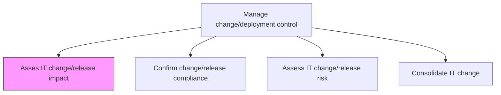
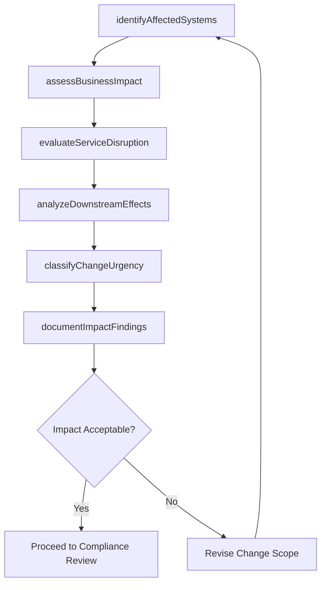

# Asses IT change/release impact

> Business-as-Code definition for evaluating the operational, technical, and business impact of proposed IT changes and releases before they are approved for deployment.

## Overview

Evaluating the impact of IT change/release on the business.

## Process Hierarchy



## GraphDL

```yaml
asses:
  object: IT Change/release Impact
  actor: ChangeAnalyst
  result: ImpactAssessmentReport
```

## Actions

| Action | Description |
|--------|-------------|
| identifyAffectedSystems | Map all systems, services, and integrations affected by the proposed change |
| assessBusinessImpact | Evaluate the effect on business processes, users, and revenue streams |
| evaluateServiceDisruption | Determine expected service downtime and degradation during change implementation |
| analyzeDownstreamEffects | Trace cascading impacts across dependent services and data flows |
| classifyChangeUrgency | Categorize the change by urgency level and business criticality |
| documentImpactFindings | Record impact assessment findings for change advisory board review |

## Events

| Event | Description |
|-------|-------------|
| affectedSystemsIdentified | All impacted systems and integrations mapped |
| businessImpactAssessed | Business process and revenue impact evaluated |
| serviceDisruptionEvaluated | Expected downtime and degradation determined |
| downstreamEffectsAnalyzed | Cascading impacts across dependencies traced |
| changeUrgencyClassified | Change urgency and criticality categorized |
| impactFindingsDocumented | Assessment findings recorded for CAB review |

## Searches

| Search | Description |
|--------|-------------|
| getImpactAssessments | Retrieve impact assessments filtered by change request, severity, or date |
| getAffectedSystems | List systems and services affected by a specific change |
| getBusinessImpactSummary | Get business impact summary for a change request |
| getChangeHistory | Access historical impact data for similar past changes |

## Process Flow



## RACI Matrix

| Activity | Responsible | Accountable | Consulted | Informed |
|----------|-------------|-------------|-----------|----------|
| identifyAffectedSystems | ChangeAnalyst | ChangeManager | InfrastructureTeam | ReleaseManager |
| assessBusinessImpact | ChangeAnalyst | ChangeManager | BusinessAnalysts | ExecutiveSponsor |
| evaluateServiceDisruption | ChangeAnalyst | ChangeManager | ITOperations | ServiceDeskManager |
| documentImpactFindings | ChangeAnalyst | ChangeManager | SecurityTeam | ChangeAdvisoryBoard |

## Related Processes

| Process | Relationship |
|---------|-------------|
| 8.6.3.2 Confirm change/release compliance | Downstream - impact findings inform compliance review |
| 8.6.3.3 Assess IT change/release risk | Parallel - impact and risk assessments complement each other |
| 8.6.3.6 Approve change/release deployment | Downstream - impact assessment required for approval decision |

## Related Departments

| Department | Role |
|-----------|------|
| Change Management | Leads impact assessment and coordinates CAB reviews |
| IT Operations | Provides operational impact data and service dependency maps |
| Business Analysis | Evaluates business process and user impact |
| IT Security | Assesses security implications of proposed changes |

## Related Occupations

| Occupation | Involvement |
|-----------|-------------|
| Change Analyst | Conducts impact analysis across systems and business processes |
| Service Delivery Manager | Evaluates service disruption and customer impact |
| Business Analyst | Assesses business process impact and user readiness |

## KPIs

| KPI | Description | Unit |
|-----|-------------|------|
| Impact Assessment Completion Rate | Percentage of changes with completed impact assessments | % |
| Impact Prediction Accuracy | Percentage of predicted impacts matching actual outcomes | % |
| Assessment Turnaround Time | Average time to complete an impact assessment | Hours |
| Change Rejection Rate | Percentage of changes rejected due to unacceptable impact | % |

## Usage

```typescript
import { assesItChangeReleaseImpact } from '@headlessly/asses-it-change-release-impact'

const impact = assesItChangeReleaseImpact()

// Get impact assessment for a change request
const assessment = await impact.getImpactAssessments({
  changeRequestId: 'CR-2024-1547',
  severity: 'high'
})

// List affected systems for a change
const affected = await impact.getAffectedSystems({
  changeRequestId: 'CR-2024-1547',
  includeDownstream: true
})
```
