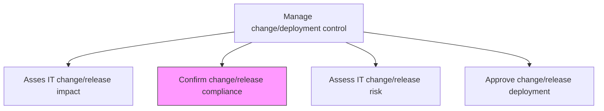
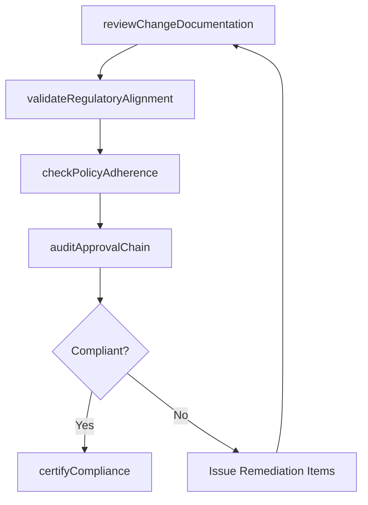

# Confirm change/release compliance

> Business-as-Code definition for verifying that IT changes and releases meet organizational change management guidelines, regulatory requirements, and governance standards before deployment.

## Overview

Ensure that change/release meets change guidelines set by the organization.

## Process Hierarchy



## GraphDL

```yaml
confirm:
  object: Change/release Compliance
  actor: ComplianceReviewer
  result: ComplianceVerificationReport
```

## Actions

| Action | Description |
|--------|-------------|
| reviewChangeDocumentation | Verify that change request documentation meets completeness and quality standards |
| validateRegulatoryAlignment | Confirm the change adheres to applicable regulatory and audit requirements |
| checkPolicyAdherence | Verify compliance with organizational change management policies and procedures |
| auditApprovalChain | Validate that all required approvals are obtained in the correct sequence |
| certifyCompliance | Issue formal compliance certification for the change or release |

## Events

| Event | Description |
|-------|-------------|
| changeDocumentationReviewed | Change request documentation verified for completeness |
| regulatoryAlignmentValidated | Regulatory and audit compliance confirmed |
| policyAdherenceChecked | Organizational policy compliance verified |
| approvalChainAudited | Required approvals validated in correct sequence |
| complianceCertified | Formal compliance certification issued |

## Searches

| Search | Description |
|--------|-------------|
| getComplianceStatus | Retrieve compliance status for changes filtered by release, status, or reviewer |
| getComplianceViolations | List compliance violations or gaps for a specific change |
| getApprovalChain | Get the approval chain and status for a change request |
| getComplianceHistory | Access compliance review history for similar changes |

## Process Flow



## RACI Matrix

| Activity | Responsible | Accountable | Consulted | Informed |
|----------|-------------|-------------|-----------|----------|
| reviewChangeDocumentation | ComplianceReviewer | ChangeManager | ChangeRequestor | ReleaseManager |
| validateRegulatoryAlignment | ComplianceReviewer | ITGovernanceOfficer | LegalTeam | AuditTeam |
| checkPolicyAdherence | ComplianceReviewer | ChangeManager | SecurityTeam | ITDirector |
| certifyCompliance | ComplianceReviewer | ITGovernanceOfficer | ChangeAdvisoryBoard | ExecutiveSponsor |

## Related Processes

| Process | Relationship |
|---------|-------------|
| 8.6.3.1 Asses IT change/release impact | Upstream - impact assessment precedes compliance review |
| 8.6.3.6 Approve change/release deployment | Downstream - compliance certification required for approval |
| 8.6.3.3 Assess IT change/release risk | Parallel - risk and compliance reviews often occur together |

## Related Departments

| Department | Role |
|-----------|------|
| IT Governance | Sets compliance standards and policies for change management |
| Internal Audit | Validates adherence to regulatory and audit requirements |
| Change Management | Coordinates compliance reviews as part of change process |
| Legal and Compliance | Advises on regulatory implications of IT changes |

## Related Occupations

| Occupation | Involvement |
|-----------|-------------|
| Compliance Reviewer | Conducts compliance verification of change documentation |
| IT Governance Officer | Maintains compliance standards and certification authority |
| Internal Auditor | Validates regulatory adherence for IT changes |

## KPIs

| KPI | Description | Unit |
|-----|-------------|------|
| Compliance Certification Rate | Percentage of changes certified compliant on first review | % |
| Compliance Review Cycle Time | Average time from submission to compliance certification | Hours |
| Remediation Item Count | Number of compliance gaps identified per change | Count |
| Regulatory Violation Rate | Percentage of changes with regulatory non-compliance findings | % |

## Usage

```typescript
import { confirmChangeReleaseCompliance } from '@headlessly/confirm-change-release-compliance'

const compliance = confirmChangeReleaseCompliance()

// Check compliance status for a change
const status = await compliance.getComplianceStatus({
  changeRequestId: 'CR-2024-1547',
  reviewer: 'governance-team'
})

// List compliance violations
const violations = await compliance.getComplianceViolations({
  changeRequestId: 'CR-2024-1547',
  severity: 'critical'
})
```
