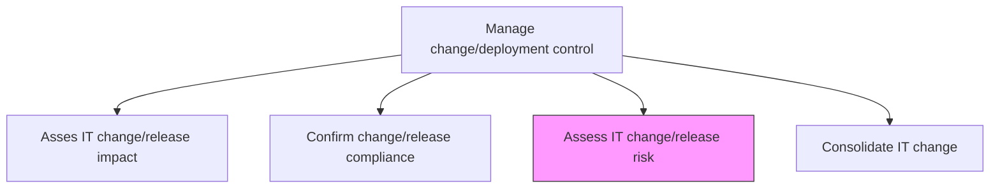
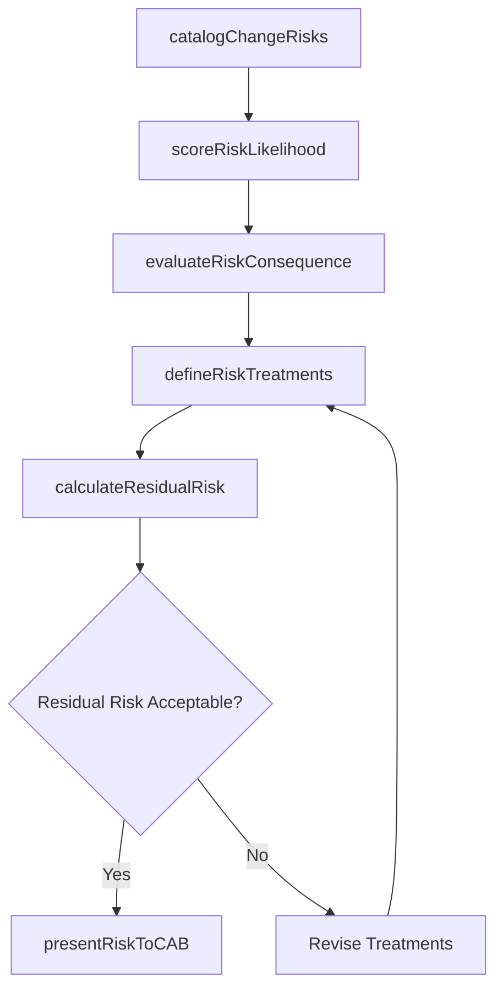

# Assess IT change/release risk

> Business-as-Code definition for evaluating risks and threats associated with IT change and release deployments, including technical failures, security vulnerabilities, and operational disruptions.

## Overview

Evaluating for any kind of risks or threats which could be caused due to IT change/release deployment.

## Process Hierarchy



## GraphDL

```yaml
assess:
  object: IT Change/release Risk
  actor: ChangeRiskAnalyst
  result: ChangeRiskAssessment
```

## Actions

| Action | Description |
|--------|-------------|
| catalogChangeRisks | Identify and categorize risks specific to the proposed change or release |
| scoreRiskLikelihood | Assign probability scores to each identified risk based on historical data and complexity |
| evaluateRiskConsequence | Determine the severity of consequences if each risk materializes |
| defineRiskTreatments | Specify mitigation, transfer, avoidance, or acceptance strategies for each risk |
| calculateResidualRisk | Assess remaining risk levels after planned treatments are applied |
| presentRiskToCAB | Present the risk assessment to the Change Advisory Board for review |

## Events

| Event | Description |
|-------|-------------|
| changeRisksCataloged | Risks for the proposed change identified and categorized |
| riskLikelihoodScored | Probability scores assigned to each change risk |
| riskConsequenceEvaluated | Severity of risk consequences determined |
| riskTreatmentsDefined | Mitigation strategies specified for identified risks |
| residualRiskCalculated | Remaining risk levels assessed after planned treatments |
| riskPresentedToCAB | Risk assessment presented to Change Advisory Board |

## Searches

| Search | Description |
|--------|-------------|
| getChangeRisks | Retrieve risks for a specific change filtered by category, score, or status |
| getRiskTreatments | List risk treatment plans for a specific change or release |
| getResidualRiskProfile | Get the residual risk profile after treatments are applied |
| getRiskTrends | Access historical risk trends for similar change types |

## Process Flow



## RACI Matrix

| Activity | Responsible | Accountable | Consulted | Informed |
|----------|-------------|-------------|-----------|----------|
| catalogChangeRisks | ChangeRiskAnalyst | ChangeManager | InfrastructureTeam | ReleaseManager |
| scoreRiskLikelihood | ChangeRiskAnalyst | ChangeManager | ITOperations | SecurityTeam |
| defineRiskTreatments | ChangeRiskAnalyst | ChangeManager | ApplicationTeam | ChangeAdvisoryBoard |
| presentRiskToCAB | ChangeManager | ITDirector | ChangeRiskAnalyst | ExecutiveSponsor |

## Related Processes

| Process | Relationship |
|---------|-------------|
| 8.6.3.1 Asses IT change/release impact | Parallel - impact assessment feeds risk evaluation |
| 8.6.3.6 Approve change/release deployment | Downstream - risk assessment required for approval decision |
| 8.6.2.1 Assess IT deployment risk | Related - deployment-level risk complements change-level risk |

## Related Departments

| Department | Role |
|-----------|------|
| Change Management | Coordinates risk assessment as part of change control process |
| IT Risk Management | Provides risk assessment frameworks and scoring methods |
| IT Security | Evaluates security-related risks for changes and releases |
| IT Operations | Assesses operational and infrastructure risks |

## Related Occupations

| Occupation | Involvement |
|-----------|-------------|
| Change Risk Analyst | Conducts risk identification, scoring, and treatment planning |
| Change Manager | Oversees risk assessment and presents findings to CAB |
| Security Analyst | Evaluates security risks associated with proposed changes |

## KPIs

| KPI | Description | Unit |
|-----|-------------|------|
| Risk Assessment Coverage | Percentage of changes with completed risk assessments | % |
| Risk Treatment Effectiveness | Percentage of risks successfully mitigated by planned treatments | % |
| Post-Change Incident Rate | Number of incidents attributed to changes per release cycle | Count |
| CAB Risk Rejection Rate | Percentage of changes rejected by CAB due to unacceptable risk | % |

## Usage

```typescript
import { assessItChangeReleaseRisk } from '@headlessly/assess-it-change-release-risk'

const riskAssessment = assessItChangeReleaseRisk()

// Get risks for a change request
const risks = await riskAssessment.getChangeRisks({
  changeRequestId: 'CR-2024-1547',
  minScore: 7,
  category: 'infrastructure'
})

// Retrieve risk treatments
const treatments = await riskAssessment.getRiskTreatments({
  changeRequestId: 'CR-2024-1547',
  strategy: 'mitigate'
})
```
