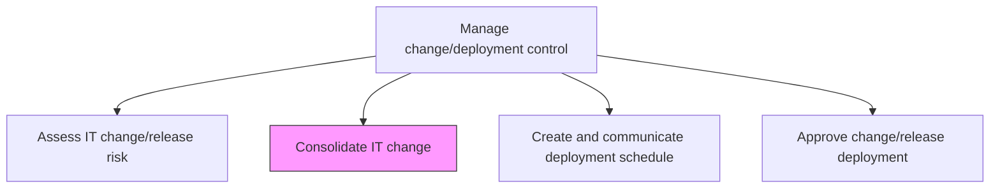
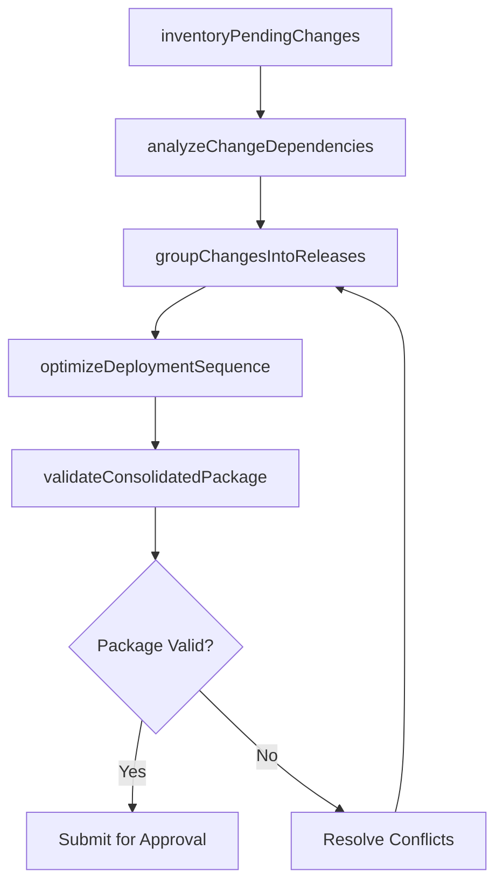

# Consolidate IT change

> Business-as-Code definition for bundling and integrating multiple IT changes into coordinated release packages to optimize resource utilization, minimize downtime, and reduce deployment overhead.

## Overview

Integrate all forms of changes in IT in order to make more efficient use of resources and down time, and optimizing results.

## Process Hierarchy



## GraphDL

```yaml
consolidate:
  object: IT Change
  actor: ReleaseCoordinator
  result: ConsolidatedReleasePlan
```

## Actions

| Action | Description |
|--------|-------------|
| inventoryPendingChanges | Catalog all pending change requests eligible for consolidation |
| analyzeChangeDependencies | Map interdependencies between pending changes to identify bundling opportunities |
| groupChangesIntoReleases | Bundle compatible changes into coordinated release packages |
| optimizeDeploymentSequence | Order grouped changes to minimize downtime and resource conflicts |
| validateConsolidatedPackage | Verify the consolidated release package for compatibility and completeness |

## Events

| Event | Description |
|-------|-------------|
| pendingChangesInventoried | All pending change requests cataloged for consolidation |
| changeDependenciesAnalyzed | Interdependencies between changes mapped |
| changesGroupedIntoReleases | Compatible changes bundled into release packages |
| deploymentSequenceOptimized | Change ordering optimized for minimal disruption |
| consolidatedPackageValidated | Release package verified for compatibility |

## Searches

| Search | Description |
|--------|-------------|
| getPendingChanges | Retrieve pending changes eligible for consolidation by date, priority, or system |
| getConsolidatedReleases | List consolidated release packages with included changes |
| getChangeDependencies | Get dependency map between changes within a release |
| getConflictingChanges | Identify changes that cannot be bundled together |

## Process Flow



## RACI Matrix

| Activity | Responsible | Accountable | Consulted | Informed |
|----------|-------------|-------------|-----------|----------|
| inventoryPendingChanges | ReleaseCoordinator | ReleaseManager | ChangeRequestors | ITOperations |
| analyzeChangeDependencies | ReleaseCoordinator | ReleaseManager | ApplicationTeams | InfrastructureTeam |
| groupChangesIntoReleases | ReleaseCoordinator | ReleaseManager | ChangeAdvisoryBoard | ProjectManagers |
| validateConsolidatedPackage | ReleaseCoordinator | ReleaseManager | QATeam | ChangeManager |

## Related Processes

| Process | Relationship |
|---------|-------------|
| 8.6.3.5 Create and communicate deployment schedule | Downstream - consolidated releases drive deployment scheduling |
| 8.6.3.1 Asses IT change/release impact | Upstream - individual change impacts inform consolidation |
| 8.6.3.6 Approve change/release deployment | Downstream - consolidated packages submitted for approval |

## Related Departments

| Department | Role |
|-----------|------|
| Release Management | Coordinates change consolidation and release packaging |
| Change Management | Provides change request inventory and priority data |
| IT Operations | Validates operational feasibility of consolidated deployments |

## Related Occupations

| Occupation | Involvement |
|-----------|-------------|
| Release Coordinator | Bundles and sequences changes into release packages |
| Change Manager | Prioritizes changes for consolidation |
| Configuration Manager | Validates package compatibility against CMDB |

## KPIs

| KPI | Description | Unit |
|-----|-------------|------|
| Consolidation Ratio | Average number of changes bundled per release | Count |
| Deployment Window Utilization | Percentage of deployment window used by consolidated changes | % |
| Change Conflict Rate | Percentage of changes with consolidation conflicts | % |
| Downtime Reduction | Reduction in total downtime through consolidation versus individual deployments | % |

## Usage

```typescript
import { consolidateItChange } from '@headlessly/consolidate-it-change'

const consolidation = consolidateItChange()

// Get pending changes eligible for consolidation
const pending = await consolidation.getPendingChanges({
  targetDate: '2024-11-15',
  priority: ['high', 'medium'],
  system: 'order-management'
})

// Retrieve consolidated release packages
const releases = await consolidation.getConsolidatedReleases({
  releaseWindow: '2024-Q4',
  status: 'validated'
})
```
