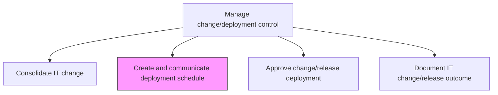
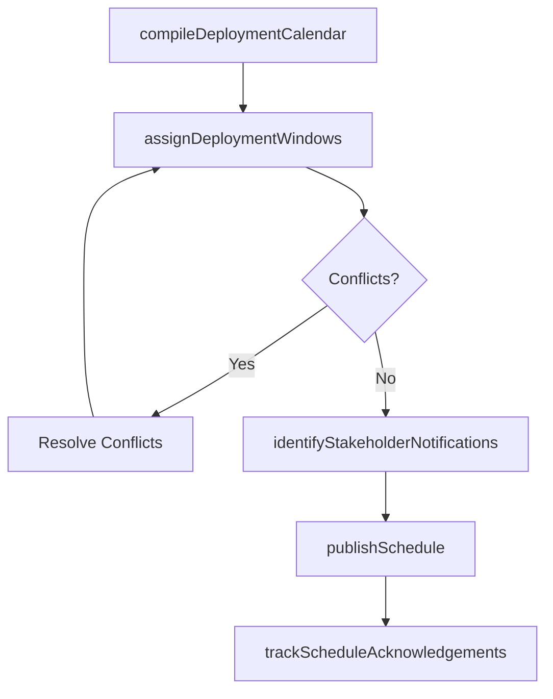

# Create and communicate deployment schedule

> Business-as-Code definition for creating formal deployment schedules and communicating them to all stakeholders, ensuring coordinated awareness of deployment windows, expected impacts, and responsibilities.

## Overview

Defining and communicating the schedule for implementation to related stakeholders and functions.

## Process Hierarchy



## GraphDL

```yaml
create:
  object: And Communicate Deployment Schedule
  actor: DeploymentScheduler
  result: DeploymentSchedule
```

## Actions

| Action | Description |
|--------|-------------|
| compileDeploymentCalendar | Aggregate all approved changes into a master deployment calendar |
| assignDeploymentWindows | Allocate specific time slots for each deployment activity |
| identifyStakeholderNotifications | Determine which stakeholders require notification for each deployment |
| publishSchedule | Distribute the finalized deployment schedule through approved channels |
| trackScheduleAcknowledgements | Monitor stakeholder receipt and acknowledgement of schedule communications |

## Events

| Event | Description |
|-------|-------------|
| deploymentCalendarCompiled | Master deployment calendar assembled from approved changes |
| deploymentWindowsAssigned | Time slots allocated for each deployment activity |
| stakeholderNotificationsIdentified | Notification requirements mapped to stakeholders |
| schedulePublished | Deployment schedule distributed to all stakeholders |
| scheduleAcknowledgementsTracked | Stakeholder acknowledgements monitored and recorded |

## Searches

| Search | Description |
|--------|-------------|
| getDeploymentSchedule | Retrieve the deployment schedule filtered by date range, system, or team |
| getDeploymentWindows | List assigned deployment windows with activities and responsible teams |
| getScheduleConflicts | Identify scheduling conflicts across overlapping deployments |
| getStakeholderAcknowledgements | Get acknowledgement status for deployment schedule communications |

## Process Flow



## RACI Matrix

| Activity | Responsible | Accountable | Consulted | Informed |
|----------|-------------|-------------|-----------|----------|
| compileDeploymentCalendar | DeploymentScheduler | ReleaseManager | ChangeManager | ITOperations |
| assignDeploymentWindows | DeploymentScheduler | ReleaseManager | InfrastructureTeam | ServiceDeskManager |
| publishSchedule | DeploymentScheduler | ReleaseManager | CommunicationsTeam | AllStakeholders |

## Related Processes

| Process | Relationship |
|---------|-------------|
| 8.6.3.4 Consolidate IT change | Upstream - consolidated changes feed the deployment calendar |
| 8.6.3.6 Approve change/release deployment | Parallel - approved changes populate the deployment schedule |
| 8.6.2.2 Define implementation schedule and roll-out sequence | Related - implementation schedule informs deployment scheduling |

## Related Departments

| Department | Role |
|-----------|------|
| Release Management | Creates and publishes the deployment schedule |
| IT Operations | Validates deployment window feasibility and staffing |
| Corporate Communications | Assists with stakeholder notification distribution |

## Related Occupations

| Occupation | Involvement |
|-----------|-------------|
| Deployment Scheduler | Compiles and manages the deployment calendar |
| Release Manager | Approves and oversees schedule publication |
| Operations Manager | Validates staffing and operational readiness for windows |

## KPIs

| KPI | Description | Unit |
|-----|-------------|------|
| Schedule Publication Lead Time | Average days between schedule publication and deployment | Days |
| Stakeholder Acknowledgement Rate | Percentage of stakeholders acknowledging the deployment schedule | % |
| Schedule Conflict Rate | Number of scheduling conflicts identified per deployment cycle | Count |
| Schedule Adherence | Percentage of deployments executed within published windows | % |

## Usage

```typescript
import { createAndCommunicateDeploymentSchedule } from '@headlessly/create-and-communicate-deployment-schedule'

const scheduler = createAndCommunicateDeploymentSchedule()

// Get deployment schedule for a period
const schedule = await scheduler.getDeploymentSchedule({
  dateRange: { start: '2024-11-01', end: '2024-11-30' },
  system: 'core-platform'
})

// Check for scheduling conflicts
const conflicts = await scheduler.getScheduleConflicts({
  deploymentWindow: '2024-11-15T02:00:00Z',
  duration: 240
})
```
