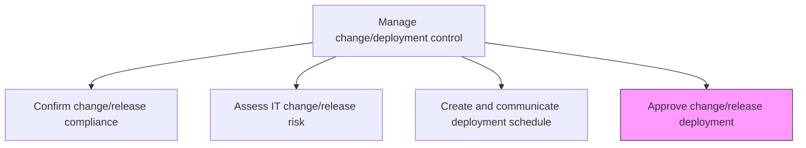
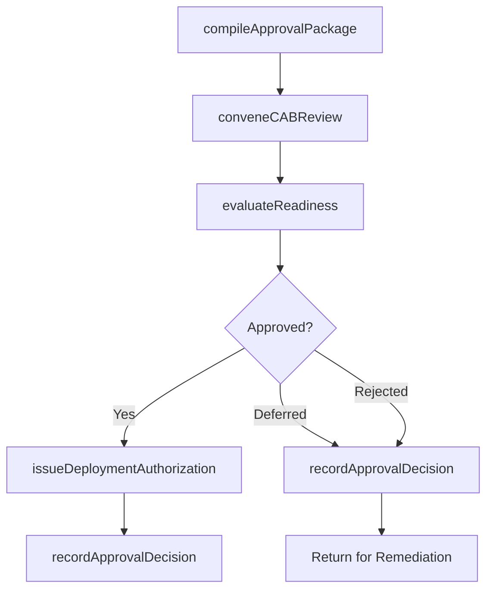

# Approve change/release deployment

> Business-as-Code definition for the formal approval gate where authorized decision-makers review impact, risk, and compliance assessments to authorize IT change and release deployments.

## Overview

Permitting for the change/release deployment. Approve deployment based on the evaluation of business impact due to change/release.

## Process Hierarchy



## GraphDL

```yaml
approve:
  object: Change/release Deployment
  actor: ChangeAdvisoryBoardChair
  result: DeploymentApproval
```

## Actions

| Action | Description |
|--------|-------------|
| compileApprovalPackage | Assemble impact, risk, compliance, and test results into a review package |
| conveneCABReview | Schedule and conduct Change Advisory Board review of the deployment package |
| evaluateReadiness | Assess overall deployment readiness across technical, operational, and business dimensions |
| recordApprovalDecision | Document the approval, deferral, or rejection decision with rationale |
| issueDeploymentAuthorization | Grant formal authorization to proceed with deployment |

## Events

| Event | Description |
|-------|-------------|
| approvalPackageCompiled | Review package assembled with all assessment artifacts |
| cabReviewConvened | Change Advisory Board review session completed |
| readinessEvaluated | Deployment readiness assessed across all dimensions |
| approvalDecisionRecorded | Approval, deferral, or rejection decision documented |
| deploymentAuthorizationIssued | Formal deployment authorization granted |

## Searches

| Search | Description |
|--------|-------------|
| getApprovalQueue | Retrieve changes pending CAB approval filtered by priority or date |
| getApprovalDecisions | List past approval decisions with rationale and conditions |
| getApprovalPackage | Get the compiled review package for a specific change |
| getCABCalendar | Retrieve scheduled CAB review sessions and agendas |

## Process Flow



## RACI Matrix

| Activity | Responsible | Accountable | Consulted | Informed |
|----------|-------------|-------------|-----------|----------|
| compileApprovalPackage | ChangeManager | ChangeAdvisoryBoardChair | ChangeAnalyst | ReleaseManager |
| conveneCABReview | ChangeAdvisoryBoardChair | ITDirector | CABMembers | ProjectManagers |
| issueDeploymentAuthorization | ChangeAdvisoryBoardChair | ITDirector | ReleaseManager | AllStakeholders |

## Related Processes

| Process | Relationship |
|---------|-------------|
| 8.6.3.1 Asses IT change/release impact | Upstream - impact assessment feeds approval review |
| 8.6.3.2 Confirm change/release compliance | Upstream - compliance certification required for approval |
| 8.6.3.7 Document IT change/release outcome | Downstream - approval decision documented in change record |
| 8.6.4 Implement technology solutions | Downstream - approved changes proceed to implementation |

## Related Departments

| Department | Role |
|-----------|------|
| Change Advisory Board | Reviews and approves deployment requests |
| IT Governance | Maintains approval policies and authority matrices |
| Release Management | Prepares approval packages and executes approved deployments |

## Related Occupations

| Occupation | Involvement |
|-----------|-------------|
| CAB Chair | Conducts review and issues approval decisions |
| Change Manager | Compiles approval packages and records decisions |
| IT Director | Provides executive approval authority for high-risk changes |

## KPIs

| KPI | Description | Unit |
|-----|-------------|------|
| Approval Cycle Time | Average time from submission to approval decision | Hours |
| First-Pass Approval Rate | Percentage of changes approved on first CAB review | % |
| Emergency Change Rate | Percentage of changes requiring expedited approval | % |
| Post-Approval Incident Rate | Incidents caused by approved changes within 72 hours | Count |

## Usage

```typescript
import { approveChangeReleaseDeployment } from '@headlessly/approve-change-release-deployment'

const approval = approveChangeReleaseDeployment()

// Get changes pending approval
const queue = await approval.getApprovalQueue({
  priority: 'high',
  scheduledBefore: '2024-11-15'
})

// Retrieve approval decisions
const decisions = await approval.getApprovalDecisions({
  changeRequestId: 'CR-2024-1547',
  outcome: 'approved'
})
```
