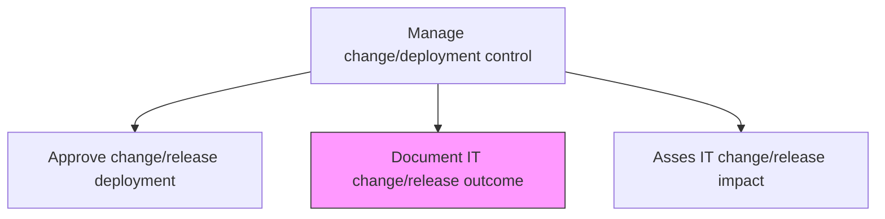
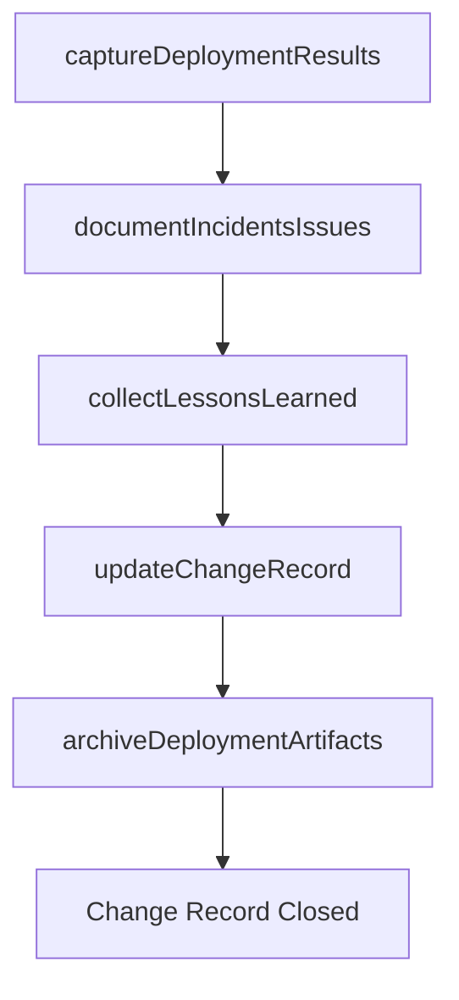

# Document IT change/release outcome

> Business-as-Code definition for recording the outcomes, lessons learned, and post-implementation status of IT change and release deployments to support continuous improvement and audit compliance.

## Overview

Recording outcomes related to the change/release deployment.

## Process Hierarchy



## GraphDL

```yaml
document:
  object: IT Change/release Outcome
  actor: ChangeRecordKeeper
  result: ChangeOutcomeRecord
```

## Actions

| Action | Description |
|--------|-------------|
| captureDeploymentResults | Record the actual outcomes of the deployment including success status and deviations |
| documentIncidentsIssues | Log any incidents, errors, or issues encountered during deployment |
| collectLessonsLearned | Gather feedback and observations from deployment participants for process improvement |
| updateChangeRecord | Finalize the change record with outcome data, closure status, and resolution details |
| archiveDeploymentArtifacts | Store deployment logs, scripts, and configuration snapshots for audit purposes |

## Events

| Event | Description |
|-------|-------------|
| deploymentResultsCaptured | Actual deployment outcomes and deviations recorded |
| incidentsIssuesDocumented | Deployment incidents and errors logged |
| lessonsLearnedCollected | Participant feedback and observations gathered |
| changeRecordUpdated | Change record finalized with outcome and closure data |
| deploymentArtifactsArchived | Deployment logs and artifacts stored for audit |

## Searches

| Search | Description |
|--------|-------------|
| getChangeOutcomes | Retrieve change outcome records filtered by release, status, or date range |
| getDeploymentIncidents | List incidents encountered during a specific deployment |
| getLessonsLearned | Access lessons learned from past deployments filtered by category or severity |
| getDeploymentArtifacts | Retrieve archived deployment logs and configuration snapshots |

## Process Flow



## RACI Matrix

| Activity | Responsible | Accountable | Consulted | Informed |
|----------|-------------|-------------|-----------|----------|
| captureDeploymentResults | ChangeRecordKeeper | ChangeManager | ReleaseEngineer | ITOperations |
| collectLessonsLearned | ChangeRecordKeeper | ChangeManager | DeploymentTeam | ChangeAdvisoryBoard |
| updateChangeRecord | ChangeRecordKeeper | ChangeManager | AuditTeam | ITDirector |

## Related Processes

| Process | Relationship |
|---------|-------------|
| 8.6.3.6 Approve change/release deployment | Upstream - approved and executed changes produce outcomes to document |
| 8.6.4.8 Verify change/release implementation success | Upstream - verification results feed outcome documentation |
| 8.7.5.10 Maintain service support learning | Downstream - lessons learned feed knowledge management |

## Related Departments

| Department | Role |
|-----------|------|
| Change Management | Owns change record documentation and closure |
| IT Operations | Provides deployment execution data and incident details |
| Internal Audit | Consumes outcome records for compliance verification |

## Related Occupations

| Occupation | Involvement |
|-----------|-------------|
| Change Record Keeper | Documents outcomes and maintains change records |
| Change Manager | Reviews and approves change record closure |
| Release Engineer | Provides technical deployment data and artifacts |

## KPIs

| KPI | Description | Unit |
|-----|-------------|------|
| Documentation Completeness | Percentage of deployments with fully documented outcomes | % |
| Change Record Closure Time | Average time from deployment to change record closure | Days |
| Lessons Learned Capture Rate | Percentage of deployments with documented lessons learned | % |
| Audit Readiness Score | Percentage of change records meeting audit documentation requirements | % |

## Usage

```typescript
import { documentItChangeReleaseOutcome } from '@headlessly/document-it-change-release-outcome'

const documentation = documentItChangeReleaseOutcome()

// Get outcomes for recent deployments
const outcomes = await documentation.getChangeOutcomes({
  dateRange: { start: '2024-10-01', end: '2024-11-30' },
  status: 'closed'
})

// Retrieve lessons learned
const lessons = await documentation.getLessonsLearned({
  category: 'infrastructure',
  severity: 'major'
})
```
