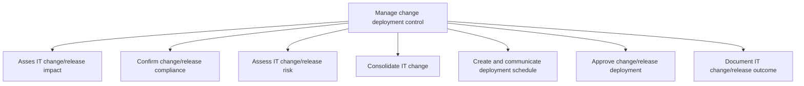
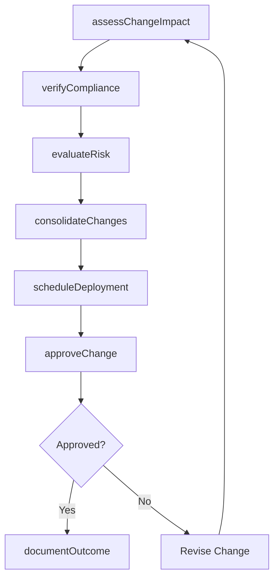

# Manage change deployment control

> Business-as-Code definition for governing the change and release control process for IT deployments, including impact assessment, compliance verification, risk evaluation, change consolidation, scheduling, approval, and outcome documentation.

## Overview

Creating and deploying an architecture for securing the changes deployed in the organization. Create and develop protocols that ensure proper and efficient use of deployed IT services and solutions. Test, evaluate, and implement the policies and protocols.

## Process Hierarchy



## GraphDL

```yaml
manage:
  object: Change Deployment Control
  actor: ChangeManager
  result: ChangeRecord
```

## Actions

| Action | Description |
|--------|-------------|
| assessChangeImpact | Evaluate the business and technical impact of a proposed change |
| verifyCompliance | Confirm the change meets organizational and regulatory guidelines |
| evaluateRisk | Assess risks and threats associated with the change or release |
| consolidateChanges | Combine related changes to optimize resource usage and downtime |
| scheduleDeployment | Create and communicate the deployment schedule to stakeholders |
| approveChange | Grant formal approval for the change or release deployment |
| documentOutcome | Record the results and lessons learned from the change deployment |

## Events

| Event | Description |
|-------|-------------|
| changeImpactAssessed | Change impact analysis completed and documented |
| complianceVerified | Change confirmed as compliant with organizational guidelines |
| riskEvaluated | Change risk assessment completed with mitigations |
| changesConsolidated | Related changes bundled for coordinated deployment |
| deploymentScheduled | Deployment schedule created and communicated |
| changeApproved | Formal approval granted by the change advisory board |
| outcomeDocumented | Change outcome recorded with lessons learned |

## Searches

| Search | Description |
|--------|-------------|
| findChangeRequests | List change requests filtered by status, priority, or requester |
| getChangeDetails | Retrieve full details for a specific change request |
| getDeploymentCalendar | View the deployment schedule with all planned changes |
| getComplianceStatus | Check compliance status of pending change requests |

## Process Flow



## RACI Matrix

| Activity | Responsible | Accountable | Consulted | Informed |
|----------|-------------|-------------|-----------|----------|
| assessChangeImpact | ChangeAnalyst | ChangeManager | ServiceOwners | ProjectManagers |
| verifyCompliance | ComplianceAnalyst | ChangeManager | LegalTeam | SecurityTeam |
| approveChange | ChangeAdvisoryBoard | ChangeManager | ReleaseManager | ITOperations |
| documentOutcome | ChangeAnalyst | ChangeManager | QATeam | ExecutiveTeam |

## Sub-Processes

| ID | Name | Description |
|----|------|-------------|
| 8.6.3.1 | Asses IT change/release impact | Evaluating the impact of IT change/release on the business. |
| 8.6.3.2 | Confirm change/release compliance | Ensure that change/release meets change guidelines set by the organization. |
| 8.6.3.3 | Assess IT change/release risk | Evaluating for any kind of risks or threats which could be caused due to IT change/release deploymen |
| 8.6.3.4 | Consolidate IT change | Integrate all forms of changes in IT in order to make more efficient use of resources and down time, |
| 8.6.3.5 | Create and communicate deployment schedule | Defining and communicating the schedule for implementation to related stakeholders and functions. |
| 8.6.3.6 | Approve change/release deployment | Permitting for the change/release deployment. Approve deployment based on the evaluation of business |
| 8.6.3.7 | Document IT change/release outcome | Recording outcomes related to the change/release deployment. |

## Related Processes

| Process | Relationship |
|---------|-------------|
| 8.6.1 Develop and manage service/solution deployment strategy | Upstream - deployment strategy defines change control policies |
| 8.6.4 Implement technology solutions | Downstream - approved changes are implemented |
| 8.6.2 Plan service and solution implementation | Parallel - implementation plans feed into change control |

## Related Departments

| Department | Role |
|-----------|------|
| Change Management | Operates the change advisory board and approval workflow |
| IT Governance | Oversees change compliance and risk evaluation |
| Release Management | Coordinates deployment schedules and consolidation |
| IT Security | Reviews change requests for security implications |

## Related Occupations

| Occupation | Involvement |
|-----------|-------------|
| Change Manager | Oversees the change control process end to end |
| Change Analyst | Assesses impact, risk, and compliance of change requests |
| Release Coordinator | Schedules and consolidates changes for deployment |

## KPIs

| KPI | Description | Unit |
|-----|-------------|------|
| Change Approval Cycle Time | Average time from change request to approval decision | Days |
| Change Success Rate | Percentage of approved changes deployed without incident | % |
| Emergency Change Ratio | Percentage of changes classified as emergency | % |
| Change Backlog | Number of pending change requests awaiting review | Count |

## Usage

```typescript
import { manageChangeDeploymentControl } from '@headlessly/manage-change-deployment-control'

const changeControl = manageChangeDeploymentControl()

// Assess change impact
const impact = await changeControl.assessChangeImpact({
  changeId: 'CHG-2025-1045',
  affectedServices: ['svc-email', 'svc-directory'],
  estimatedDowntime: '15 minutes'
})

// Approve the change
const approval = await changeControl.approveChange({
  changeId: 'CHG-2025-1045',
  board: 'weekly-cab',
  conditions: ['off-peak-window', 'rollback-tested']
})

// Document the outcome
await changeControl.documentOutcome({
  changeId: 'CHG-2025-1045',
  result: 'successful',
  lessonsLearned: 'Pre-deployment DNS cache flush reduced propagation time'
})
```
