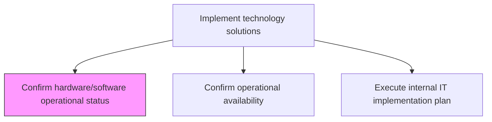
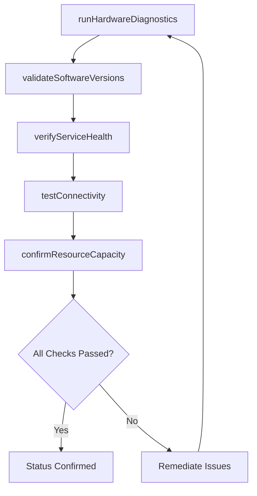

# Confirm hardware/software operational status

> Business-as-Code definition for verifying that all hardware and software components are functioning within expected operational parameters prior to and during deployment activities.

## Overview

Confirm if hardware/software are operating as per the expectation.

## Process Hierarchy



## GraphDL

```yaml
confirm:
  object: Hardware/software Operational Status
  actor: InfrastructureEngineer
  result: OperationalStatusReport
```

## Actions

| Action | Description |
|--------|-------------|
| runHardwareDiagnostics | Execute diagnostic checks on servers, storage, and network hardware |
| validateSoftwareVersions | Confirm installed software versions match deployment specifications |
| verifyServiceHealth | Check health endpoints and status of all dependent services |
| testConnectivity | Validate network connectivity between all system components |
| confirmResourceCapacity | Verify CPU, memory, storage, and bandwidth meet operational thresholds |

## Events

| Event | Description |
|-------|-------------|
| hardwareDiagnosticsCompleted | Hardware diagnostic checks executed and results recorded |
| softwareVersionsValidated | Software version compliance confirmed |
| serviceHealthVerified | Service health checks passed for all dependencies |
| connectivityTested | Network connectivity validated between components |
| resourceCapacityConfirmed | Resource capacity verified against operational thresholds |

## Searches

| Search | Description |
|--------|-------------|
| getOperationalStatus | Retrieve operational status for hardware and software components by environment |
| getDiagnosticResults | List diagnostic check results filtered by component or status |
| getVersionCompliance | Get software version compliance data for deployed components |
| getCapacityMetrics | Retrieve current resource utilization and capacity metrics |

## Process Flow



## RACI Matrix

| Activity | Responsible | Accountable | Consulted | Informed |
|----------|-------------|-------------|-----------|----------|
| runHardwareDiagnostics | InfrastructureEngineer | InfrastructureManager | VendorSupport | ReleaseManager |
| validateSoftwareVersions | ReleaseEngineer | ReleaseManager | ApplicationTeam | ChangeManager |
| verifyServiceHealth | ITOperationsEngineer | ITOperationsManager | ApplicationSupport | ServiceDeskManager |

## Related Processes

| Process | Relationship |
|---------|-------------|
| 8.6.4.2 Confirm operational availability | Downstream - hardware/software status feeds availability confirmation |
| 8.6.4.6 Perform post-installation testing | Downstream - operational status verified before post-install tests |
| 8.6.2.3 Determine implementation requirements | Upstream - requirements define expected operational parameters |

## Related Departments

| Department | Role |
|-----------|------|
| IT Infrastructure | Runs hardware diagnostics and validates physical components |
| IT Operations | Monitors service health and operational metrics |
| Release Engineering | Validates software versions and deployment specifications |

## Related Occupations

| Occupation | Involvement |
|-----------|-------------|
| Infrastructure Engineer | Executes hardware diagnostics and connectivity tests |
| Release Engineer | Validates software version compliance |
| Operations Analyst | Monitors service health and resource capacity |

## KPIs

| KPI | Description | Unit |
|-----|-------------|------|
| Diagnostic Pass Rate | Percentage of hardware/software checks passing on first run | % |
| Version Compliance Rate | Percentage of components matching specified software versions | % |
| Service Health Score | Composite health score across all monitored services | Score (0-100) |
| Pre-Deployment Check Duration | Average time to complete all operational status confirmations | Minutes |

## Usage

```typescript
import { confirmHardwareSoftwareOperationalStatus } from '@headlessly/confirm-hardware-software-operational-status'

const statusCheck = confirmHardwareSoftwareOperationalStatus()

// Get operational status for deployment environment
const status = await statusCheck.getOperationalStatus({
  environment: 'production',
  componentType: ['server', 'database', 'loadbalancer']
})

// Retrieve diagnostic results
const diagnostics = await statusCheck.getDiagnosticResults({
  environment: 'production',
  status: 'failed'
})
```
