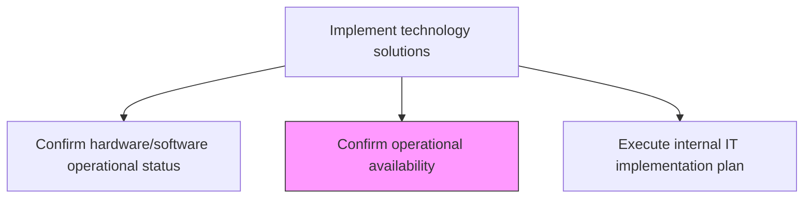
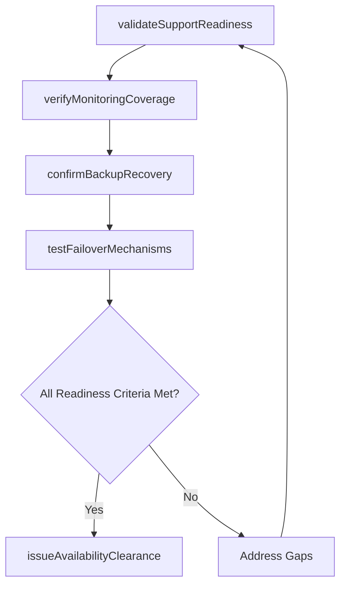

# Confirm operational availability

> Business-as-Code definition for validating that IT services and supporting operational processes are ready and available for production use following a deployment or change implementation.

## Overview

Confirm if operational activities of IT services could be performed.

## Process Hierarchy



## GraphDL

```yaml
confirm:
  object: Operational Availability
  actor: OperationsReadinessManager
  result: AvailabilityConfirmation
```

## Actions

| Action | Description |
|--------|-------------|
| validateSupportReadiness | Confirm that support teams, runbooks, and escalation paths are in place |
| verifyMonitoringCoverage | Ensure monitoring, alerting, and dashboards are configured for the deployed service |
| confirmBackupRecovery | Validate that backup and recovery procedures are operational for the new deployment |
| testFailoverMechanisms | Execute failover tests to confirm high-availability configurations |
| issueAvailabilityClearance | Formally certify that the service is operationally available for users |

## Events

| Event | Description |
|-------|-------------|
| supportReadinessValidated | Support teams and escalation paths confirmed as ready |
| monitoringCoverageVerified | Monitoring and alerting configured and operational |
| backupRecoveryConfirmed | Backup and recovery procedures validated |
| failoverMechanismsTested | Failover configurations tested and verified |
| availabilityClearanceIssued | Service formally certified as operationally available |

## Searches

| Search | Description |
|--------|-------------|
| getAvailabilityStatus | Retrieve operational availability status for deployed services |
| getReadinessChecklist | Get the operational readiness checklist with completion status |
| getFailoverTestResults | List failover test results for a specific deployment |

## Process Flow



## RACI Matrix

| Activity | Responsible | Accountable | Consulted | Informed |
|----------|-------------|-------------|-----------|----------|
| validateSupportReadiness | OperationsReadinessManager | ITOperationsDirector | ServiceDeskManager | ReleaseManager |
| verifyMonitoringCoverage | MonitoringEngineer | ITOperationsDirector | InfrastructureTeam | ApplicationTeam |
| issueAvailabilityClearance | OperationsReadinessManager | ITOperationsDirector | ChangeAdvisoryBoard | BusinessStakeholders |

## Related Processes

| Process | Relationship |
|---------|-------------|
| 8.6.4.1 Confirm hardware/software operational status | Upstream - hardware/software status informs availability |
| 8.6.4.4 Confirm implementation completion | Downstream - availability clearance contributes to completion |
| 8.7.6.1 Operate and monitor online systems | Downstream - operational monitoring takes over after availability confirmed |

## Related Departments

| Department | Role |
|-----------|------|
| IT Operations | Validates operational readiness and monitoring coverage |
| Service Desk | Confirms support readiness and escalation paths |
| Infrastructure Engineering | Tests failover and high-availability configurations |

## Related Occupations

| Occupation | Involvement |
|-----------|-------------|
| Operations Readiness Manager | Leads availability validation and issues clearance |
| Monitoring Engineer | Configures and validates monitoring and alerting |
| Disaster Recovery Specialist | Tests backup and failover mechanisms |

## KPIs

| KPI | Description | Unit |
|-----|-------------|------|
| Readiness Checklist Completion | Percentage of readiness criteria met before go-live | % |
| Time to Operational Availability | Duration from deployment to availability clearance | Hours |
| Failover Test Success Rate | Percentage of failover tests completing successfully | % |
| Post-Deployment Availability | Service uptime percentage in first 72 hours after deployment | % |

## Usage

```typescript
import { confirmOperationalAvailability } from '@headlessly/confirm-operational-availability'

const availability = confirmOperationalAvailability()

// Check availability status for a deployment
const status = await availability.getAvailabilityStatus({
  deploymentId: 'dep-2024-1103',
  environment: 'production'
})

// Get readiness checklist
const checklist = await availability.getReadinessChecklist({
  deploymentId: 'dep-2024-1103',
  filter: 'incomplete'
})
```
