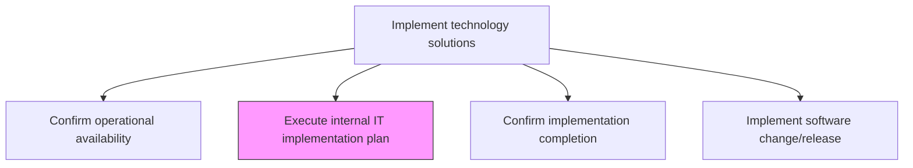
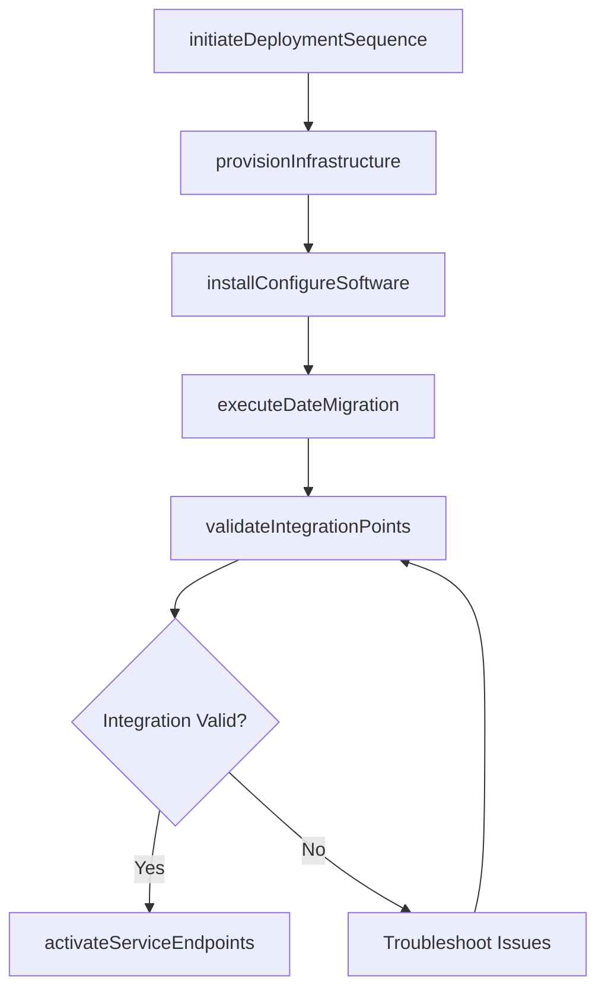

# Execute internal IT implementation plan

> Business-as-Code definition for carrying out the approved IT implementation plan, coordinating infrastructure provisioning, software installation, data migration, and configuration activities to deliver services for internal use.

## Overview

Executing IT implementation plan to make the IT services and solutions available for internal use.

## Process Hierarchy



## GraphDL

```yaml
execute:
  object: Internal IT Implementation Plan
  actor: ImplementationLead
  result: ImplementationExecutionLog
```

## Actions

| Action | Description |
|--------|-------------|
| initiateDeploymentSequence | Begin the planned deployment sequence according to the approved implementation plan |
| provisionInfrastructure | Set up servers, networks, storage, and cloud resources per deployment specifications |
| installConfigureSoftware | Deploy application binaries and apply environment-specific configurations |
| executeDateMigration | Transfer, transform, and load data from source systems into the new environment |
| validateIntegrationPoints | Confirm all integration endpoints and data flows are functioning correctly |
| activateServiceEndpoints | Enable production service endpoints and route traffic to the new deployment |

## Events

| Event | Description |
|-------|-------------|
| deploymentSequenceInitiated | Planned deployment sequence started |
| infrastructureProvisioned | Infrastructure resources set up per specifications |
| softwareInstalledConfigured | Application deployed and environment configured |
| dataMigrationExecuted | Data transfer and transformation completed |
| integrationPointsValidated | Integration endpoints and data flows confirmed |
| serviceEndpointsActivated | Production endpoints enabled and traffic routed |

## Searches

| Search | Description |
|--------|-------------|
| getImplementationProgress | Retrieve current progress of implementation plan execution by phase |
| getDeploymentLogs | Access deployment execution logs filtered by component or time range |
| getIntegrationStatus | Get validation status for integration points |
| getMigrationStatus | Retrieve data migration progress and validation results |

## Process Flow



## RACI Matrix

| Activity | Responsible | Accountable | Consulted | Informed |
|----------|-------------|-------------|-----------|----------|
| provisionInfrastructure | InfrastructureEngineer | ImplementationLead | CloudArchitect | ReleaseManager |
| installConfigureSoftware | ReleaseEngineer | ImplementationLead | ApplicationDevelopers | ITOperations |
| executeDateMigration | DataEngineer | ImplementationLead | DatabaseAdmin | BusinessAnalysts |
| activateServiceEndpoints | ImplementationLead | ITDirector | NetworkEngineer | AllStakeholders |

## Related Processes

| Process | Relationship |
|---------|-------------|
| 8.6.4.1 Confirm hardware/software operational status | Upstream - operational status confirmed before execution |
| 8.6.4.4 Confirm implementation completion | Downstream - execution leads to completion confirmation |
| 8.6.2.2 Define implementation schedule and roll-out sequence | Upstream - schedule defines execution timing |

## Related Departments

| Department | Role |
|-----------|------|
| IT Infrastructure | Provisions and configures infrastructure components |
| Application Development | Deploys and configures application software |
| Data Management | Executes data migration and transformation activities |
| IT Operations | Monitors and supports deployment execution |

## Related Occupations

| Occupation | Involvement |
|-----------|-------------|
| Implementation Lead | Coordinates overall execution of the implementation plan |
| Infrastructure Engineer | Provisions physical and cloud infrastructure |
| Release Engineer | Deploys software packages and applies configurations |

## KPIs

| KPI | Description | Unit |
|-----|-------------|------|
| Implementation Plan Adherence | Percentage of plan steps completed on schedule | % |
| Deployment Success Rate | Percentage of implementation executions completed without rollback | % |
| Integration Validation Pass Rate | Percentage of integration points passing validation on first attempt | % |
| Data Migration Accuracy | Percentage of migrated records passing data quality validation | % |

## Usage

```typescript
import { executeInternalItImplementationPlan } from '@headlessly/execute-internal-it-implementation-plan'

const implementation = executeInternalItImplementationPlan()

// Check implementation progress
const progress = await implementation.getImplementationProgress({
  implementationId: 'impl-2024-q4-003',
  phase: 'production'
})

// Get deployment execution logs
const logs = await implementation.getDeploymentLogs({
  implementationId: 'impl-2024-q4-003',
  severity: 'error',
  timeRange: { start: '2024-11-15T00:00:00Z', end: '2024-11-15T06:00:00Z' }
})
```
