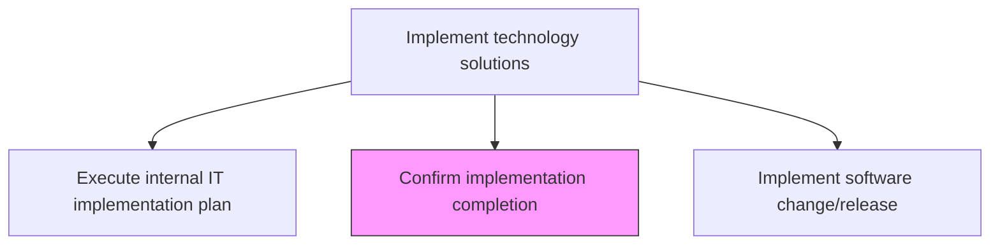
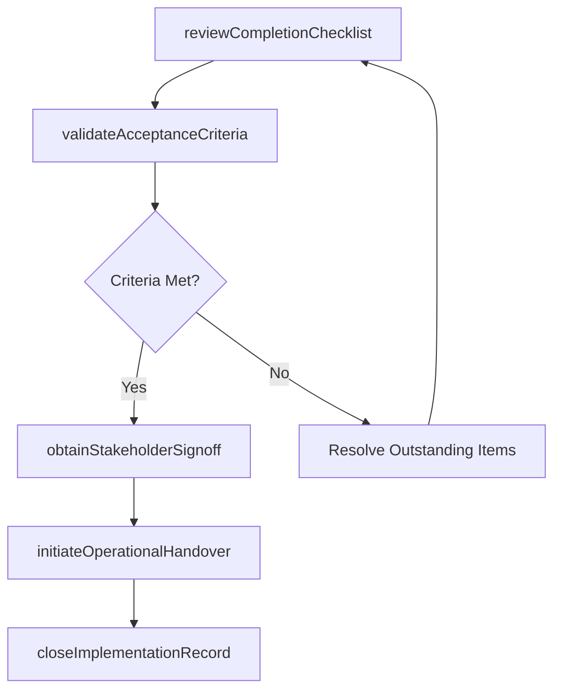

# Confirm implementation completion

> Business-as-Code definition for formally verifying that all implementation activities have been completed, acceptance criteria met, and the deployment is ready for operational handover.

## Overview

Confirming the completion of IT implementation.

## Process Hierarchy



## GraphDL

```yaml
confirm:
  object: Implementation Completion
  actor: ImplementationLead
  result: CompletionCertificate
```

## Actions

| Action | Description |
|--------|-------------|
| reviewCompletionChecklist | Verify all implementation plan tasks and deliverables are completed |
| validateAcceptanceCriteria | Confirm that all defined acceptance criteria and success metrics are met |
| obtainStakeholderSignoff | Collect formal sign-off from business and technical stakeholders |
| initiateOperationalHandover | Transfer operational responsibility from the project team to IT operations |
| closeImplementationRecord | Finalize and close the implementation record with completion status |

## Events

| Event | Description |
|-------|-------------|
| completionChecklistReviewed | All implementation tasks and deliverables verified as complete |
| acceptanceCriteriaValidated | Success metrics and acceptance criteria confirmed |
| stakeholderSignoffObtained | Formal sign-off collected from stakeholders |
| operationalHandoverInitiated | Operational responsibility transferred to IT operations |
| implementationRecordClosed | Implementation record finalized with completion status |

## Searches

| Search | Description |
|--------|-------------|
| getCompletionStatus | Retrieve implementation completion status by deployment or release |
| getOutstandingItems | List incomplete tasks or unmet acceptance criteria |
| getSignoffStatus | Get stakeholder sign-off progress for an implementation |

## Process Flow



## RACI Matrix

| Activity | Responsible | Accountable | Consulted | Informed |
|----------|-------------|-------------|-----------|----------|
| reviewCompletionChecklist | ImplementationLead | ReleaseManager | ProjectManager | ITOperations |
| validateAcceptanceCriteria | QALead | ReleaseManager | BusinessAnalysts | ChangeManager |
| obtainStakeholderSignoff | ImplementationLead | ITDirector | BusinessUnitLeads | ExecutiveSponsor |

## Related Processes

| Process | Relationship |
|---------|-------------|
| 8.6.4.3 Execute internal IT implementation plan | Upstream - implementation execution precedes completion |
| 8.6.4.8 Verify change/release implementation success | Parallel - success verification supports completion confirmation |
| 8.6.3.7 Document IT change/release outcome | Downstream - completion data feeds outcome documentation |

## Related Departments

| Department | Role |
|-----------|------|
| Project Management Office | Tracks implementation milestones and completion criteria |
| Quality Assurance | Validates acceptance criteria and test results |
| IT Operations | Receives operational handover from project team |

## Related Occupations

| Occupation | Involvement |
|-----------|-------------|
| Implementation Lead | Reviews completion and coordinates stakeholder sign-off |
| QA Lead | Validates acceptance criteria are met |
| Project Manager | Tracks milestone completion and resource closure |

## KPIs

| KPI | Description | Unit |
|-----|-------------|------|
| On-Time Completion Rate | Percentage of implementations completed by target date | % |
| First-Pass Acceptance Rate | Percentage of implementations passing acceptance on first review | % |
| Handover Cycle Time | Average time from completion to operational handover | Days |
| Outstanding Item Count | Number of open items at implementation closure | Count |

## Usage

```typescript
import { confirmImplementationCompletion } from '@headlessly/confirm-implementation-completion'

const completion = confirmImplementationCompletion()

// Check completion status
const status = await completion.getCompletionStatus({
  implementationId: 'impl-2024-q4-003',
  environment: 'production'
})

// Get outstanding items
const outstanding = await completion.getOutstandingItems({
  implementationId: 'impl-2024-q4-003',
  severity: 'critical'
})
```
