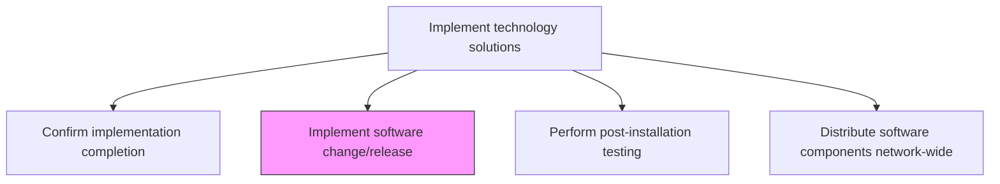
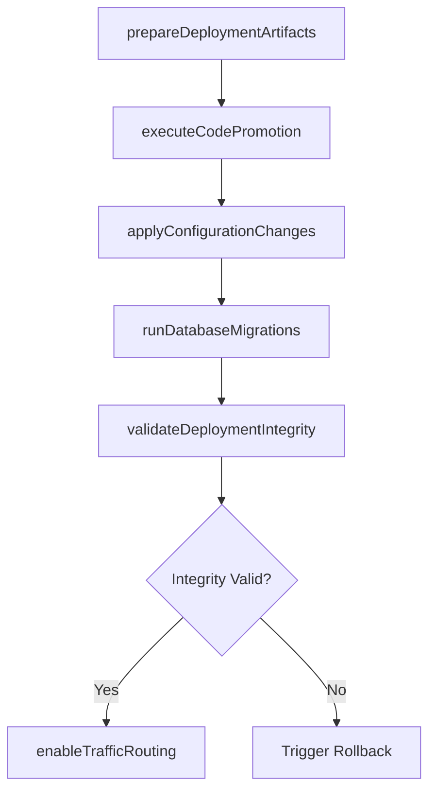

# Implement software change/release

> Business-as-Code definition for executing software change and release deployments according to the approved schedule, including code promotion, configuration updates, and database schema changes.

## Overview

Executing changes in software and services as per change/release schedule.

## Process Hierarchy



## GraphDL

```yaml
implement:
  object: Software Change/release
  actor: ReleaseEngineer
  result: DeploymentRecord
```

## Actions

| Action | Description |
|--------|-------------|
| prepareDeploymentArtifacts | Stage build artifacts, configuration files, and database migration scripts |
| executeCodePromotion | Promote application code through deployment pipeline to target environment |
| applyConfigurationChanges | Update environment-specific configurations, feature flags, and connection strings |
| runDatabaseMigrations | Execute database schema changes and data transformations |
| validateDeploymentIntegrity | Verify deployed artifacts match expected checksums and versions |
| enableTrafficRouting | Switch traffic routing to the newly deployed software version |

## Events

| Event | Description |
|-------|-------------|
| deploymentArtifactsPrepared | Build artifacts and scripts staged for deployment |
| codePromotionExecuted | Application code promoted to target environment |
| configurationChangesApplied | Environment configurations updated |
| databaseMigrationsCompleted | Schema changes and data transformations executed |
| deploymentIntegrityValidated | Deployed artifacts verified for correctness |
| trafficRoutingEnabled | Traffic switched to the new software version |

## Searches

| Search | Description |
|--------|-------------|
| getDeploymentStatus | Retrieve deployment status for a release by environment or component |
| getDeploymentArtifacts | List staged artifacts and their versions for a release |
| getMigrationHistory | Access database migration history for a specific deployment |
| getDeploymentDiff | Compare deployed configuration against previous version |

## Process Flow



## RACI Matrix

| Activity | Responsible | Accountable | Consulted | Informed |
|----------|-------------|-------------|-----------|----------|
| executeCodePromotion | ReleaseEngineer | ReleaseManager | DevOpsTeam | ApplicationDevelopers |
| applyConfigurationChanges | ReleaseEngineer | ReleaseManager | InfrastructureTeam | SecurityTeam |
| runDatabaseMigrations | DatabaseAdmin | ReleaseManager | DataArchitect | ApplicationTeam |
| enableTrafficRouting | ReleaseEngineer | ReleaseManager | NetworkEngineer | ITOperations |

## Related Processes

| Process | Relationship |
|---------|-------------|
| 8.6.4.6 Perform post-installation testing | Downstream - deployed software verified through post-install tests |
| 8.6.4.9 Execute roll-back plan | Contingency - rollback triggered if deployment fails |
| 8.6.3.6 Approve change/release deployment | Upstream - approval required before implementation |

## Related Departments

| Department | Role |
|-----------|------|
| Release Engineering | Executes code promotion and deployment activities |
| Database Administration | Manages database migrations and schema changes |
| DevOps | Maintains deployment pipelines and automation tooling |
| IT Operations | Monitors deployment execution and service health |

## Related Occupations

| Occupation | Involvement |
|-----------|-------------|
| Release Engineer | Executes deployment pipeline and manages artifacts |
| Database Administrator | Runs database migrations and validates data integrity |
| DevOps Engineer | Maintains CI/CD infrastructure and deployment automation |

## KPIs

| KPI | Description | Unit |
|-----|-------------|------|
| Deployment Success Rate | Percentage of software deployments completed without rollback | % |
| Deployment Duration | Average time to complete a software change deployment | Minutes |
| Change Failure Rate | Percentage of changes resulting in service degradation | % |
| Deployment Frequency | Number of successful deployments per time period | Per Week |

## Usage

```typescript
import { implementSoftwareChangeRelease } from '@headlessly/implement-software-change-release'

const deployment = implementSoftwareChangeRelease()

// Check deployment status
const status = await deployment.getDeploymentStatus({
  releaseId: 'rel-2024-q4-003',
  environment: 'production'
})

// Get deployment artifacts
const artifacts = await deployment.getDeploymentArtifacts({
  releaseId: 'rel-2024-q4-003',
  type: 'application'
})
```
